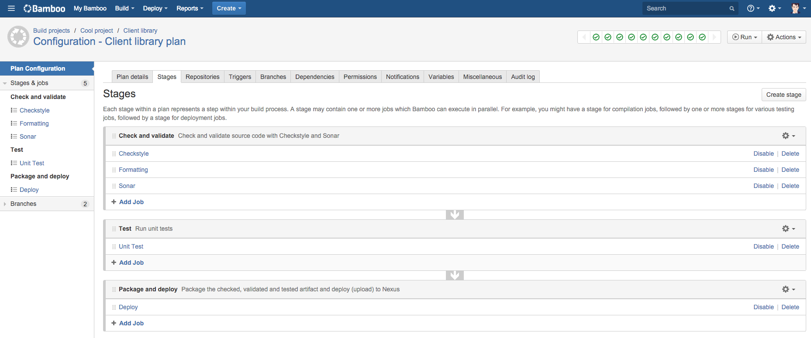
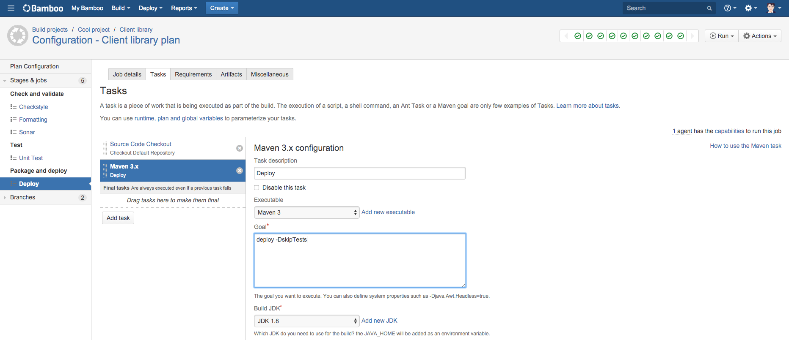
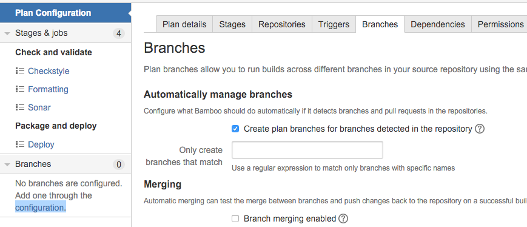
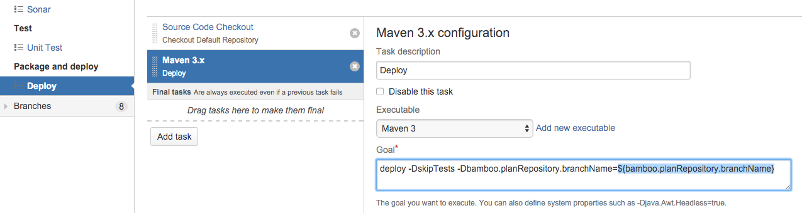

Atlassian Bamboo is a great build server, however, if you, as part of your Git feature branch development workflow come across the situation where you want to skip Maven deployment for your plan branches but currently can't configure that out of the box, read on...

## The problem

We have some client libraries that are shared across multiple applications and we use Maven for our Java builds. These libraries are brought in via the normal Maven dependency management and therefore are deployed to an internal Nexus Maven repository.

A typical flow to get the shared library into our Nexus repository is to get Maven to build the `.jar` artifact (`package`/`install`) and then run the `deploy` goal to upload that to Nexus.

### Ba~~m~~dboo

As I've mentioned, Bamboo is a great CI server and has most of the features you'll ever need. However, one area where it falls short is when you need to specifically disable Bamboo build plan jobs/tasks on plan branches. I.e. you want a job/task to run on your master branch but skip it when running feature branch builds.

#### The master plan

If you follow the Git [feature branch](https://www.atlassian.com/git/tutorials/comparing-workflows/feature-branch-workflow) development workflow, you'll create a new branch off of your master branch to add new features etc. The idea being that once you're happy with your changes, you'll push your commits on your feature branch up to your remote Git server (we use ~~Stash~~Bitbicket Server) and create a [Pull Request](https://confluence.atlassian.com/stash/using-pull-requests-in-stash-299570995.html).

Then, as part of your CI pipeline, you should be kicking off an automated build of your feature branch at this point. We have a process whereby feature branches are only eligible for merging (via a Pull Request) into master branch if they have met some prerequisites, one of those being that there should be at least one successful build of our feature branch.

So how does this look on Bamboo?
First you would create a build plan for your client library's master branch. This plan would include stages with jobs for code checks, run all tests, package up the `.jar` artifact and deploy to our Nexus repo. Below is a screenshot of such a build plan:



All of these jobs include checking out the source and a Maven task for running the corresponding Maven goal. For instance the goal to deploy to Nexus is below:



This build plan configuration is generally configured to use the master branch from our linked repository. So how do we configure Bamboo to build feature branches for our Client library as well?

#### Plan branches

Bamboo makes picking up feature branches and building them extremely easy (Only tested with ~~Stash~~Bitbucket Server). All you have to do is click on the *configuration* link under the *Branches* tab of your build plan configuration and tick the *Create plan branches for branches detected in the repository* checkbox:



After this, every time you push a new branch to your Git repo, Bamboo will automatically create a plan branch configuration for your feature branch. This plan branch basically inherits all the stages and jobs from the "master" build plan. I.e. the build plan for your feature branch will be exactly the same as for your master branch. Which makes sense...

#### The crux of the matter

However, therein lies the problem.
With this behaviour it means that **any** build of your client library will deploy to Nexus, even your feature branch builds.

This is not what you want because new features that might break other projects, incomplete implementations or unapproved (Pull requests should generally be reviewed before merging) changes will be deployed to Nexus. 
You only want your master branch being deployed to Nexus when all checks have been done, changes verified or in the event of a release. This problem becomes even worse in a CD pipeline when you have child plan dependencies on your client library.

## The solution

There is a JIRA issue ([BAM-11257](https://jira.atlassian.com/browse/BAM-11257)) for adding conditional support to plan branches which should solve this in a native way but for an immediate solution, there are workarounds [here](https://answers.atlassian.com/questions/144064/answers/4040501), [here](http://stackoverflow.com/a/27818441/2408961) and a [plugin](https://marketplace.atlassian.com/plugins/org.valens.dynamicPlans/server/overview) that could help solve this problem.

### Our solution

Based on [this](http://stackoverflow.com/a/27818441/2408961) workaround I came up with a solution that skips deploying to Nexus on plan branches within Bamboo and also prevents developers from uploading (`mvn deploy`) to Nexus by mistake from their local machines.

#### A master build profile

It's really quite simple, basically we add a Maven profile that is activated when a certain property's value is `master`. This profile enables (un-skips) the `maven-deploy-plugin` which is skipped by default.

Below is an example of a `pom.xml` with the above `master-build` profile:

```
<?xml version="1.0" encoding="UTF-8"?>
<project xmlns="http://maven.apache.org/POM/4.0.0"
         xmlns:xsi="http://www.w3.org/2001/XMLSchema-instance"
         xsi:schemaLocation="http://maven.apache.org/POM/4.0.0 http://maven.apache.org/xsd/maven-4.0.0.xsd">
    <modelVersion>4.0.0</modelVersion>

    ...

    <profiles>
        <profile>
            <id>master-build</id>
            <activation>
                <activeByDefault>false</activeByDefault>
                <property>
                    <name>bamboo.planRepository.branchName</name>
                    <value>master</value>
                </property>
            </activation>

            <build>
                <plugins>
                    <plugin>
                        <groupId>org.apache.maven.plugins</groupId>
                        <artifactId>maven-deploy-plugin</artifactId>
                        <version>2.8.2</version>
                        <configuration>
                            <skip>false</skip>
                        </configuration>
                    </plugin>
                </plugins>
            </build>
        </profile>
    </profiles>

    ...

    <build>
        <plugins>
            <plugin>
                <groupId>org.apache.maven.plugins</groupId>
                <artifactId>maven-deploy-plugin</artifactId>
                <version>2.8.2</version>
                <configuration>
                    <skip>true</skip>
                </configuration>
            </plugin>
        </plugins>
    </build>

</project>
```

On your local machine, if you run the deploy task without anything else:

```
$ mvn deploy
```

You will see that the deploy goal is skipped:

```
...
[INFO] --- maven-install-plugin:2.4:install (default-install) @ client-library ---
[INFO] Installing ...
[INFO] 
[INFO] --- maven-deploy-plugin:2.8.2:deploy (default-deploy) @ client-library ---
[INFO] Skipping artifact deployment
[INFO] ------------------------------------------------------------------------
[INFO] BUILD SUCCESS
[INFO] ------------------------------------------------------------------------
```

If you want to deploy the built artifact to Nexus from your local machine or if you want to test how it will work on Bamboo, then run the deploy goal but with our property set to master:

```
$ mvn deploy -Dbamboo.planRepository.branchName=master
```

which will upload to Nexus:

```
[INFO] --- maven-install-plugin:2.4:install (default-install) @ client-library ---
[INFO] Installing ...
[INFO] 
[INFO] --- maven-deploy-plugin:2.8.2:deploy (default-deploy) @ client-library ---
Downloading: ...
Downloaded: ...
Uploading: ...
Uploaded: ...
[INFO] ------------------------------------------------------------------------
[INFO] BUILD SUCCESS
[INFO] ------------------------------------------------------------------------
```

#### Bamboo-ify it

Great, so we now have a conditional deployment based on the presence of a property value. All we need to do now is configure our deployment job to pass in the value for our property.

Bamboo has many [built in variables](https://confluence.atlassian.com/bamboo/bamboo-variables-289277087.html) that you can include in your task configurations.
We need a variable that evaluates to the current branch. That way, when we are building master branch for example, the variable's value will be "master" which we can then set as our property for our Maven deployment goal and which will then enable the deployment to Nexus. If we are building a feature branch, then the value will not be "master" and deployment will be skipped. 

Luckily there is a `bamboo.planRepository.branchName` variable we can use that does exactly this (I cheated and used the same name for my Maven property). Let's see how we can add this to our task configuration:



Now when this task runs, the `${bamboo.planRepository.branchName}` variable will evaluate to the current branch name and depending on what it is, it will either deploy to Nexus if the branch is `master` or skip deployment if the branch is anything else.

## Bamboosion

In conclusion, like anything else in computing, there are many ways to carve a bamboo shoot. The [plugin](https://marketplace.atlassian.com/plugins/org.valens.dynamicPlans/server/overview) mentioned before looks very promising and would mean no changes to you Maven setup. I might have a look at this in future...

However, our current solution does work nicely and has the benefit of preventing local deployments by mistake (even though you could probably prevent this with user permissions etc. as well) but I digress.

We've used it to enable conditional execution of our deploy task but the same principle can be applied to other goals as well.