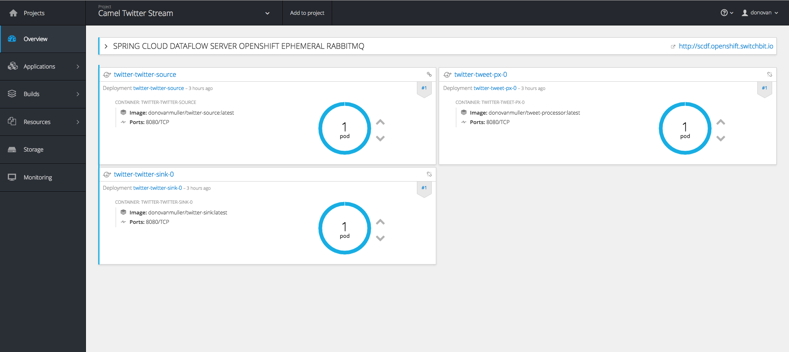

The new Camel Spring Cloud Stream component allows you to use the programming model and binder abstractions from the Spring Cloud Stream project natively within Apache Camel.

In this post we'll breeze through a simple sample application demonstrating how to use the Camel Spring Cloud Stream component.

## Introduction

I'll let the official project page describe what [Spring Cloud Stream](https://cloud.spring.io/spring-cloud-stream/) is all about: *"Spring Cloud Stream is a framework for building message-driven microservices. ... Spring Cloud Stream provides an opinionated configuration of message brokers, introducing the concepts of persistent pub/sub semantics, consumer groups and partitions across several middleware vendors. This opinionated configuration provides the basis to create stream processing applications."*

In a nutshell, Spring Cloud Stream abstracts the niggly bits of connecting your applications to messaging middleware to easily facilitate building "stream processing" pipelines. The [programming model](http://docs.spring.io/spring-cloud-stream/docs/Brooklyn.SR1/reference/htmlsingle/#_programming_model) is centered around binding abstract messaging channels (really Spring Integration `MessageChannel`'s at this point), which facilitate sending and receiving messages, to an interface method. These interfaces can then be used to send/receive messages. Methods can also be annotated (with [`@StreamListener`](http://docs.spring.io/spring-cloud-stream/docs/Brooklyn.SR1/reference/htmlsingle/#_using_streamlistener_for_automatic_content_type_handling) for example), turning a run of the mill method declaration into an easy to reason about messaging processing mechanism, where method parameters are actually incoming messages (including [content conversion](http://docs.spring.io/spring-cloud-stream/docs/Brooklyn.SR1/reference/htmlsingle/#contenttypemanagement)) and the return value results in a new message being sent.

What's more, the actual messaging middleware (Kafka, RabbitMQ, etc.) is completely abstracted away. The channels described above are bound to the messaging layer at runtime. Allowing you to swap out messaging middleware implementations at will, without affecting your code. Powerful stuff.

## A Source, a Processor and a Sink walk into a bar

At it's most basic, Stream comes with three [predefined interfaces](http://docs.spring.io/spring-cloud-stream/docs/Brooklyn.SR1/reference/htmlsingle/#__literal_source_literal_literal_sink_literal_and_literal_processor_literal): `Source`, `Processor` and `Sink`. These interfaces have a combination of `input` and `output` bindings which help with the following scenarios:

* if you only need to accept incoming messages, maybe you only want to persist the message, then you want a `Sink`, which only contains a `input` channel binding.
* however, you might want to receive and incoming message, perform some transformation on it and then send it to another application. In this case, you want a `Processor`, which has both `input` and `output` channel bindings.
* If you poll your database and then send corresponding messages out, you'll want a `Source`. Which only contains a `output` channel binding.

You can define any combination of channels, with different names and even different corresponding binders but generally these three interfaces will get you quite far.

It is on this premise that the Camel Spring Cloud Stream component draws inspiration.

## A Stream full of Camels

Since Spring Cloud Stream is essentially built on top of Spring Integration, why would you want to use [Apache Camel](http://camel.apache.org/) in your apps, why not just use Spring Integration? After all, they're quite similar.

Well, in my opinion Camel's programming model, based on the concept of defining a [`Route`](http://camel.apache.org/routes.html), consisting of components that amongst _many_ other things, implement the EAI patterns, is exceptionally easy to get to grips with and use. You can go from zero to a small demo app in no time at all. Plus, Camel has been around for... donkeys years and has components for just about any integration you can think of. This is not to say that there is anything wrong with Spring Integration, just that Camel is a worthy substitute in many cases.

So what if you could have the power and convenience of Spring Cloud Stream combined with the simple, yet powerful ecosystem of Apache Camel? Well, that's exactly what I thought. Turns out, it works rather nicely, and so the [**Camel Spring Cloud Stream**](https://github.com/donovanmuller/camel-spring-cloud-stream) component was born.

> See the Camel Spring Cloud Stream component GitHub repo for more information: https://github.com/donovanmuller/camel-spring-cloud-stream

## A tale of two Tweets

Instead of boring you with more technical facts, let's jump into a sample stream, consisting of three applications. These applications will demonstrate how you can use the Camel Spring Cloud Stream component to mimic the functionality of the `Source`, `Processor` and `Sink` interfaces.

### An experiment

Instead of the usual boring "Hello World!" sample application, I thought I'd make it interesting and build a stream that does the following:

* Monitors a Tweet for any retweets,
* when someone retweets the tweet (no comments! - *it doesn't register as a retweet*), we'll strip off the retweeters screen name,
* then we'll prepare a reply tweet, to thank the user for retweeting our tweet
* and finally, we'll tweet that reply out on our timeline

Could it backfire somehow and be construed as spam? Maybe... but I'm guessing about 10 or so people will actually retweet the tweet I'll send out to announce this post, so... we'll see 😬

### To the code

> The source for this sample application can be viewed in it's entirety here: https://github.com/donovanmuller/camel-twitter-stream. Use at your own risk.

I'll be highlighting and walking through only the Camel route for each application, since that is the meaty camel center of this Spring'y sandwich. Each app is packaged as a [Spring Boot](https://projects.spring.io/spring-boot/) application, including only the [`camel-spring-cloud-stream-starter`](https://github.com/donovanmuller/camel-spring-cloud-stream/tree/master/camel-spring-cloud-stream-starter), the [Rabbit MQ binder](https://github.com/spring-cloud/spring-cloud-stream-binder-rabbit) (we'll be using Rabbit MQ as the messaging middleware in this example, however, feel free to swap it out for any other supported implementation, like [Kafka](https://github.com/spring-cloud/spring-cloud-stream-binder-kafka) for example) and supporting starter dependencies.

#### Twitter Source

The [twitter-source](https://github.com/donovanmuller/camel-twitter-stream/tree/master/twitter-source) application will poll the Twitter API's (using [Twitter4j](http://twitter4j.org/en/index.html)) for any retweets of the tweet we will specify. When the retweeter is returned, we'll grab their `screen_name`. This is what this looks like:

```
@Service
public class RetweetService {

	private Twitter twitter;

	public RetweetService(Twitter twitter) {
		this.twitter = twitter;
	}

	@Handler
	public List<String> getRetweetsWithScreenNames(@Header("statusId") Long statusId)
			throws TwitterException {
		return twitter.getRetweets(statusId).stream()
				.map(tweet -> tweet.getUser().getScreenName())
				.collect(Collectors.toList());
	}
}
```

A simple Spring bean, [`RetweetService.java`](https://github.com/donovanmuller/camel-twitter-stream/blob/master/twitter-source/src/main/java/io/switchbit/RetweetService.java), injected with a Twitter4j `Twitter` reference to call the Twitter API's.

The `statusId` is the tweet we're monitoring for retweets. When we get retweets, we grab the `screenName`
from them and return the screen names as a `List<String>`.

Now let's have a look at the Camel route, [`TwitterSourceRoute.java`](https://github.com/donovanmuller/camel-twitter-stream/blob/master/twitter-source/src/main/java/io/switchbit/TwitterSourceRoute.java):

```
@Component
public class TwitterSourceRoute extends RouteBuilder {

	private TwitterProperties properties;
	private IdempotentRepository idempotentRepository;

	public TwitterSourceRoute(TwitterProperties properties,
			IdempotentRepository idempotentRepository) {
		this.properties = properties;
		this.idempotentRepository = idempotentRepository;
	}

	@Override
	public void configure() throws Exception {
		fromRetweets();
		from("direct:retweets").to("scst:output");

	}

	private ExpressionNode fromRetweets() {
		return from("timer:pollRetweets?fixedRate=true&period={{twitter.pollPeriod}}")
				.setHeader("statusId", simple("{{twitter.statusId}}"))
				.to("bean:retweetService")
                .split(body())
				.idempotentConsumer(simple("${body}"), idempotentRepository)
				.skipDuplicate(properties.getSkipDuplicate())
				.log("Received retweet from: @${body}").to("direct:retweets");
	}
}
```

There are actually two route definitions kicking about here. The first, referenced as `fromRetweets`, declares a [`timer`](http://camel.apache.org/timer.html) component, that fires every `twitter.pollPeriod` (a Spring configuration property).

Then we call our `RetweetService` bean and try get retweeters screen names. Any retweeters we find, will be run through an [Idempotent Consumer](http://camel.apache.org/idempotent-consumer.html) backed by a [`SpringCacheIdempotentRepository`](https://github.com/donovanmuller/camel-twitter-stream/blob/master/twitter-source/src/main/java/io/switchbit/configuration/TwitterSourceConfiguration.java#L60) which in turn is backed by Redis . Basically, this ensures that if our app is ever restarted, we won't re-process the retweets again (otherwise... cue Twitter outrage).

From there, we basically send to a `direct` consumer component, which then feeds the new Spring Cloud Stream producer component:

```
    from("direct:retweets").to("scst:output");
```

This means, send the incoming exchange over the `output` channel I'm about to lazily create and bind the channel to a binder implementation and then send. 

If this was a "normal" Spring Cloud Stream app, it could look something like this:

```
@EnableBinding(Source.class)
public class TwitterSource {

    private MessageChannel output;

    public TwitterSource(MessageChannel output) {
        this.output = output;
    }

    public void sendRetweets(String screenName) {
         output.send(MessageBuilder.withPayload(screenName).build());
    }
}
```

imagining a similar Spring based polling mechanism invoking `twitterSource.sendRetweets("humpdeehump42")`.

#### Tweet Processor

This route, [`TweetProcessorRoute`](https://github.com/donovanmuller/camel-twitter-stream/blob/master/tweet-processor/src/main/java/io/switchbit/TweetProcessorRoute.java), takes the incoming screen name, passes that into the Camel [Mustache](http://camel.apache.org/mustache.html) component to render content that will become our reply tweet:

```
@Component
public class TweetProcessorRoute extends RouteBuilder {

    @Override
    public void configure() throws Exception {
        from("scst:input")
                .to("mustache:tweet.mustache")
                .to("scst:output");
    }
}
```

Pretty self explanatory, receive the message over the Spring Cloud Stream `input` channel, run it through Mustache, which renders a template file located in [`src/main/resources/tweet.mustache`](https://github.com/donovanmuller/camel-twitter-stream/blob/master/tweet-processor/src/main/resources/tweet.mustache) and then send the rendered content out on the `output` Spring Cloud Stream channel.

A Spring Cloud Stream app would comparatively look something like this:

```
@EnableBinding(Processor.class)
public class TweetProcessor {

    private Mustache mustache;

    public TweetProcessor(Mustache mustache) {
        this.mustache = mustache;
    }

    @StreamListener(Processor.INPUT)
    @SendTo(Processor.OUTPUT)
    public String handle(String screenName) {
        return mustache.render(screenName);
    }
}
```

#### Twitter Sink

Lastly, we'll take the incoming reply tweet content and create a tweet on our timeline:

```
@Component
public class TwitterSinkRoute extends RouteBuilder {

    @Override
	public void configure() throws Exception {
        from("scst:input")
                .to("twitter:timeline/user");
	}
}
```

we use the Camel [`twitter`](http://camel.apache.org/twitter.html) component (not Twitter4j directly as in the Twitter Source application) to create a tweet on our timeline. It takes the incoming Exchange's `getIn().getBody()` as the content of the tweet, in our case, the rendered Mustache template content from the Tweet Processor app.

Again, for comparison, this is what the default Spring Cloud Stream version would look like:

```
@EnableBinding(Sink.class)
public class TwitterSink {

    private Twitter twitter;

    public TwitterSink(Twitter twitter) {
        this.twitter = twitter;
    }

    @StreamListener(Sink.INPUT)
    public void handle(String tweet) {
        twitter.tweet(tweet);
    }
}
```

That's it! Ship it!

### Just Flow with it

You could manually deploy these three apps. However, you would have to map the `output` and `input` channel destinations correctly for the stream to flow (not getting into that now... see the Spring Cloud Stream [references docs](http://docs.spring.io/spring-cloud-stream/docs/Brooklyn.SR1/reference/htmlsingle/#_connecting_multiple_application_instances)). An easier way is to use the awesome [Spring Cloud Data Flow](http://cloud.spring.io/spring-cloud-dataflow/) project to orchestrate the deployment of this stream.

The Spring Cloud Data Flow project provides a DSL that you can use to register, define and deploy Spring Cloud Stream apps with. You also have your choice of deployment platform thanks to the [Spring Cloud Deployer](https://github.com/spring-cloud/spring-cloud-deployer) abstraction. Currently [supported platforms](spring-cloud-data-flow-implementations) are Local (for development), Cloud Foundry, Kubernetes, Mesos, RedHat OpenShift, Hashicorp Nomad etc. I'm not going to go into detail of how to get the Data Flow server installed and running, however, you can check out the reference docs for the various deployer implementations.

#### Shifting a Camel along the Stream

I'm going to be a little bias (I contributed it 😎) and use the [OpenShift deployer](https://github.com/donovanmuller/spring-cloud-dataflow-server-openshift) to deploy our sample app.

There are quite a few ways to get up and running with [OpenShift](https://www.openshift.com/) so I recommend reading the [reference docs](https://donovanmuller.github.io/spring-cloud-dataflow-server-openshift/docs/1.1.0.RELEASE/reference/htmlsingle/) to get a Data Flow server up and running. For this sample application I have spun up a very basic cluster on Google Compute Engine instances and have deployed the OpenShift Data Flow server to it.

> If you're interested, you can poke around the [OpenShift console](https://104.199.93.47:8443/console) to see what it's all about. I'll run the cluster for a few days/weeks after this post is released. Feel free to have a look around at https://104.199.93.47:8443/console. You can login with username/password (`twitter`/`twitter`). Please be a good citizen and not try do something nasty. 👍

I can't be bothered to setup authentication on the Data Flow UI, so we'll use the Data Flow Shell to register, define and deploy our stream. First go grab the Shell if you haven't already, then fire it up

```
$ wget http://repo.spring.io/release/org/springframework/cloud/spring-cloud-dataflow-shell/1.1.1.RELEASE/spring-cloud-dataflow-shell-1.1.1.RELEASE.jar
$ java -jar spring-cloud-dataflow-shell-1.1.1.RELEASE.jar --dataflow.uri=http://scdf.openshift.switchbit.io/
...
dataflow:>
```

use the `dataflow.uri` that corresponds to your deployment platform.

Next we register our three apps

```
dataflow:>app register --name twitter-source --type source --uri docker:donovanmuller/twitter-source:latest
Successfully registered application 'source:twitter-source'
dataflow:>app register --name tweet-px --type processor  --uri docker:donovanmuller/tweet-processor:latest
Successfully registered application 'processor:tweet-processor'
dataflow:>app register --name twitter-sink --type sink --uri docker:donovanmuller/twitter-sink:latest
Successfully registered application 'sink:twitter-sink'
dataflow:>app list
╔══════════════╤═════════╤════════════╤════╗
║    source    │processor│    sink    │task║
╠══════════════╪═════════╪════════════╪════╣
║twitter-source│tweet-px │twitter-sink│    ║
╚══════════════╧═════════╧════════════╧════╝

dataflow:>
```

next we create the definition of our `twitter` stream

```
dataflow:>stream create --name twitter --definition "twitter-source | tweet-px | twitter-sink"
Created new stream 'twitter'
```

and finally deploy it!

```
dataflow:>stream deploy --name twitter --propertiesFile /tmp/camel-twitter-stream.properties
Deployment request has been sent for stream 'twitter'
```

note that we pass in reference to a properties file `camel-twitter-stream.properties` that contains the Spring configuration properties for all the apps. This includes Twitter API keys, the tweet `statusId` to monitor etc. It looks like this:

```
app.twitter-source.twitter.consumerKey=...
app.twitter-source.twitter.consumerSecret=...
app.twitter-source.twitter.accessToken=...
app.twitter-source.twitter.accessTokenSecret=...
app.twitter-source.twitter.statusId=...
app.twitter-source.spring.rabbitmq.host=rabbitmq
app.twitter-source.spring.redis.host=redis

app.tweet-px.spring.rabbitmq.host=rabbitmq

app.twitter-sink.camel.component.twitter.consumerKey=...
app.twitter-sink.camel.component.twitter.consumerSecret=...
app.twitter-sink.camel.component.twitter.accessToken=...
app.twitter-sink.camel.component.twitter.accessTokenSecret=...
app.twitter-sink.spring.rabbitmq.host=rabbitmq
```

if all goes well, our stream should be deployed, listening for those elusive retweets...



as mentioned above, feel free to [browse around](https://104.199.93.47:8443/console), while the cluster is up. Check the logs etc. etc.

## Wrapping up

This was a brief, light hearted walk through a sample application using the new Camel Spring Cloud Stream component. Hopefully it gave you a good idea of how simple it is to integrate Spring Cloud Stream into your Camel routes but also, how easy it is to leverage the power and flexibility you get with Spring Cloud Stream and Spring Cloud Data Flow.

> The source for this sample application can be found here: https://github.com/donovanmuller/camel-twitter-stream.

If you have any questions or feedback, please let me know at [@donovancmuller](https://twitter.com/donovancmuller).

## Try it!

In passing, why not retweet the tweet below and see the stream described here in action!

<blockquote class="twitter-tweet" data-lang="en"><p lang="en" dir="ltr">Want to see the new Apache Camel <a href="https://twitter.com/springcloud">@springcloud</a> Stream component in action? See below! <a href="https://twitter.com/hashtag/SpringCloudStream?src=hash">#SpringCloudStream</a> <a href="https://twitter.com/hashtag/ApacheCamel?src=hash">#ApacheCamel</a> <a href="https://t.co/Ssh2Qdwk60">pic.twitter.com/Ssh2Qdwk60</a></p>&mdash; Donovan Muller (@donovancmuller) <a href="https://twitter.com/donovancmuller/status/819691472572346370">January 12, 2017</a></blockquote>
<script async src="//platform.twitter.com/widgets.js" charset="utf-8"></script>