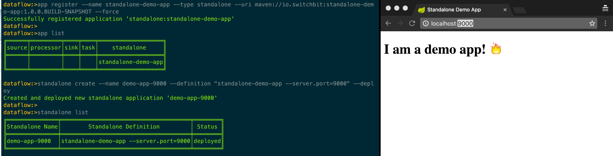

Spring Cloud Data Flow currently supports source, processor, sink and task application types in both stream and task definitions. This post introduces the concept of a new 'standalone' application type. Allowing standalone (i.e. non Spring Cloud Stream) Spring Boot applications to be defined and deployed via the Spring Cloud Data Flow environment.

## Why the need for a standalone app?

Spring Cloud Data Flow has its roots in composing data pipelines using cloud native microservices, so why would we want a standalone application type? These are my top 3 reasons:

* a need to deploy current/legacy Spring Boot applications in the same way we can deploy both streams and tasks
* standalone applications can sometimes supplement streams/tasks and therefore would benefit from being deployed in a consistent way using the same tooling/environment
* the Spring Cloud Data Flow tooling is rich and easily extensible, making implementing your own "deployer server" unappealing.

In my case, the team already had a multitude of standalone Spring Boot applications being deployed via a custom CI/CD pipeline but, as we started to introduce more Spring Cloud Data Flow (henceforth referred to as SCDF) defined streams and tasks, it became apparent that having a consistent way to deploy all types of Spring Boot apps into the same environment was needed. The [Spring Cloud Deployer](https://github.com/spring-cloud/spring-cloud-deployer) abstraction was perfect for this and initially I attempted to build a separate deployer server for standalone apps. However, it pretty soon became apparent that I was duplicating allot of effort already present in the SCDF Core project. So I ditched that, forked the SCDF repo and added the standalone application type to the core project, which turned out to be much simpler.

### Caveat

Having said that, I'm not sure if this application type makes sense for where the SCDF team is heading, however, it fits our purposes quite nicely and also paved the way for another feature I'll introduce in another post 🤔. I've logged an issue to track this feature: [spring-cloud-dataflow/issues/915](https://github.com/spring-cloud/spring-cloud-dataflow/issues/915)

## Booting up in Data Flow

Let's demonstrate how we define and deploy a standalone application in SCDF by way of a simple example. First, grab the following binary (a build of my fork of the [spring-cloud-dataflow](https://github.com/donovanmuller/spring-cloud-dataflow/tree/standalone) project)

```
$ wget https://github.com/donovanmuller/spring-cloud-dataflow/releases/download/v1.1.0.STANDALONE-SNAPSHOT/spring-cloud-dataflow-server-local-1.1.0.BUILD-SNAPSHOT.jar
```

> The [`standalone`]([spring-cloud-dataflow](https://github.com/donovanmuller/spring-cloud-dataflow/tree/standalone)) branch on my fork of [spring-cloud-dataflow](https://github.com/donovanmuller/spring-cloud-dataflow/tree/standalone) contains the [commits](https://github.com/donovanmuller/spring-cloud-dataflow/commit/64da383ce053abee5055bd8444305fca0c5c3dc5) implementing the standalone application type.

We will use the local deployer for simplicity's sake, however, since there is nothing changed in the way apps are deployed via the Spring Cloud Deployer abstraction, all current deployer implementations should work out of the box. First, let's fire up a SCDF server with the local deployer support:

```
$ java -jar spring-cloud-dataflow-server-local-1.1.0.BUILD-SNAPSHOT.jar \
   --spring.cloud.dataflow.features.standalone-enabled=true
```

The standalone application is implemented as an additional feature, in the same way that you can enable/disable the analytics, stream and task functionality by toggling the [feature flags](https://github.com/spring-cloud/spring-cloud-dataflow/blob/master/spring-cloud-dataflow-server-core/src/main/java/org/springframework/cloud/dataflow/server/config/features/FeaturesConfiguration.java#L48). By default it is disabled, hence we enable it above via the `--spring.cloud.dataflow.features.standalone-enabled=true` property.

Now we'll use the [SCDF Shell](https://github.com/spring-cloud/spring-cloud-dataflow/tree/master/spring-cloud-dataflow-shell) to define and deploy our example application. Currently, only the Shell has been augmented to include support for the standalone application type feature, based on feedback from the upstream [proposal issue](https://github.com/spring-cloud/spring-cloud-dataflow/issues/915), integration into the UI could be added later. To start the shell, first grab the binary (again, built from my fork of SCDF) and then start her up:

```
$ wget https://github.com/donovanmuller/spring-cloud-dataflow/releases/download/v1.1.0.STANDALONE-SNAPSHOT/spring-cloud-dataflow-shell-1.1.0.BUILD-SNAPSHOT.jar
$ java -jar spring-cloud-dataflow-shell-1.1.0.BUILD-SNAPSHOT.jar
```

the SCDF server will be targeted at http://localhost:9393 be default. If you push the Tab key, you should see support for `standalone` in the shell. You can type `standalone list` to verify:

```
dataflow:>standalone list
╔═══════════════╤═════════════════════╤══════╗
║Standalone Name│Standalone Definition│Status║
╚═══════════════╧═════════════════════╧══════╝

dataflow:>
```

### Registering a standalone application

Nothing out of the ordinary here, we register a standalone application just like any other application type. For this example we'll register a standalone application I wrote <github repo> using the `maven://` resource.

I haven't published this application to any publicly available Maven repository, so we'll just have to install it into our local repository. To do that, clone the example application and do a `mvn install`:

```
$ git clone https://github.com/donovanmuller/standalone-demo-app.git && cd standalone-demo-app
$ mvn install
```

now we can register our app in the SCDF Shell:

```
dataflow:>app list
No registered apps.
You can register new apps with the 'app register' and 'app import' commands.

dataflow:>app register --name standalone-demo-app --type standalone --uri maven://io.switchbit:standalone-demo-app:1.0.0.BUILD-SNAPSHOT
Successfully registered application 'standalone:standalone-demo-app'

dataflow:>app list
╔══════╤═════════╤════╤════╤═══════════════════╗
║source│processor│sink│task│    standalone     ║
╠══════╪═════════╪════╪════╪═══════════════════╣
║      │         │    │    │standalone-demo-app║
╚══════╧═════════╧════╧════╧═══════════════════╝

dataflow:>
```

`app list` confirms that our app is registered (note the 'standalone' application type).

### Define our standalone application

Sticking with the concept of defining stream and tasks, we need to define a standalone definition for our registered app. This allows us to configure the same standalone app in a few different configurations. Admittedly, *defining* a standalone app is a little frivolous but having the, register once, configure for multiple usage capability could be useful (it was also just easier to implement it the same as streams/tasks 😁).

```
dataflow:>standalone create --name demo-app-9000 --definition "standalone-demo-app --server.port=9000" --deploy
Created and deployed new standalone application 'demo-app-9000'
```

with the above command we defined a new standalone definition called `demo-app-9000` using the registered `standalone-demo-app` standalone application. We also passed the `--server.port=9000` application property, specifying that this app should listen on port `9000` instead of the default 8080 and then instructed SCDF to deploy this definition immediately with `--deploy`.

Let's see how it's doing:

```
dataflow:>standalone list
╔═══════════════╤══════════════════════════════════════╤════════╗
║Standalone Name│        Standalone Definition         │ Status ║
╠═══════════════╪══════════════════════════════════════╪════════╣
║demo-app-9000  │standalone-demo-app --server.port=9000│deployed║
╚═══════════════╧══════════════════════════════════════╧════════╝

dataflow:>
```

looks good, if you open http://localhost:9000 you should see our demo app running.



Well, that was easy. Let's clean up house and destroy (the app will be undeployed implicitly) our standalone demo app:

```
dataflow:>standalone destroy demo-app-9000
Destroyed standalone application 'demo-app-9000'

dataflow:>runtime apps
╔════════════════════╤═══════════╤═════════════════════════════╗
║App Id / Instance Id│Unit Status│No. of Instances / Attributes║
╚════════════════════╧═══════════╧═════════════════════════════╝

dataflow:>standalone list
╔═══════════════╤═════════════════════╤══════╗
║Standalone Name│Standalone Definition│Status║
╚═══════════════╧═════════════════════╧══════╝

dataflow:>
```

## Could it be easier?

Yes. Yes it could.

It could become a little tedious registering, defining and deploying your apps all day long, especially if you're restarting your deployer server during development. Wouldn't it be great if there was a way to leverage your build tool, in this case Maven, (I'm discussing Maven only here - sorry Gradle people) to deploy your app with SCDF?

### Spring Cloud Data Flow Maven Plugin

Fortunately that's exactly what the [`spring-cloud-dataflow-maven-plugin`](https://github.com/donovanmuller/spring-cloud-dataflow-maven-plugin) is for. This is a Maven plugin I wrote to make the task of deploying apps with SCDF easier while in development, as well as providing a convenient way to integrate into a CI/CD pipeline. The plugin is available via [Bintray](https://bintray.com/donovanmuller/switchbit-public/spring-cloud-dataflow-maven-plugin).

When you cloned the example application, it already included the build plugin. Have at peep at the [`pom.xml`](https://github.com/donovanmuller/standalone-demo-app/blob/master/pom.xml#L31) at the [plugin definition](https://github.com/donovanmuller/standalone-demo-app/blob/master/pom.xml#L31):

```
    ...
    <build>
        <plugins>
            ...
            <plugin>
                <groupId>io.switchbit</groupId>
                <artifactId>spring-cloud-dataflow-maven-plugin</artifactId>
                <version>1.0.0.M1</version>
                <configuration>
                    <applicationProperties>
                        <server.port>9000</server.port>
                    </applicationProperties>
                </configuration>
            </plugin>
        </plugins>
    </build>
```

so how does this plugin work?

The plugin performs the following tasks:

* by default this plugin will execute the `install` Maven phase first, this is perfect for our local example but you might have to execute the `deploy` goal (e.g. `mvn deploy scdf:deploy-standalone`) before this plugin if you need to publish your app to a remote Maven repository (which you'll configure on your deployer implementation)
* first step is to register your app:
  * using [`${project.name}`](https://github.com/donovanmuller/standalone-demo-app/blob/master/pom.xml#L10) as the app name
  * and building the `uri` from the `groupId`, `artifactId` and `version` of the encompassing `pom.xml`
* next, create the app definition, using the optional [`applicationProperties`](https://github.com/donovanmuller/standalone-demo-app/blob/master/pom.xml#L36)
* and finally deploy that definition, providing the optional `deploymentProperties` to the deployer

Basically, the plugin would execute the following (as if entered via the Shell):

```
dataflow:>app register --name standalone-demo-app --type standalone --uri maven://io.switchbit:standalone-demo-app:1.0.0.BUILD-SNAPSHOT --force

dataflow:>standalone create --name demo-app-9000 --definition "standalone-demo-app --server.port=9000"

dataflow:>standalone deploy demo-app-9000
```

Below is a quick video showing the above.

<iframe width="100%" height="315" src="https://www.youtube.com/embed/VTcijIhuaGQ" frameborder="0" allowfullscreen></iframe>

## Wrapping up

This was a quick demonstration of the *standalone* application type introduced to Spring Cloud Data Flow. We saw how easy it was to orchestrate a Spring Boot app via the Shell and even easier, using the `spring-cloud-dataflow-maven-plugin` to deploy straight from your IDE, console or build pipeline.

As mentioned initially, this feature is simply a proposal and it's fit within Spring Cloud Data Flow is up for debate. However, we will use this feature internally and therefore I will strive to maintain compatibility with the upstream project, despite the fact that it might never make it into SCDF. You can track the progress under this issue: [spring-cloud-dataflow/issues/915](https://github.com/spring-cloud/spring-cloud-dataflow/issues/915)

Any [feedback](https://twitter.com/donovancmuller)/enhancements welcome!

## What's Next

With this new feature, we can orchestrate standalone, stream and task application definitions with Spring Cloud Data Flow but how about orchestrating any *combination* of these related application types using one resource, something like... an application group? 🤔 Check out the upcoming post...