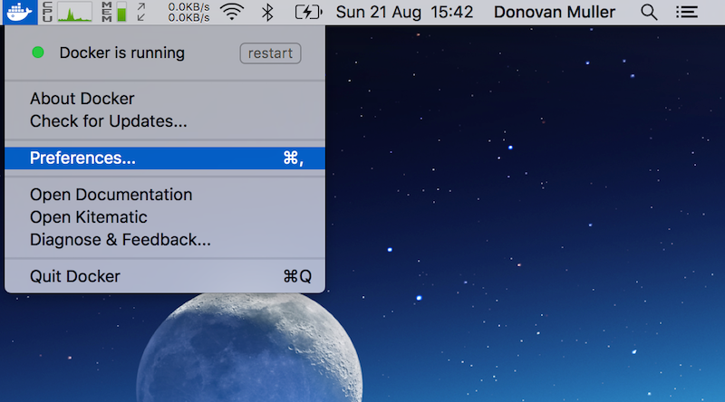
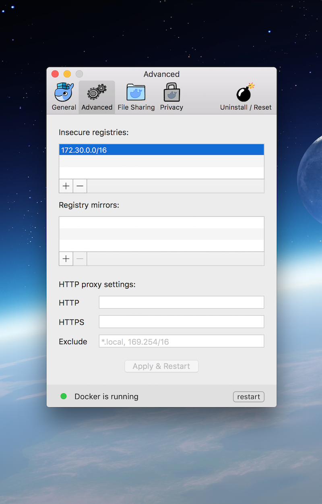
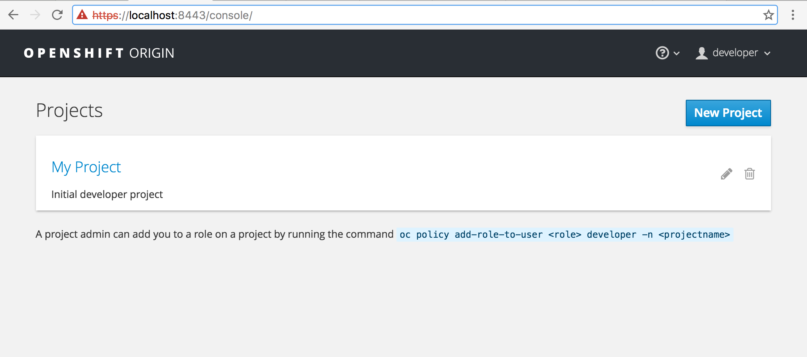
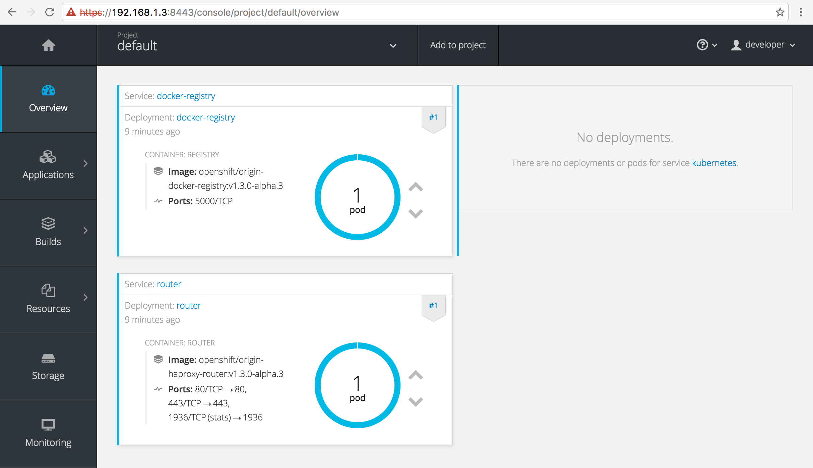

A quick step by step guide to getting a local, single node OpenShift cluster up and running with the `oc` CLI tools and Docker for Mac.

## The `oc`

If you've been to https://github.com/openshift/origin#openshift-application-platform latetly and gazed at the simplicity of installing a local OpenShift Origin cluster simply by typing `oc cluster up`, you'll no doubt want to try that out!

However, the current (as of August 21st, 2016) assumption is that you need [Docker Toolbox](https://www.docker.com/products/docker-toolbox) installed for this to work. Only thing is, if you like living on the bleeding edge, you'll no doubt be running [Docker for Mac](https://www.docker.com/products/docker#/mac).

So can we still use `oc cluster up`? Yes, yes you can.

### Installing

I use [Homebrew](http://brew.sh/) for installing apps on Mac, so I will explain how to get the `oc` CLI installed using `brew`. First you need to install the [_unstable_](https://github.com/Homebrew/brew/blob/master/share/doc/homebrew/Formula-Cookbook.md#devel) version of `oc`, which at the time of writing is `1.3.0-alpha.3` (thanks to [elyscape](https://github.com/Homebrew/homebrew-core/pull/3844)), with:

```
$ brew update
$ brew install --devel openshift-cli
```

this will install the `go` dependency if you don't have it already, pull the OpenShift source from GitHub and build the binaries.

You should now have `oc` on your path:

```
$ oc version
oc v1.3.0-alpha.3
kubernetes v1.3.0+507d3a7
features: Basic-Auth
```

## Cluster Up

Making sure you're Docker for Mac whale is snuggly nestled in your menu bar (I.e. Docker is running), execute the following:

```
$ oc cluster up
```

after some Docker image pulling, you will be greeted with this:

```
-- Checking OpenShift client ... OK
-- Checking Docker client ... OK
-- Checking for existing OpenShift container ... OK
-- Checking for openshift/origin:v1.3.0-alpha.3 image ...
   Pulling image openshift/origin:v1.3.0-alpha.3

...

   Pulled 3/3 layers, 100% complete
   Extracting
   Image pull complete
-- Checking Docker daemon configuration ... FAIL
   Error: did not detect an --insecure-registry argument on the Docker daemon
   Solution:

     Ensure that the Docker daemon is running with the following argument:
       	--insecure-registry 172.30.0.0/16

     You can run this command with --create-machine to create a machine with the
     right argument.
```

### Feeling a little insecure

Luckily adding `172.30.0.0/16` to the insecure registries for our Docker daemon is as easy as ever. Click the whale, hit "*Preferences*":



then add `172.30.0.0/16` to the insecure registries section under the "*Advanced*" tab:



hit "*Apply and Restart*" and wait for the Docker daemon to restart.

### Missing cat

Good to go, let's try again:

```
$ oc cluster up
-- Checking OpenShift client ... OK
-- Checking Docker client ... OK
-- Checking for existing OpenShift container ... OK
-- Checking for openshift/origin:v1.3.0-alpha.3 image ... OK
-- Checking Docker daemon configuration ... OK
-- Checking for available ports ... OK
-- Checking type of volume mount ...
   Using Docker shared volumes for OpenShift volumes
-- Checking Docker version ... OK
-- Creating host directories ... OK
-- Finding server IP ..
   Using 192.168.1.3 as the server IP
-- Starting OpenShift container ... FAIL
   Error: exec: "socat": executable file not found in $PATH
```

#### *Update - 2016-08-31*

The missing `socat` error below should be fixed with [this commit](https://github.com/Homebrew/homebrew-core/commit/7af538b36003fff29335585f0c734b7b90b6ec78) to the `openshift-cli` formula. The commit adds `socat` as a dependency and therefore `socat` will be installed as part of the `openshift-cli` install.

~~So close! Apparently we need [`socat`](http://www.dest-unreach.org/socat/) though. No worries, simply install with `brew`:~~

```
# don't need this anymore, see update ^
$ brew install socat
```

Let's give it one more try:

```
oc cluster up
-- Checking OpenShift client ... OK
-- Checking Docker client ... OK
-- Checking for existing OpenShift container ... OK
-- Checking for openshift/origin:v1.3.0-alpha.3 image ... OK
-- Checking Docker daemon configuration ... OK
-- Checking for available ports ... OK
-- Checking type of volume mount ...
   Using Docker shared volumes for OpenShift volumes
-- Checking Docker version ... OK
-- Creating host directories ... OK
-- Finding server IP ...
   Using 192.168.1.3 as the server IP
-- Starting OpenShift container ...
   Creating initial OpenShift configuration
   Starting OpenShift using container 'origin'
   Waiting for API server to start listening
   OpenShift server started
-- Installing registry ... OK
-- Installing router ... OK
-- Importing image streams ... OK
-- Importing templates ... OK
-- Login to server ... OK
-- Creating initial project "myproject" ... OK
-- Server Information ...
   OpenShift server started.
   The server is accessible via web console at:
       https://192.168.1.3:8443

   You are logged in as:
       User:     developer
       Password: developer

   To login as administrator:
       oc login -u system:admin
```

and there we have it, an OpenShift Origin cluster up and running.

You should be able to hit the OpenShift console at: https://localhost:8443/console/ * using the username and password `developer` to login.

** or whatever server IP was designated when starting up. In my example above it would be `192.168.1.3`*



## I need more power

By default the `developer` user does not have cluster administration rights. Which is why we only see the one project `My Project`.

A developer needs admin rights, so let's give it to him using the `oadm`/`oc adm` tool:

> If for some reason the `oadm` binary is not on your `$PATH`, you can also use `oc adm` which has identical functionality. Thanks to Matthias Lübken ([@luebken](https://twitter.com/luebken)) for the [suggestion](https://twitter.com/luebken/status/771724821562523648).

```
$ oc login -u system:admin
$ oadm policy add-cluster-role-to-user cluster-admin developer
$ -- OR --
$ oc adm policy add-cluster-role-to-user cluster-admin developer
```

First we login with the `admin` user which has  the correct privileges to grant the `cluster-admin` role and then add that role to `developer`. Now you should see all the projects and be able to poke around a bit:



## Finally

That's it, have fun...
When you're done, don't forget to `oc cluster down`.

This guide has been tested with these versions of Docker for Mac (1.12.0), `oc` (v1.3.0-alpha.3) and OSX El Capitan (10.11.6).