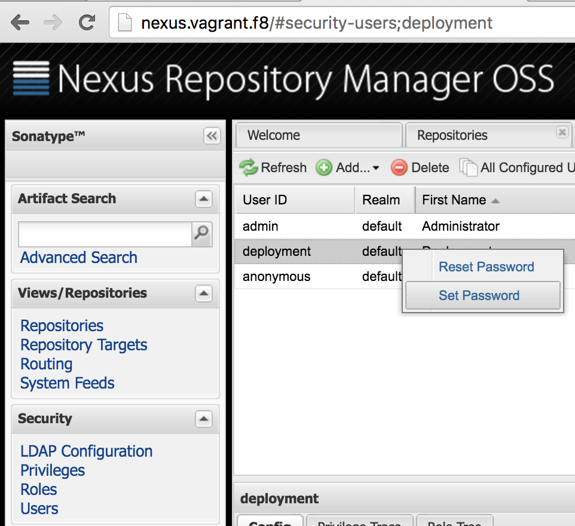
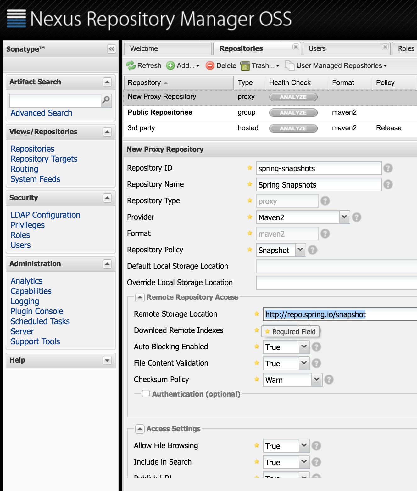
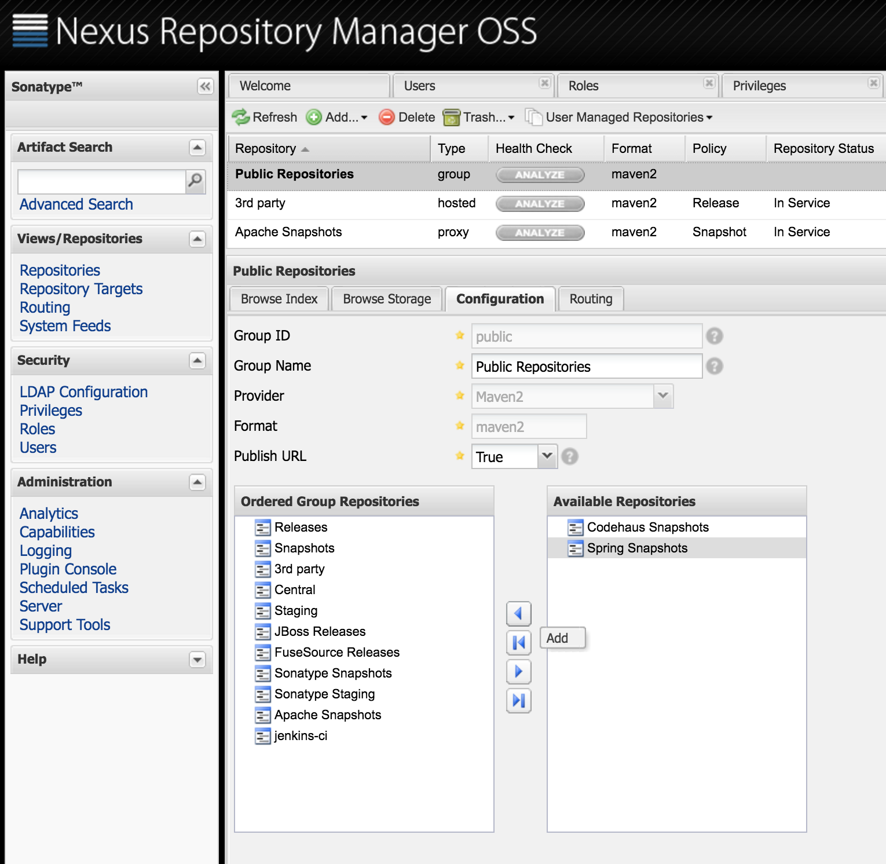
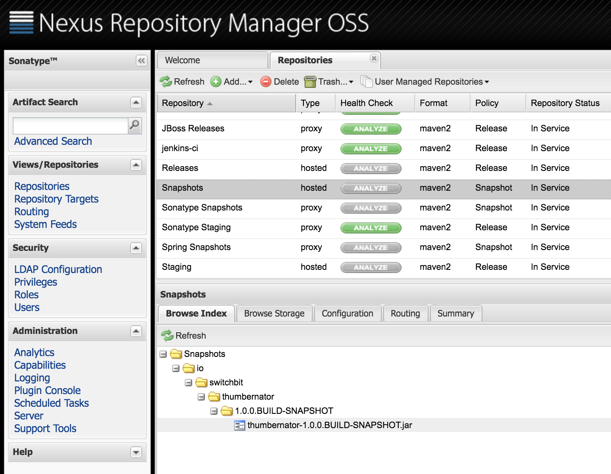
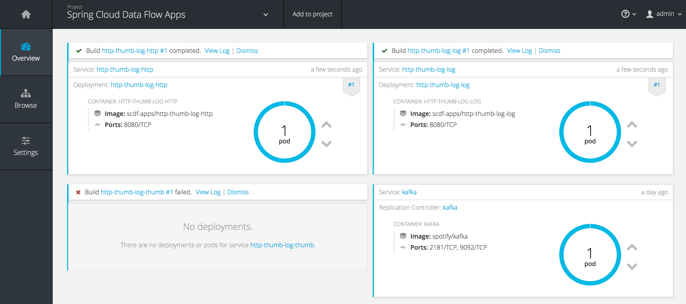
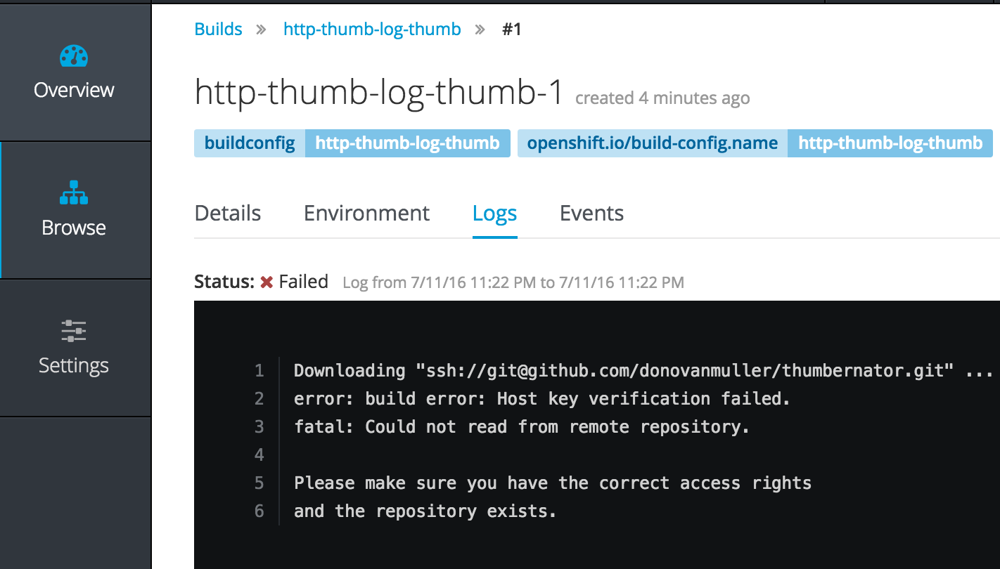
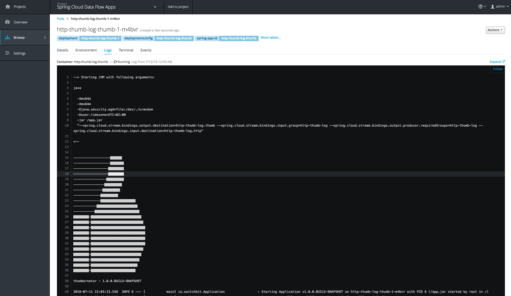
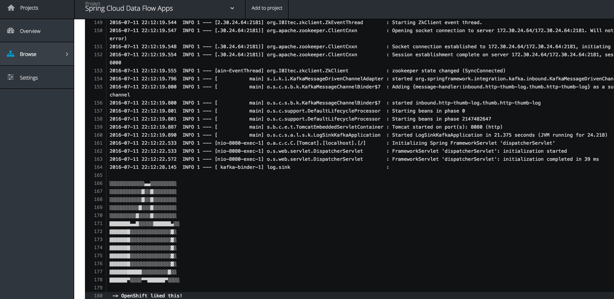

Using Spring Cloud Data Flow Server OpenShift, we will deploy a stream to OpenShift, including a custom Spring Cloud Stream processor application deployed to a local Nexus repository with a custom Dockerfile.

This post follows on from the introduction of Spring Cloud Data Flow Server OpenShift using Spring Cloud Deployer OpenShift. If you have not yet read the [previous post](https://donovanmuller.blog/spring-cloud-deployer-openshift), it is strongly recommended you do so.

> _Update (2017/02/19)_: Since this post was written, a [1.1.0](https://github.com/donovanmuller/spring-cloud-dataflow-server-openshift/releases/tag/v1.1.0.RELEASE) release of the [Spring Cloud Data Flow Server for OpenShift](https://github.com/donovanmuller/spring-cloud-dataflow-server-openshift) has been released. This release simplified the deployment of the server in an OpenShift environment using [Templates](https://docs.openshift.org/latest/dev_guide/templates.html) and should be considered the **recommended deployment mechanism**. For more information, see the ["Getting Started"](https://donovanmuller.github.io/spring-cloud-dataflow-server-openshift/docs/1.1.0.RELEASE/reference/htmlsingle#getting-started) section to deploy the server as well as the ["Deploying Custom Stream App as a Maven Resource"](https://donovanmuller.github.io/spring-cloud-dataflow-server-openshift/docs/1.1.0.RELEASE/reference/htmlsingle/#_deploying_custom_stream_app_as_a_maven_resource) section in context of this post.

## Thumbs and Dockerfiles

This post will introduce the "thumbernator" application. A Spring Cloud Stream [processor](http://docs.spring.io/spring-cloud-stream/docs/current/reference/htmlsingle/#__literal_source_literal_literal_sink_literal_and_literal_processor_literal) that augments the incoming message on the input channel with a 👍.

Useful? Nope, but it will help me demonstrate how you can use the OpenShift server/deployer to deploy an app built  and deployed with Maven to a local Nexus repository and which uses a custom `Dockerfile` for the image build on OpenShift.

### Nexus

In the previous post we used the [Fabric8 Vagrant box](http://fabric8.io/guide/getStarted/vagrant.html) for a local OpenShift instance. Conveniently, this configuration also includes a running [Nexus](http://www.sonatype.org/nexus/) instance. It is deployed under the `default` project/namespace and has a Route of http://nexus.vagrant.f8.

To simulate as closely as possible a "real" development environment (and to show the server/deployer's support for remote repository authentication), we will add some security to our Nexus instance. Go to http://nexus.vagrant.f8 and login with `admin`/`admin123`. Now open the "*Security*" accordion and select "*Users*". Right click on the "*deployment*" user and "*Set Password*" to `password`.



Granted, this isn't the most secure Nexus repo you'll ever encounter but it's ok for now. Besides, the Nexus instance is ephemeral and all your config will be blown away if you bounce your Vagrant VM.

Next we get a little ahead of ourselves and add a proxy repository for the Spring Snapshots repository. We will need this later. Hit Repositories and click "*Add*" then "*Proxy Repository*". Fill out the form as below:



Make sure you choose the "*Snapshot*" `Repository Policy` and a `Remote Storage Location` as "*http://repo.spring.io/snapshot*". Hit "*Save*" and your proxy record should become active. Now we just need to add it to the `Public Repositories` group, right click that repository and move the `Spring Snapshots` repo into the `Ordered Group Repositories` list on the left:



Ultimately this allows us to resolve Spring Cloud Stream Starter Apps (like the Http and Log OOTB applications) as well as our locally deployed apps through the same `http://nexus.vagrant.f8/content/groups/public` remote repository URL.

### Clone, build and dee ploy

Now that our Maven repository is primed, we can deploy our thumbernator application to it. 
First clone the source from GitHub:

```
$ git clone https://github.com/donovanmuller/thumbernator.git
``` 

Thanks to the pre-configured `.settings.xml` in the root of the project, you don't need to do anything to deploy the app to our local repo, well, except actually deploying it with:

```
$ cd thumbernator
$ ./mvnw -s .settings.xml deploy
```

You should get a `BUILD SUCCESS` and our thumbernator app successfully deployed:



## Boot'ing up the server

Our app is ready to go, so now we need to start up Spring Cloud Data Flow Server OpenShift (mouthful, isn't it):

*Please see the [previous post](https://donovanmuller.blog/spring-cloud-deployer-openshift/#deployingasimplestream) on the steps required to build the prerequisite projects and the spring-cloud-dataflow-server-openshift project.*

```
$ cd spring-cloud-dataflow-server-openshift/target
$ java -Dopenshift.url=https://172.28.128.4:8443 \
  -Dkubernetes.master=https://172.28.128.4:8443 \
  -Dkubernetes.trust.certificates=true \
  -Dkubernetes.auth.basic.username=admin \
  -Dkubernetes.auth.basic.password=admin \
  -jar spring-cloud-dataflow-server-openshift-1.0.0.BUILD-SNAPSHOT.jar \
  --spring.cloud.deployer.kubernetes.namespace=scdf-apps \
  --maven.resolvePom=true \
  --maven.remote-repositories.nexus.url=http://nexus.vagrant.f8/content/groups/public \
  --maven.remote-repositories.nexus.auth.username=deployment \
  --maven.remote-repositories.nexus.auth.password=password \
  --maven.requestTimeout=1800000
```

Note the few extra options this time around. The `maven.remote-repositories.nexus.` family of properties now point to our local Nexus repository and include the authentication details. We also set the `maven.requestTimeout` property, which gives our Nexus repository some extra time to download the Spring Stream Starter Apps from http://repo.spring.io/snapshot. Depending on your bandwidth, it could take too long to download these artifacts the first time around and cause your Build to fail with `504 GATEWAY TIMEOUT` errors.

## Thumbs away

Almost there. Next let's fire up the Spring Cloud Data Flow Shell and register the apps we'll use in our stream:

```
$ java -jar spring-cloud-dataflow-shell-1.0.0.BUILD-SNAPSHOT.jar
...

dataflow:>app register --name http --type source --uri maven://org.springframework.cloud.stream.app:http-source-kafka:1.0.0.BUILD-SNAPSHOT
Successfully registered application 'source:http'

dataflow:>app register --name thumb --type processor --uri maven://io.switchbit:thumbernator:1.0.0.BUILD-SNAPSHOT
Successfully registered application 'processor:thumb'

dataflow:>app register --name log --type sink --uri maven://org.springframework.cloud.stream.app:log-sink-kafka:1.0.0.BUILD-SNAPSHOT
Successfully registered application 'sink:log'
```

Note the thumbernator app registered as a `processor`. Also note that we register the OOTB `http` and `log` apps using their Spring Snapshot repository URI's (e.g. `org.springframework.cloud.stream.app:http-source-kafka:1.0.0.BUILD-SNAPSHOT`). This is where the previous step of configuring a `Spring Snapshots` proxy repository in Nexus becomes quite important. Currently, the OpenShift deployer only supports a single remote Maven repository (with `--maven.remote-repositories.`). This being the case, the deployer would not be able to resolve the BUILD-SNAPSHOT builds of the OOTB apps *and* our thumbernator artifact, if it were not for our proxy repository and the `Public Repositories` group configured in Nexus.


Next let's define our stream:

```
dataflow:>stream create --name http-thumb-log --definition "http | thumb | log"
Created new stream 'http-thumb-log'
```

*The stream definition, Http and Log apps are described in more detail in the [previous post](https://donovanmuller.blog/spring-cloud-deployer-openshift). Please [read that post](https://donovanmuller.blog/spring-cloud-deployer-openshift/#astreamdefined) first if you are not sure what is going on here.*

Straightforward, we'll accept an HTTP POST, send that to the thumbernator and then log the output (or input, depending on your viewpoint).

Finally, let's deploy our stream:

```
dataflow:>stream deploy http-thumb-log
Deployed stream 'http-thumb-log'
```

Great! Our stream is deployed and we're ready to pull finger...



no, no wait. Our thumbernator app failed to build.
But why?



*It goes without saying that you will not be able to clone the thumbernator app from my repo, unless you get hold of my private key, which I hope you don't. However, you could push the thumbernator app to your own GitHub (or even Bitbucket) account and replace the repository references where applicable.*

Hmm, looks like we couldn't authenticate when trying to clone the source from GitHub. Darn. 

Wait... what is actually going on here? Why is it trying to clone from GitHub when the artifact is in Nexus?

## Custom Dockerfile builds

To answer that, we need to cast our mind back to the previous post, to the part describing how [Dockerfile resolution works](https://donovanmuller.blog/spring-cloud-deployer-openshift/#dockerfileresolution). In particular, the second point is relevant here:

> If `src/main/docker/Dockerfile` is detected in the Maven artifact Jar, then it is assumed that the `Dockerfile` will exist in that location in a remote Git repository. In that case, the [Git repository source](https://docs.openshift.org/latest/dev_guide/builds.html#source-code) is used in conjunction with the Docker build strategy. The remote Git URI and ref are extracted from the `<scm><connection></connection></scm>` and `<scm><tag></tag></scm>` tags in the `pom.xml` (if available) of the Maven Jar artifact. For example, if the `<scm><connection>` value was `scm:git:git@github.com:spring-cloud/spring-cloud-dataflow.git`, then the remote Git URI would be parsed as `ssh://git@github.com:spring-cloud/spring-cloud-dataflow.git`. In short, **the `Dockerfile` from the remote Git repository for the app being deployed will be used (OpenShift actually clones the Git repo) as the source for the image build.** Of course, you can include and customise whatever and however you like in this `Dockerfile`.

If you look at the thumbernator project on GitHub, there is indeed a [`src/main/docker/Dockerfile`](https://github.com/donovanmuller/thumbernator/tree/master/src/main/docker). Which means the `<scm><connection>` value was extracted from the [`pom.xml`](https://github.com/donovanmuller/thumbernator/blob/master/pom.xml#L18) and used as the Git URI for the [Git repository source](https://docs.openshift.org/latest/dev_guide/builds.html#source-code) for the OpenShift build.

Urm ok, so what. Well the whole point of this is so that we can use a custom `Dockerfile` to build our app. If you look at the [`Dockerfile`](https://github.com/donovanmuller/thumbernator/blob/master/src/main/docker/Dockerfile) for the thumbernator app:

```
FROM java:8

VOLUME /tmp
ADD entrypoint.sh /entrypoint.sh
RUN bash -c 'chmod a+rx /entrypoint.sh'

ENTRYPOINT ["/entrypoint.sh"]

RUN wget --quiet --user ${repo_auth_username} \
  --password ${repo_auth_password} \
  --content-disposition \
  -O /app.jar \
  "http://nexus.vagrant.f8/service/local/artifact/maven/redirect?r=public&g=${app_groupId}&a=${app_artifactId}&v=${app_version}"

RUN bash -c 'chmod a+rx /app.jar'
```

you can see it is slightly different to the default [`Dockerfile`](https://github.com/donovanmuller/spring-cloud-deployer-openshift/blob/master/src/main/resources/Dockerfile) provided by the OpenShift deployer.

For one, it is copying in a script ([entrypoint.sh](https://github.com/donovanmuller/thumbernator/blob/master/src/main/docker/entrypoint.sh)) as the entrypoint. Second, it is using a [Nexus API](https://repository.sonatype.org/nexus-restlet1x-plugin/default/docs/path__artifact_maven_redirect.html) call to download the Maven artifact Jar. This is actually quite important because the default `Dockerfile` provided by the deployer will not work with a Nexus repository, like it works for the [Spring repo's](https://repo.spring.io/snapshot/), which use [Artifactory](https://www.jfrog.com/open-source/).

In other words, this is how you can use your own crafted `Dockerfile` instead of the default or having to specify a `Dockerfile` inline as per the other resolution options.

### Shhh, it's a secret

Now we know the why, we need to solve the how.
How do we provide a private key for Git to use when cloning a remote repository?

Well, that's pretty easy. It's a [secret](https://docs.openshift.org/latest/dev_guide/builds.html#ssh-key-authentication). No, really. We just need to create a SSH auth secret in OpenShift and reference that when kicking off the build.

For this post I'm just going to copy a private key associated with my GitHub account, from my machine to the `/vagrant` share (the Vagrantfile location on *your* machine) and then create the secret using the `oc` CLI tool in a SSH session on the Vagrant VM. 

*This is probably not the best thing to do security wise so please **take caution** when copying your private key around.*

```
$ cp ~/.ssh/id_rsa_github <your fabcric8 clone>/fabric8-installer/vagrant/openshift
$ vagrant ssh
[vagrant@vagrant ~]$ oc secrets new-sshauth github-ssh-secret --ssh-privatekey=/vagrant/id_rsa_github
secret/github-ssh-secret
```

Now we just need to undeploy our current `http-thumb-log` stream definition and recreate it indicating the source secret to use:

```
dataflow:>stream undeploy http-thumb-log
Un-deployed stream 'http-thumb-log'
dataflow:>stream deploy http-thumb-log --properties "app.thumb.spring.cloud.deployer.openshift.build.git.secret=github-ssh-secret,app.http.spring.cloud.deployer.openshift.createRoute=true,app.http.spring.cloud.deployer.openshift.deployment.route.host=http.vagrant.f8"
Deployed stream 'http-thumb-log'
```

Note the deployment property `app.thumb.spring.cloud.deployer.openshift.build.git.secret=github-ssh-secret` which indicates that the `thumb` app should include the "github-ssh-secret" source secret.

The `http` and `log` apps built successfully last time, so they don't get another build but rather just get deployed using the existing image. Our `thumb` build can now clone our source, using SSH authentication to GitHub with our "github-ssh-secret" secret.

*The current implementation only supports cloning a remote repository using the ssh:// scheme. HTTPS support will be added in future.*

## Thumbs up

Our build should now complete successfully and start up our `thumb` app:



We can see our custom `entrypoint.sh` script starting the app and how about that banner! 😃

Also note the command line arguments passed to the Spring Boot app (`--spring.cloud.stream.bindings.xxx`). The binder input/output destinations are built and provided by the Data Flow Server when the definition was parsed. This is the beauty of this platform, there is no magic, nothing you couldn't do yourself, just a well thought out implementation. I would add a thumbs up emoji right about now but I think we've got enough of those. So 👏

Let's test this stream out by pointing a HTTP request at it and see what happens:

```
dataflow:>http post --data "OpenShift liked this!" --target http://http.vagrant.f8/
> POST (text/plain;Charset=UTF-8) http://http.vagrant.f8/ OpenShift liked this!
> 202 ACCEPTED
```

and if we check the `log` apps, urm, log:



there it is. Considered yourself 👍'd.

## Conclusion

Our pointless (but awesome) thumbernator app demonstrated how we can resolve local apps deployed to a Nexus repository and how we can implement a custom `Dockerfile` for the OpenShift build kicked off by the OpenShift deployer.

This functionality is must in a "real" environment, where the default `Dockerfile` might not suffice.

The thumbernator app can be found on GitHub: https://github.com/donovanmuller/thumbernator

## What's Next

Whilst using the Shell (or [UI](http://localhost:9393/dashboard/index.html)) to create and deploy stream/task definitions is convenient, it's probably not going to scale to deploying in teams etc.

Next up will be a [Bamboo](https://www.atlassian.com/software/bamboo) plugin that will enable deployment of stream/task definitions and even stand alone Boot apps (the deployer is actually not coupled to Data Flow at all).

👍