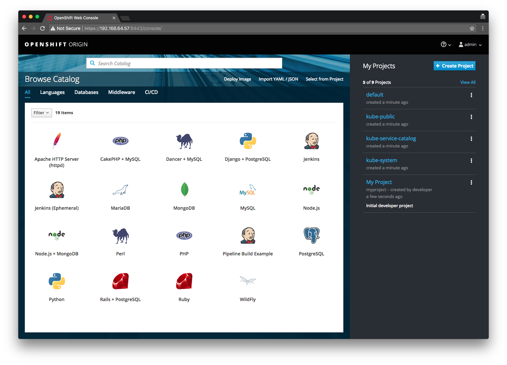
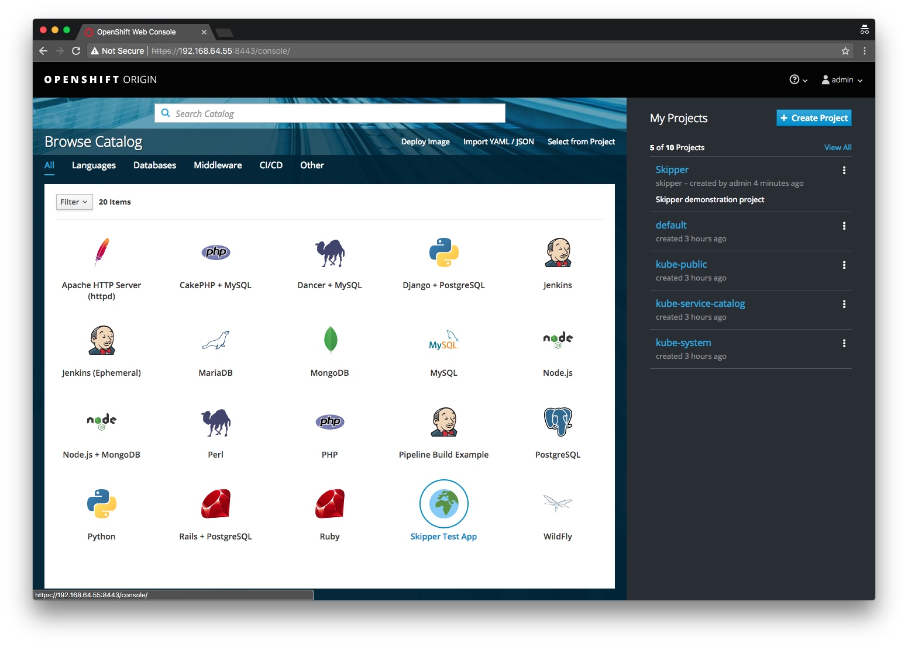
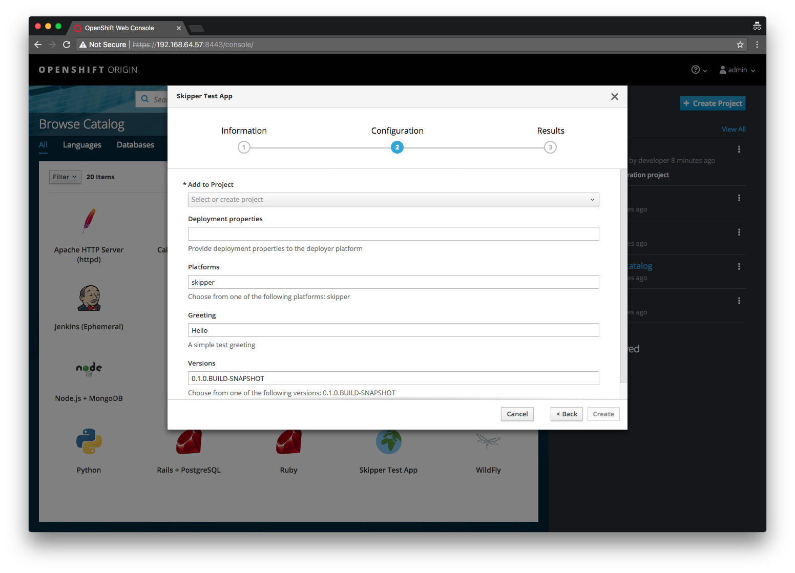
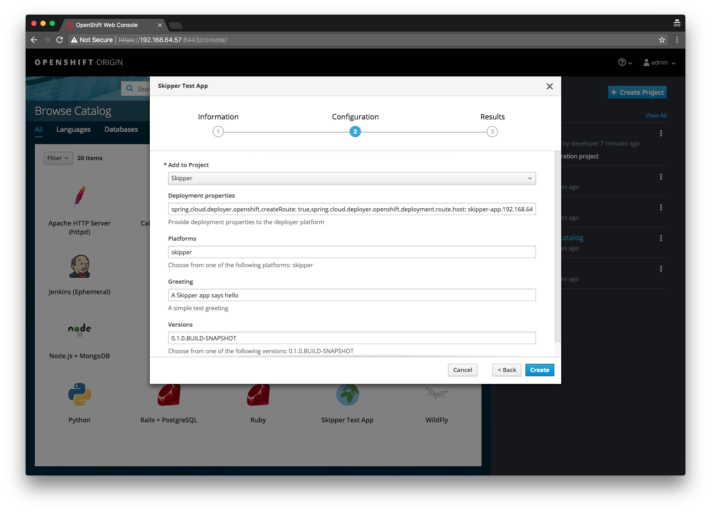
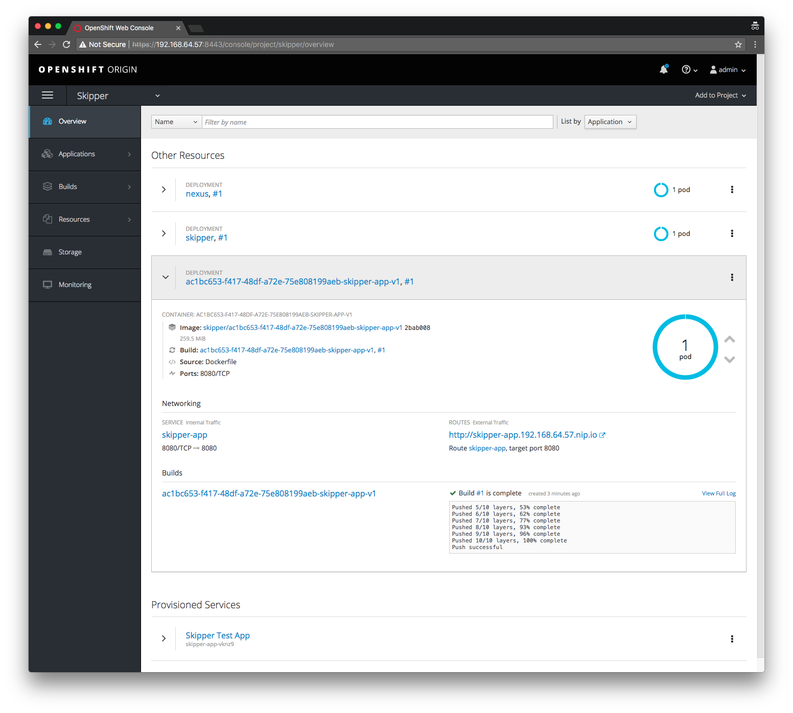
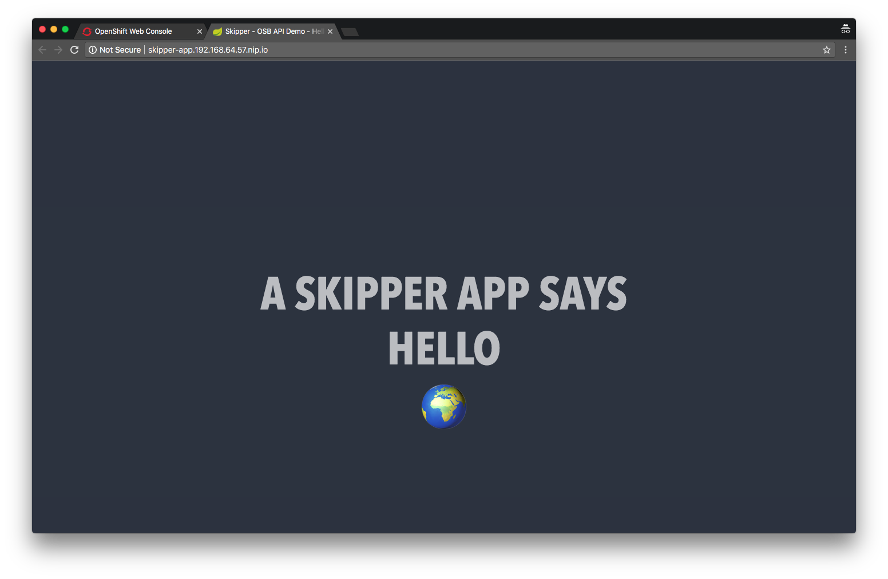
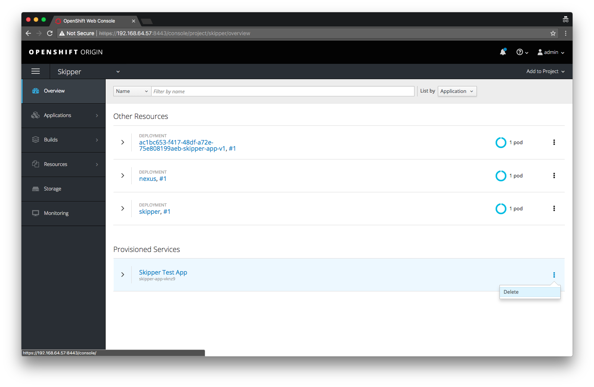

Kubernetes recently added support for the Open Service Broker API. Spring Cloud Skipper, an equally new project, provides a Continuous Delivery platform to deploy Spring Boot based applications to cloud platforms. Eager to play around with both, I combine both topics in the ubiquitous "hello world" demonstration with OpenShift.

## Open Service Broker API

The Open Service Broker API initiative was [announced](https://www.openservicebrokerapi.org/blog/2016/12/13/open-service-broker-api-launches-as-industry-standard) late in 2016 and established a working group to foster an industry standard for provisioing and wiring services into modern cloud native platforms.

So what exactly is the Cloud Foundry Service Broker API? An article from The New Stack entitled ["Cloud Foundry’s Service Broker API Role in Kubernetes and Open Source Platforms"](https://thenewstack.io/cloud-foundrys-service-broker-api-role-in-kubernetes-and-open-source-platforms/) puts it quite succinctly.

> *Think of it as a clean abstraction that allows “services” to expose a catalog of capabilities, as well as the ability to create, use and delete those services...* - The New Stack: Cloud Foundry’s Service Broker API Role in Kubernetes and Open Source Platforms

Traditionally a feature in [Cloud Foundry](https://www.cloudfoundry.org/why-cloud-foundry-is-making-the-open-service-broker-api-even-more-open-2/) it is now available in Kubernetes and OpenShift. I won't go into too much detail around the Open Service Broker API but the [GitHub repository](https://github.com/openservicebrokerapi/servicebroker) has a wealth of information, including the actual specification.

This post will focus on the OpenShift implementation of the Open Service API.

### OpenShift

OpenShift introduced support for the [Service Catalog](https://docs.openshift.org/latest/architecture/service_catalog/index.html) work done in the upstream Kubernetes project through a new catalog interface in the OpenShift Web Console.

This "app store" like catalog, exposes the Services offered by the configured Service Brokers. Let's see this in action by running a local instance of OpenShift 3.7 using the `minishift` CLI tool.

First, [install `minishift`](https://docs.openshift.org/latest/minishift/getting-started/installing.html) for your platform (I'm using the macOS install for the rest of this post). Once installed we need to:

* enable the `admin-user` and `anyuid` [addons](https://docs.openshift.org/latest/minishift/using/addons.html) (to assign `cluster-admin` role to the `admin` user and allow Pods to run as the root user) 
* enable the [experimental features](https://docs.openshift.org/latest/minishift/using/experimental-features.html) (to allow the option to install the `service-catalog`)
* and then finally start an OpenShift Origin 3.7 instance with:

```console
$ minishift --profile skipper addons enable admin-user
$ minishift --profile skipper addons enable anyuid
$ minishift --profile skipper addons list
- admin-user     : enabled    P(0)
- anyuid         : enabled    P(0)
- registry-route : disabled   P(0)
- xpaas          : disabled   P(0)

$ export MINISHIFT_ENABLE_EXPERIMENTAL=y
$ minishift start --profile skipper --service-catalog --openshift-version=v3.7.0 --cpus=4 --memory=4096
...
Image pull complete
OpenShift server started.

The server is accessible via web console at:
    https://192.168.64.49:8443

You are logged in as:
    User:     developer
    Password: <any value>

To login as administrator:
    oc login -u system:admin

-- Waiting for persistent volumes to be created ... OK

-- Applying addon 'admin-user':..

-- Applying addon 'anyuid':.
 Add-on 'anyuid' changed the default security context constraints to allow pods to run as any user.
 Per default OpenShift runs containers using an arbitrarily assigned user ID.
 Refer to https://docs.openshift.org/latest/architecture/additional_concepts/authorization.html#security-context-constraints and
 https://docs.openshift.org/latest/creating_images/guidelines.html#openshift-origin-specific-guidelines for more information.
$
```

Once the install has completed, open the console and login as the `admin` user with `admin`/`admin`. You should be presented with the Catalog.



Where did all these items, like MariaDB, MongoDb, etc., come from? As mentioned the Catalog provides an interface that exposes the Services available from the configured Service Brokers. So it goes to reason that these items (or Services) are coming from some Service Broker(s) right? Correct. There is a default [Template Service Broker](https://docs.openshift.org/latest/architecture/service_catalog/template_service_broker.html#arch-template-service-broker) that exposes the bundled OpenShift [Templates](https://docs.openshift.org/latest/dev_guide/templates.html#dev-guide-templates) as Services.

You can use the `oc` CLI tool to get all Service Brokers:

```console
# In the Web Console, go to Help > Command Line Tools and copy the 'oc login ...' value
$ oc login ...
$ oc get clusterservicebrokers
NAME                      KIND
template-service-broker   ClusterServiceBroker.v1beta1.servicecatalog.k8s.io
```

Note the `template-service-broker` as described above, as well as the fact that Service Broker resources in OpenShift/Kubernetes are called `clusterservicebrokers`.

> To prove that the items in the Catalog are Templates provided as Services made available by the Template Service Broker, you can delete the `template-service-broker` and see what happens: 
```console
$ oc delete clusterservicebrokers/template-service-broker
clusterservicebroker "template-service-broker" deleted
```
> go back to the web console and note that most of the items in the Catalog have been removed.

Going back to the web console Catalog, click some of the items and note the workflow of provisioning Services.

## A Spring Experiment

🤔  So... what would it look like if I wanted to create my own Service Broker? What if that Service Broker could provide a way to deploy uploaded Spring Boot apps to OpenShift, simply by navigating the Catalog?

That sounds like a good excuse to learn more about the Open Service Broker API as well as play around with [Spring Cloud Skipper](https://github.com/spring-cloud/spring-cloud-skipper), a new project that is *... package manager that installs, upgrades, and rolls back applications on multiple Cloud Platforms.* 

Our experiment will conceptually work like this:

1. We will retrofit a fork of Spring Cloud Skipper to act as a Service Broker that adheres to the Open Service Broker API (v2.13), which we will be deployed to the OpenShift instance we just started.
2. We will take a demo application, zip it up into a Skipper package and upload it to our Skipper instance.
3. Once uploaded, it will appear in the OpenShift web console Catalog where we can select and deploy the application.

## Skipper

Spring Cloud Skipper is a new project born out of the Spring Cloud Data Flow project and inspired by [Helm](https://github.com/kubernetes/helm), the Kubernetes package manager. It aims to provide a Continuous Deployment friendly way of managing the deployment of Spring Boot applications. It incorprates features like versioned releases (with rollback) as well as various deployment strategies. I like to think of Skipper as `yum`, `apt-get` or `brew` for Spring Boot applications.

> For more information please refer to the [reference documentation](https://docs.spring.io/spring-cloud-skipper/docs/1.0.0.M3/reference/htmlsingle/) as well as [this session on YouTube](https://www.youtube.com/watch?v=X0EiedwdK7c) from SpringOne Platform 2017.

For our experiment, we'll use Skipper to deploy our demo application to OpenShift. Skipper makes this easy because we don't have to worry about the details around taking a Spring Boot application and running it in OpenShift. Thanks to the [Spring Cloud Deployer](https://github.com/spring-cloud/spring-cloud-deployer) abstraction used by Skipper, the deployment details can be handled by the [Spring Cloud Deployer for OpenShift](https://github.com/donovanmuller/spring-cloud-deployer-openshift). 

Our experiment calls for exposing Spring Boot applications uploaded to Skipper as an item presented on the OpenShift web console's Catalog. So what we need to do is expose our Skipper server using the Service Broker API, in the same way that the Template Service Broker exposed Templates as Services, we can expose Spring Boot applications as Services. Thankfully this is made quite simple thanks to yet another Spring Cloud project, namely the tongue twisting [Spring Cloud - Cloud Foundry Service Broker](https://github.com/spring-cloud/spring-cloud-cloudfoundry-service-broker) project. Basically by adding this project as a dependency to a Spring Boot application, it auto configures `@RestController`'s that adhere to the OSB (Open Service Broker) API specification and allows you to wire up beans that allow you to hook into the OSB lifecycle.

I've already done the work of integrating the deployment functionality of Skipper into the OSB lifecycle in the fork below. Go ahead and clone [my fork](https://github.com/donovanmuller/spring-cloud-skipper/tree/service-broker) and checkout the `service-broker` branch and have a look around. Look at [this commit](https://github.com/donovanmuller/spring-cloud-skipper/commit/797373ee33ea7f949a9decf972a777ce79984268) for the Service Broker specific changes.

```console
$ git clone https://github.com/donovanmuller/spring-cloud-skipper.git $ cd spring-cloud-skipper
spring-cloud-skipper $ git checkout service-broker
spring-cloud-skipper $
```

The interesting bits are in [`ServiceBrokerCatalogConfiguration`]() where the `CatalogService` bean is responsible for populating the `Catalog` with `ServiceDefinition`'s. A `ServiceDefinition` represents a registered Skipper package (application) in this context, as well as all the metadata describing the application. This metadata allows the web console Catalog to render an item and associated wizard for provisioning a Service Instance. In addition the [`ServiceBrokerInstanceService`](https://github.com/donovanmuller/spring-cloud-skipper/commit/797373ee33ea7f949a9decf972a777ce79984268#diff-58569827dad715b4958e0f706622590c) bean is wired in, which implements four lifecycle methods related to the OSB API:

```java
/**
 * Create (provision) a new service instance.
 */
CreateServiceInstanceResponse createServiceInstance(CreateServiceInstanceRequest request);

/**
 * Get the status of the last requested operation for a service instance.
 */
GetLastServiceOperationResponse getLastOperation(GetLastServiceOperationRequest request);

/**
 * Delete (deprovision) a service instance.
 */
DeleteServiceInstanceResponse deleteServiceInstance(DeleteServiceInstanceRequest request);
    
/**
 * Update a service instance. Only modification of the service plan is supported.
 */
UpdateServiceInstanceResponse updateServiceInstance(UpdateServiceInstanceRequest request);
```

In our experiment, only the `createServiceInstance`, `getLastOperation` and `deleteServiceInstance` are supported.

#### Skipper fork

Since all the Service Broker related development is done on `master` branch of Skipper and related projects, clone [my Skipper fork](https://github.com/donovanmuller/spring-cloud-skipper.git) and run the `spring-cloud-skipper-server/src/etc/openshift/install-snapshots.sh` script to install all the necessary artifacts to your local Maven repository:

```console
$ git clone https://github.com/donovanmuller/spring-cloud-skipper.git
$ cd spring-cloud-skipper
spring-cloud-skipper $ git checkout service-broker
spring-cloud-skipper $ ./spring-cloud-skipper-server/src/etc/openshift/install-snapshots.sh
...
spring-cloud-skipper $
```

Besides cloning and building all necessary dependent projects, it will also build and push a Skipper server Docker image to the minishift Docker daemon. Expect this whole process to take a bit of time depending on your network speed etc. 😴

### Deploying Skipper to OpenShift

Once that's all built and pushed, let's deploy our retrofitted Skipper server to our local OpenShift instance. This is trivial thanks to the `spring-cloud-skipper-server/src/etc/openshift/deploy-skipper.sh` script. Assuming you've already authenticated to your local OpenShift instance, run the script with:

```console
spring-cloud-skipper $ ./spring-cloud-skipper-server/src/etc/openshift/deploy-skipper.sh
Already on project "skipper" on server "https://192.168.64.55:8443".

You can add applications to this project with the 'new-app' command. For example, try:

    oc new-app centos/ruby-22-centos7~https://github.com/openshift/ruby-ex.git

to build a new example application in Ruby.
route "nexus" created
serviceaccount "skipper" created
deploymentconfig "nexus" created
service "nexus" created
configmap "skipper-config" created
deploymentconfig "skipper" created
service "skipper" created
route "skipper" created
role "edit" added: "system:serviceaccount:skipper:skipper"
spring-cloud-skipper $
```

This script executes the following:

1. Creates a `skipper` project
2. Processes and creates the resources from the `spring-cloud-skipper-server/src/etc/openshift/skipper-osb-nexus-template.yml` OpenShift Template, which includes:
    * Nexus instance so we can push our application artifacts for Skipper to resolve
    * Our Skipper instance with OSB API support
3. Assigns the `skipper` Service Account the correct permissions to enable the Skipper server to interact with the OpenShift API's to manage applications

Once the script has been executed, you should see both successful deployments (you may have to wait a while, depending on your network speed, for the images to pull):

```console
spring-cloud-skipper $ oc project skipper
Now using project "skipper" on server https://192.168.64.55:8443".
spring-cloud-skipper $ oc get dc
NAME      REVISION   DESIRED   CURRENT   TRIGGERED BY
nexus     1          1         1         config
skipper   1          1         1         config
spring-cloud-skipper $
```

You should also be able to access Nexus via the created Route:

```console
spring-cloud-skipper $ nexus_route_host=$(oc get route nexus --template={{.spec.host}} -n skipper)
spring-cloud-skipper $ curl -I ${nexus_route_host}
HTTP/1.1 200 OK
Server: Nexus/2.14.5-02
...
spring-cloud-skipper $
```

### A new Service Broker is born

Great, now that we're all set up, let's inform OpenShift that there's a new Service Broker that can't wait to provide some services. We do this by creating a `ClusterServiceBroker` resource . Let's have a look at that resource by looking at the `spring-cloud-skipper-server/src/etc/openshift/skipper-servicebroker.yml` file:

```yaml
apiVersion: servicecatalog.k8s.io/v1beta1
kind: ClusterServiceBroker
metadata:
  name: skipper-service-broker
spec:
  url: http://skipper.skipper.svc:7577
  relistBehavior: Duration
  relistDuration: 1s
```

Simple enough. Amongst other things, it has a `name` and a `url`, which points to the Service address of our running Skipper server. This is the most basic definition and I have purposely left out security and other properties for the purpose of this demo. See the [Service Catalog Demonstration Walkthrough](https://github.com/openshift/origin/blob/master/cmd/service-catalog/go/src/github.com/kubernetes-incubator/service-catalog/docs/walkthrough.md#step-2---creating-a-clusterservicebroker-resource) for a meatier example.

Now create this resource by running the following:

```console
spring-cloud-skipper $ oc create -f spring-cloud-skipper-server/src/etc/openshift/skipper-servicebroker.yml
clusterservicebroker "skipper-service-broker" created
spring-cloud-skipper $ 
```

Once this resource is created, OpenShift's Service Catalog will execute a `GET /v2/catalog` on our Skipper server and will return nothing at this point because we haven't uploaded any packages. You can test this yourself by `curl`'ing this for yourself:

```console
spring-cloud-skipper $ skipper_route_host=$(oc get route skipper --template={{.spec.host}} -n skipper)
spring-cloud-skipper $ curl -s ${skipper_route_host}/v2/catalog | jq .
{
  "services": []
}
```

The OSB API is actually quite simple. You can view the different workflows by viewing this diagram: https://github.com/openservicebrokerapi/servicebroker/blob/master/diagram.md

Just to make sure everything is 100% before moving on, let's see what OpenShift says about our Service Broker:

```console
spring-cloud-skipper $ oc get clusterservicebroker/skipper-service-broker -o yaml
apiVersion: servicecatalog.k8s.io/v1beta1
kind: ClusterServiceBroker
metadata:
  creationTimestamp: 2017-12-20T20:15:55Z
  finalizers:
  - kubernetes-incubator/service-catalog
  generation: 1
  name: skipper-service-broker
  resourceVersion: "207"
  selfLink: /apis/servicecatalog.k8s.io/v1beta1/clusterservicebrokers/skipper-service-broker
  uid: 956527f5-e5c2-11e7-902d-0242ac110003
spec:
  relistBehavior: Duration
  relistDuration: 1s
  relistRequests: 0
  url: http://skipper.skipper.svc:7577
status:
  conditions:
  - lastTransitionTime: 2017-12-20T20:15:55Z
    message: Error syncing catalog from ServiceBroker. Error getting catalog payload
      for broker "skipper-service-broker"; received zero services; at least one service
      is required
    reason: ErrorSyncingCatalog
    status: "False"
    type: Ready
  reconciledGeneration: 0
spring-cloud-skipper $
```

Note the "error", `Error getting catalog payload for broker skipper-service-broker"; received zero services; at least one service is required`. As expected, we don't have any services.... yet.

## Hello World

I have put together a very simple "Hello world" application that we will package up and upload to Skipper, which in turn will be presented on the OpenShift web console's Catalog via the OSB API.

Go ahead and clone this demo application:

```console
$ git clone https://github.com/donovanmuller/skipper-app.git
$ cd skipper-app
skipper-app $
```

As you can see this is a plain old Spring Boot 1.5.x web application. You can run the app with `./mvnw spring-boot:run` and navigate to http://localhost:8080 to see it in action.

### The Skipper package

For this application to be uploaded to Skipper and to be eligible for deployment, it must be represented by a Skipper package. In fact, it might be a good time to define a few of the Skipper concepts as simply as possible (see the [reference documentation](https://docs.spring.io/spring-cloud-skipper/docs/current/reference/htmlsingle/#_concepts) for a complete description):

* Platform - a deployment platform that has a Spring Cloud Deployer SPI implementation
* Repository - a persistent store where packages are kept
* Package - a zip file containing YAML files describing metatdata about the application as well as [application](https://docs.spring.io/spring-cloud-dataflow/docs/current/reference/htmlsingle/#_application_properties) and [deployment](https://docs.spring.io/spring-cloud-dataflow/docs/current/reference/htmlsingle/#_deployment_properties) properties in the context of Spring Cloud Data Flow.
* Release - a persistent handle to an instance of an installed package to an available platform. This allows you to upgrade, rollback and otherwise manage the lifecycle of an application.

To tell Skipper about our Hello World application we need to create a Skipper package to represent it. As mentioned a package is simply a zip archive of YAML files. The package structure looks like this:

```console
skipper-app-0.1.0.BUILD-SNAPSHOT
├── package.yml
├── templates
│   └── template.yml
└── values.yml
```

As simple as the structure and content of the package are, the only current method of creating this structure is doing it by hand (to my knowledge). Therefore I have written a [Spring Cloud Skipper Maven plugin](https://github.com/donovanmuller/spring-cloud-skipper-maven-plugin) to help build a Skipper package. This plugin can be found here:

https://github.com/donovanmuller/spring-cloud-skipper-maven-plugin

It contains [templates](https://github.com/donovanmuller/spring-cloud-skipper-maven-plugin/tree/master/src/main/resources/skipper) for the common package files and uses the Maven project values to populate much of the template properties (`project.artifactId`, `project.version`, etc.). It also provides the ability to override any of these template files in the project if you need to tweak or add properties. This plugin is configured to run on the `package` phase in our demo application's [`pom.xml`](https://github.com/donovanmuller/skipper-app/blob/master/pom.xml#L94). Let's package our application now and see the Skipper package that get's generated:

``` console
skipper-app $ ./mvnw package
...
[INFO]
[INFO] --- maven-jar-plugin:2.6:jar (default-jar) @ skipper-app ---
[INFO] Building jar: /Users/donovan/dev/git/switchbit/blog/skipper-app/target/skipper-app-0.1.0.BUILD-SNAPSHOT.jar
[INFO]
[INFO] --- spring-boot-maven-plugin:1.5.9.RELEASE:repackage (default) @ skipper-app ---
[INFO]
[INFO] --- spring-cloud-skipper-maven-plugin:0.1.0.BUILD-SNAPSHOT:skipper-package (default) @ skipper-app ---
[INFO] Packaging application [skipper-app] for Spring Cloud Skipper
[INFO] Skipper package available at /.../skipper-app/target/skipper/skipper-app-0.1.0.BUILD-SNAPSHOT.zip
[INFO] ------------------------------------------------------------------------
[INFO] BUILD SUCCESS
[INFO] ------------------------------------------------------------------------
skipper-app $
```

Let's have a look at the package files:

```console
skipper-app $ unzip target/skipper/skipper-app-0.1.0.BUILD-SNAPSHOT.zip -d /tmp
skipper-app $ cat /tmp/skipper-app-0.1.0.BUILD-SNAPSHOT/templates/template.yml
apiVersion: skipper.spring.io/v1
kind: SpringCloudDeployerApplication
metadata:
  name: skipper-app
spec:
  resource: maven://io.switchbit:skipper-app:{{version}}
  resourceMetadata: maven://io.switchbit:skipper-app:jar:metadata:{{version}}
  version: {{version}}
...
skipper-app $
```

Note that the `metadata.name` and `spec.resource` values are populated with the values from our Maven POM.

```console
skipper-app $ cat /tmp/skipper-app-0.1.0.BUILD-SNAPSHOT/package.yml
apiVersion: skipper.spring.io/v1
kind: SkipperPackageMetadata
name: skipper-app
displayName: Skipper Test App
version: 0.1.0.BUILD-SNAPSHOT
packageSourceUrl: https://github.com/donovanmuller/skipper-app
packageHomeUrl: https://github.com/donovanmuller/skipper-app
tags: spring, spring cloud
maintainer: https://github.com/donovanmuller
description: Testing an app deployed via Spring Cloud Skipper
iconUrl: https://upload.wikimedia.org/wikipedia/commons/d/d7/Twemoji2_1f30d.svg
skipper-app $ cat /tmp/skipper-app-0.1.0.BUILD-SNAPSHOT/values.yml
version: 0.1.0.BUILD-SNAPSHOT
spec:
  deploymentProperties:
    spring.cloud.deployer.openshift.service.name: skipper-app
skipper-app $    
```

Similarly, the properties in `package.yml` and `values.yml` are populated from our POM properties.

### Application properties

The astute reader might have noticed an additional property in `template.yml` above, spcifically the `resourceMetadata: maven://io.switchbit:skipper-app:jar:metadata:{{version}}` property. I'm highlighting this property because it is used to surface any [application properties](https://docs.spring.io/spring-cloud-dataflow/docs/current/reference/htmlsingle/#_application_properties) in the wizard driven UI when provisioning the application through the OpenShift Catalog. We'll see this in action soon but for interest, this is how it works:

1. Use the `spring-cloud-app-starter-metadata-maven-plugin` to generate a metadata JAR containing *all* properties mined from our application as well as a [whitelist](https://github.com/donovanmuller/skipper-app/blob/master/src/main/resources/META-INF/spring-configuration-metadata-whitelist.properties) of properties we'd like to surface
2. This metadata artifact is referenced in our `template.yml` as mentioned above via the `resourceMetadata` property
3. The retrofitted Skipper server resolves this artifact on deploy and extracts all the whitelisted properties via a [`BootApplicationConfigurationMetadataResolver`](https://github.com/spring-cloud/spring-cloud-dataflow/blob/master/spring-cloud-dataflow-configuration-metadata/src/main/java/org/springframework/cloud/dataflow/configuration/metadata/BootApplicationConfigurationMetadataResolver.java) from the Spring Cloud Data Flow project and adds it to the OSB Service Definition model returned as part of the Catalog

## Say hello already

Finally we get to the meat of this nautical themed sandwich. Let's use our newly minted Skipper package and upload it to the `local` repository. To do that we're going to use the Skipper Shell. First though, let's Maven deploy our application to our Nexus repository so the Skipper server can resolve our app:

```console
skipper-app $ nexus_route_host=$(oc get route nexus --template={{.spec.host}} -n skipper)
skipper-app $ ./mvnw -s .settings.xml \
  deploy \
  -Dnexus.url=http://${nexus_route_host}/content/repositories/snapshots/ \
  -DskipTests
...
[INFO]
[INFO] --- maven-deploy-plugin:2.8.2:deploy (default-deploy) @ skipper-app ---
...
Uploading to nexus: http://nexus-skipper.192.168.64.55.nip.io/content/repositories/snapshots/io/switchbit/skipper-app/0.1.0.BUILD-SNAPSHOT/skipper-app-0.1.0.BUILD-20171221.071129-1.jar
Uploaded to nexus: http://nexus-skipper.192.168.64.55.nip.io/content/repositories/snapshots/io/switchbit/skipper-app/0.1.0.BUILD-SNAPSHOT/skipper-app-0.1.0.BUILD-20171221.071129-1.jar (16 MB at 18 MB/s)
Uploading to nexus: http://nexus-skipper.192.168.64.55.nip.io/content/repositories/snapshots/io/switchbit/skipper-app/0.1.0.BUILD-SNAPSHOT/skipper-app-0.1.0.BUILD-20171221.071129-1.pom
Uploaded to nexus: http://nexus-skipper.192.168.64.55.nip.io/content/repositories/snapshots/io/switchbit/skipper-app/0.1.0.BUILD-SNAPSHOT/skipper-app-0.1.0.BUILD-20171221.071129-1.pom (5.7 kB at 85 kB/s)
...
Uploading to nexus: http://nexus-skipper.192.168.64.55.nip.io/content/repositories/snapshots/io/switchbit/skipper-app/0.1.0.BUILD-SNAPSHOT/skipper-app-0.1.0.BUILD-20171221.071129-1-metadata.jar
Uploaded to nexus: http://nexus-skipper.192.168.64.55.nip.io/content/repositories/snapshots/io/switchbit/skipper-app/0.1.0.BUILD-SNAPSHOT/skipper-app-0.1.0.BUILD-20171221.071129-1-metadata.jar (39 kB at 683 kB/s)
...
[INFO] ------------------------------------------------------------------------
[INFO] BUILD SUCCESS
[INFO] ------------------------------------------------------------------------  
skipper-app $
```

Next, go to the root of your retrofitted Skipper clone and execute the following:

```console
spring-cloud-skipper $ ./mvnw install -DskipTests
...
spring-cloud-skipper $ skipper_route_host=$(oc get route skipper --template={{.spec.host}} -n skipper)
spring-cloud-skipper $ java -jar spring-cloud-skipper-shell/target/spring-cloud-skipper-shell-1.0.0.BUILD-SNAPSHOT.jar --spring.cloud.skipper.client.uri=http://${skipper_route_host}/api
skipper:> platform list
╔═══════╤═════════╤═════════════════════════════════════════════════════════════════════════════════════════╗
║ Name  │  Type   │                                       Description                                       ║
╠═══════╪═════════╪═════════════════════════════════════════════════════════════════════════════════════════╣
║skipper│openshfit│master url = [https://kubernetes.default.svc/], namespace = [skipper], api version = [v1]║
╚═══════╧═════════╧═════════════════════════════════════════════════════════════════════════════════════════╝

skipper:> search
╔════╤═══════╤═══════════╗
║Name│Version│Description║
╚════╧═══════╧═══════════╝

skipper:>
```

The above connects the Skipper Shell to our Skipper instance running in our... `skipper` OpenShift. You can see we only have one platform available, which is using the [Spring Cloud Skipper Deployer for OpenShift](https://github.com/donovanmuller/spring-cloud-skipper-deployer-openshift) \*. We also have no package uploaded. Let's fix that:

```console
skipper:> upload --path /.../skipper-app/target/skipper/skipper-app-0.1.0.BUILD-SNAPSHOT.zip --repo-name local
Package uploaded successfully:[skipper-app:0.1.0.BUILD-SNAPSHOT]
skipper:>search
╔═══════════╤════════════════════╤════════════════════════════════════════════════╗
║   Name    │      Version       │                  Description                   ║
╠═══════════╪════════════════════╪════════════════════════════════════════════════╣
║skipper-app│0.1.0.BUILD-SNAPSHOT│Testing an app deployed via Spring Cloud Skipper║
╚═══════════╧════════════════════╧════════════════════════════════════════════════╝

skipper:>
```

Referencing the Skipper package we built above, we simply upload it to Skipper to the `local` repository.

Now head back to your OpenShift web console and open up the Catalog. You should see our demo application:



Go ahead and click the Skipper Test App catalog item. Click *Next* (note the description text from our POM) and you should see the below form:



Of interest is the `Greeting` field, which is an application property from our application containing the default greeting value. Fill out the form as follows:

* Add to Project - Select the `skipper` project
* Deployment properties - Add the following value:
    * `spring.cloud.deployer.openshift.createRoute: true,spring.cloud.deployer.openshift.deployment.route.host: skipper-app.192.168.64.55.nip.io` - this informs the OpenShift deployer to create a [Route](https://docs.openshift.org/latest/dev_guide/routes.html) with the URL of http://skipper-app.192.168.64.55.nip.io so that we can access our application
* Greeting - Let's spice up the greeting a bit, enter the following (or whatever floats your boat): `A Skipper app says hello`



Now click *Create*!
Then follow the *Continue to the project overview* link. If everything goes well, you should see our demo application deployed and running after it has been [built](https://donovanmuller.github.io/spring-cloud-dataflow-server-openshift/docs/1.2.1.RELEASE/reference/htmlsingle/#_support_for_maven_resource):



Let's go back to the Skipper Shell and verify that our application has a release and all is good:

```console
skipper:>list
╔════════════════════════════════════╤═══════╤══════════════════════════╤════════╤═══════════╤════════════════════╤════════════╤══════════════════════════════════════════════════════════════════════╗
║                Name                │Version│       Last updated       │ Status │  Package  │  Package Version   │  Platform  │                           Platform Status                            ║
║                                    │       │                          │        │   Name    │                    │    Name    │                                                                      ║
╠════════════════════════════════════╪═══════╪══════════════════════════╪════════╪═══════════╪════════════════════╪════════════╪══════════════════════════════════════════════════════════════════════╣
║ac1bc653-f417-48df-a72e-75e808199aeb│1      │Thu Dec 21 17:45:58 SAST  │DEPLOYED│skipper-app│0.1.0.BUILD-SNAPSHOT│skipper     │[ac1bc653-f417-48df-a72e-75e808199aeb-skipper-app-v1], State =        ║
║                                    │       │2017                      │        │           │                    │            │[unknown]                                                             ║
╚════════════════════════════════════╧═══════╧══════════════════════════╧════════╧═══════════╧════════════════════╧════════════╧══════════════════════════════════════════════════════════════════════╝

skipper:>history --release-name ac1bc653-f417-48df-a72e-75e808199aeb
╔═══════╤═════════════════════════════╤════════╤════════════╤════════════════════╤════════════════╗
║Version│        Last updated         │ Status │Package Name│  Package Version   │  Description   ║
╠═══════╪═════════════════════════════╪════════╪════════════╪════════════════════╪════════════════╣
║1      │Thu Dec 21 17:45:58 SAST 2017│DEPLOYED│skipper-app │0.1.0.BUILD-SNAPSHOT│Install complete║
╚═══════╧═════════════════════════════╧════════╧════════════╧════════════════════╧════════════════╝

skipper:>
```

Note that the [Service Instance](https://github.com/openservicebrokerapi/servicebroker/blob/v2.13/spec.md#provisioning) Id has become the release name.
Back to the OpenShift web console and click the Route URL and you should also see your greeting:



Finally, let's clean things up by selecting the kabob menu next to our service instance under Provisioned Services and click *Delete*:



Your service instance/application should be undeployed.

## Conclusion

This experiment was an oppurtunity to explore two new things, the Open Service Broker API as implemented by OpenShift/Kubernetes and Spring Cloud Skipper for deploying Spring Boot applications in a consistent, Continuous Deployment friendly, cross platform way.

Hopefully you've learnt something, I certainly did. 
If you have any feedback please don't hesitate to let me know on Twitter at [@donovancmuller](https://twitter.com/donovancmuller). 👍
