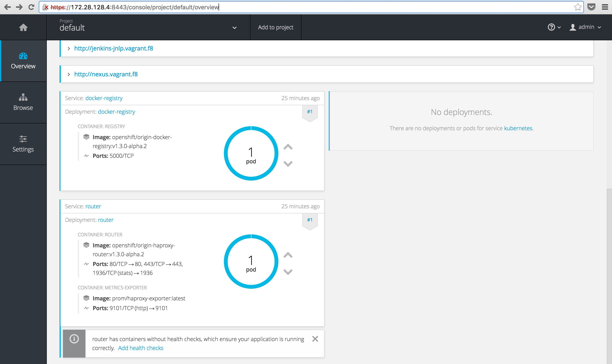
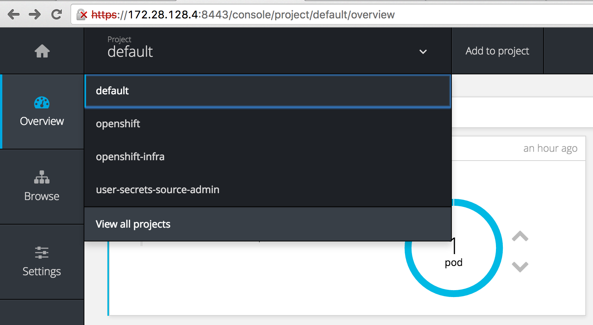
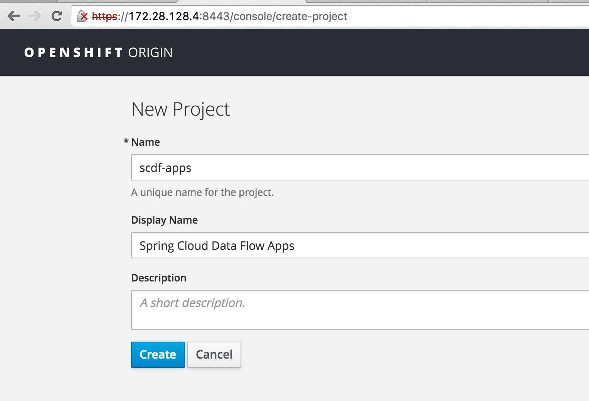
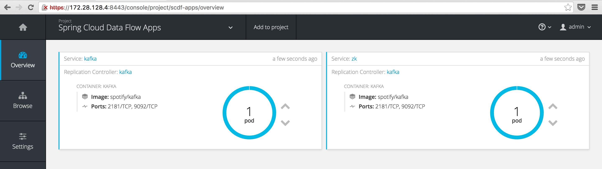
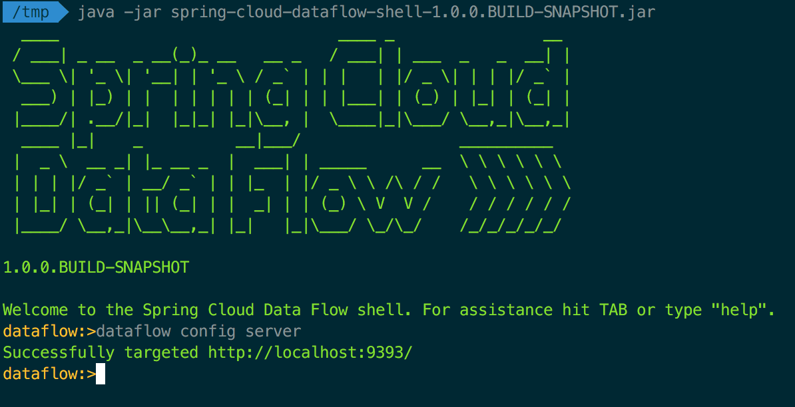
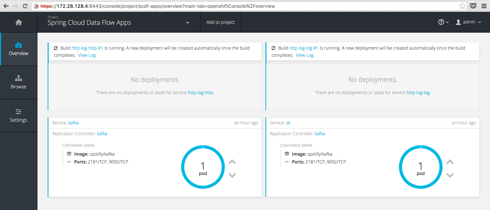
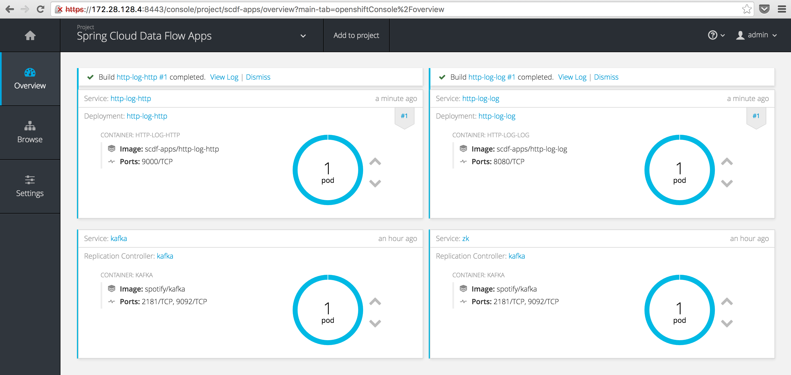
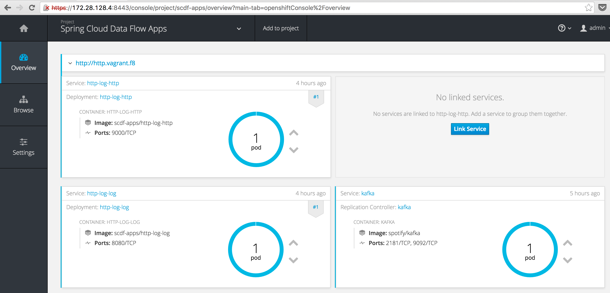
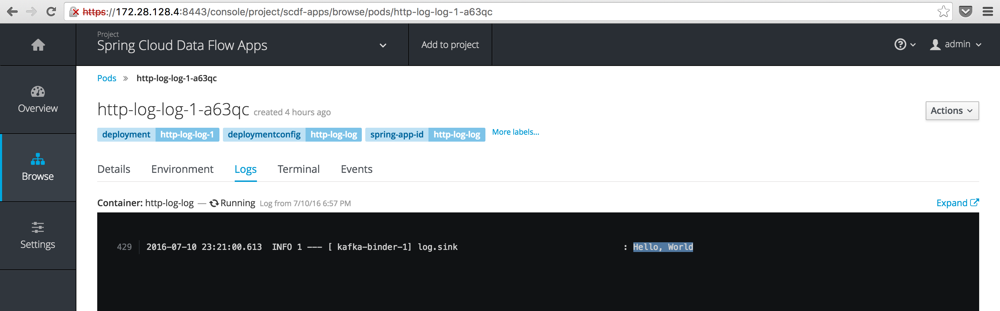

A Spring Cloud Deployer SPI implementation which extends Spring Cloud Deployer Kubernetes adding support for OpenShift 3 and with that the ability to accept both Docker *and* Maven resources.

> _Update (2017/02/19)_: Since this post was written, a [1.1.0](https://github.com/donovanmuller/spring-cloud-dataflow-server-openshift/releases/tag/v1.1.0.RELEASE) release of the [Spring Cloud Data Flow Server for OpenShift](https://github.com/donovanmuller/spring-cloud-dataflow-server-openshift) has been released. This release simplified the deployment of the server in an OpenShift environment using [Templates](https://docs.openshift.org/latest/dev_guide/templates.html) and should be considered the **recommended deployment mechanism**. For more information, see the reference documentation and specifically the ["Getting Started"](https://donovanmuller.github.io/spring-cloud-dataflow-server-openshift/docs/1.1.0.RELEASE/reference/htmlsingle#getting-started) section.

## Some ApplicationContext.png

I've been following the progress of the [Spring Cloud Data Flow](http://cloud.spring.io/spring-cloud-dataflow/) project for some time, with great interest. The concept of composing singularly focused, yet standalone apps, into a directed graph (defined as a [stream](http://cloud.spring.io/spring-cloud-stream/) or [task](http://cloud.spring.io/spring-cloud-task/)) of functionality encompassing a bounded context (in DDD terms), rather excites me.

With the project's roots sprouting from [Spring XD](http://projects.spring.io/spring-xd/), the obvious application of SCDF (Spring Cloud Data Flow) is stream processing data pipelines and the like. In other words, source data, process or analyse that data and then sink the processed/analysed data in some store or messaging system for further processing. However, my intended use of this project extends beyond this to also include building "microservices" comprising of finer grained components (apps) and composing them using SCDF. I.e. with a "catalogue" of very focused applications, have the ability to compose a stream/task definition from these applications that fulfills the larger scoped functionality required.

Spring Cloud Data Flow builds off the foundation of [Spring Cloud Stream](https://blog.pivotal.io/pivotal-cloud-foundry/products/spring-cloud-stream-the-new-event-driven-microservice-framework), a framework for building event driven microservice applications, as well as [Spring Cloud Task](https://spring.io/blog/2016/01/27/introducing-spring-cloud-task), a framework to support short lived microservices.

*From here on out, we will use a stream definition to demonstrate the OpenShift deployer. Launching a Task will form the content of another future post. However, most of the functionality implemented for stream deployment is the same for launching tasks.*

## Deploying all the things

SCDF makes composing these directed graphs or flows (either of the stream or task variety) quite easy by using the same pipe syntax used by most *nix shells. For instance to compose a stream definition consisting of a Http source application and a Log sink application, you would define that stream as follows:

```
http | log

```

In case you're wondering where the [Http](https://github.com/spring-cloud/spring-cloud-stream-app-starters/tree/master/http/spring-cloud-starter-stream-source-http) and [Log](https://github.com/spring-cloud/spring-cloud-stream-app-starters/tree/master/log/spring-cloud-starter-stream-sink-log) applications came from, there are a number of out-of-the-box applications provided by the [Spring Cloud Stream App Starters](https://github.com/spring-cloud/spring-cloud-stream-app-starters) project. There are Rabbit MQ and Kafka binders variants for each application.

Once the stream definition is defined, it is the responsibility of the Data Flow Server to interpret it and convert that into an [`AppDeploymentRequest`](https://github.com/spring-cloud/spring-cloud-deployer/blob/master/spring-cloud-deployer-spi/src/main/java/org/springframework/cloud/deployer/spi/core/AppDeploymentRequest.java) which is then passed through one of the deployer implementations to actually deploy the applications to the target environment.

### Data Flow server?

The [Spring Cloud Deployer](https://github.com/spring-cloud/spring-cloud-deployer) project contains the core logic and an SPI to deploy a stream/task definition to an environment. There are currently 5 implementations supporting deployment environments like Cloud Foundry, YARN, Mesos and Kubernetes. There is also a Local server for debugging purposes.

The server runs as a standalone Spring Boot app (like *all* other apps do as well) and has a RESTful API through which applications like the Spring Cloud Data Flow Shell and UI use to manage and deploy streams/tasks.

## OpenShift

Kubernetes is a great project for scheduling containers and [OpenShift 3](https://www.openshift.org/) builds off the Kubernetes foundation and adds a few extra bits and bobs which help with the developer experience around getting code into containers, as well as with beefing up security and other "enterprisey" concerns.

Fortunately, as mentioned, there is a [Kubernetes deployer](https://github.com/spring-cloud/spring-cloud-deployer-kubernetes) for SCDF. As OpenShift is basically Kubernetes, one might think that you would be able to use the Kubernetes deployer to deploy to OpenShift...

Unfortunately, this is not the case. There are slight API differences that prevent the existing Kubernetes deployer from authenticating etc. 💩 What to do?

## Spring Cloud OpenShift Deployer

Using the Kubernetes deployer as a base, I've implemented an [OpenShift deployer](https://github.com/donovanmuller/spring-cloud-deployer-openshift) for SCDF. It does (almost) everything the Kubernetes deployer does but also adds some nice functionality that is possible with OpenShift. Here are some of the key features currently implemented:

* Most functionality currently in the Kubernetes deployer to support deploying `docker:` resources
* Using the OpenShift BuildConfig/Build resources, add the ability to support `maven://` resources, which are built and then deployed as containers
* Use OpenShift specific resources like [ImageStream](https://docs.openshift.org/latest/architecture/core_concepts/builds_and_image_streams.html#image-streams), [DeploymentConfig](https://docs.openshift.org/latest/architecture/core_concepts/deployments.html#deployments-and-deployment-configurations), Route etc. to better support rolling updates, exposing pods via load balancers and such.

The next sections will walk you through how to deploy `maven://` resources with the OpenShift deployer. Probably the biggest feature of the OpenShift deployer.

### Getting Started

Spring Cloud Data Flow and Deployer are still under heavy development (as of writing) as the team forges on to a 1.0.0 release for SCDF. This, together with the fact that I have made a few modifications to aid in extending the Kubernetes deployer, means for now you first need to build my forked versions of the following two projects:

* [spring-cloud-deployer](https://github.com/donovanmuller/spring-cloud-deployer) - donovanmuller/spring-cloud-deployer
* [spring-cloud-deployer-kubernetes](https://github.com/donovanmuller/spring-cloud-deployer-kubernetes) - donovanmuller/spring-cloud-deployer-kubernetes

There are minor changes to make extending/reusing certain methods easier as well as a requirement to be able to resolve the `.pom` Maven artifact in addition to the `.jar`. 

The following PR's address the modifications:

* ~~Add ability to resolve pom extensions in spring-cloud-deployer [[#94](https://github.com/spring-cloud/spring-cloud-deployer/pull/94)]~~ merged as [fac89fe](https://github.com/spring-cloud/spring-cloud-deployer/commit/fac89fe55dc4292615d3443f75b49192e51a6c55)
* ~~Make spring-cloud-deployer-kubernetes more extendable [[#40](https://github.com/spring-cloud/spring-cloud-deployer-kubernetes/pull/40)]~~

First, clone and install both projects:

```
$ git clone https://github.com/donovanmuller/spring-cloud-deployer-kubernetes.git && \
  cd spring-cloud-deployer-kubernetes && \
  ./mvnw install

$ git clone https://github.com/donovanmuller/spring-cloud-deployer.git && \
  cd spring-cloud-deployer && \
  ./mvnw install
```

If all goes well, you should have two `BUILD SUCCESS`'s.

### Local OpenShift instance

One of the easiest ways to get an OpenShift instance up and running is to use one of the Vagrant images available. Most should work but I'm using the [Fabric8 OpenShift box](http://fabric8.io/guide/getStarted/vagrant.html). 

Follow [these instructions](http://fabric8.io/guide/getStarted/vagrant.html#how-to-vagrant-up) to stand up a local instance configured with a registry, router and other components that will come in handy in later posts.

Once you're done (might take a while depending on your bandwidth) you should be able to access (ignore the self signed certiticate, login credentials are `admin`/`admin`) the OpenShift console with a URL similar too: https://172.28.128.4:8443/console/



### Kafka

We will be using the Kafka binder for our apps, so we need to run an instance of Kafka on our OpenShift instance. This is pretty easy, thanks to predefined templates included in the [spring-cloud-dataflow-server-kubernetes](spring-cloud-dataflow-server-kubernetes) project under [`src/etc/kubernetes`](spring-cloud-dataflow-server-kubernetes/src/etc/kubernetes).

First, let's create a new project (a namespace in Kubernetes terms) to hold our Data Flow streams/tasks as the `default` project is a little cluttered at this point. Click the projects dropdown and select "*View all projects*"



then click the "*New Project*" button on the projects listing page. Fill out the form:



and "*Create*" the new project.

To run these templates through OpenShift we will use the `oc` [CLI tool](https://docs.openshift.org/latest/cli_reference/index.html) (basically `kubectl` with some added features for OpenShift) included with the OpenShift install. First clone the [spring-cloud-dataflow-server-kubernetes](spring-cloud-dataflow-server-kubernetes) project, then copy the Kafka templates to the location of your Fabric8 Vagrantfile (this location is [shared by default](https://www.vagrantup.com/docs/synced-folders/) by Vagrant from your Vagrantfile directory to `/vagrant` inside the VM).

```
$ git clone https://github.com/spring-cloud/spring-cloud-dataflow-server-kubernetes.git && \
  cd spring-cloud-dataflow-server-kubernetes && \
  cp src/etc/kubernetes/kafka-* <your cloned fabric8 location>/fabric8-installer/vagrant/openshift

$ cd <your cloned fabric8 location>/fabric8-installer/vagrant/openshift
```

then, `ssh` into your Vagrant OpenShift VM, authenticate your `oc` session, change to our `scdf-apps` project and create our Kafka resources: 

```
$ vagrant ssh
[vagrant@vagrant vagrant]$ oc login
Server [https://localhost:8443]:
The server uses a certificate signed by an unknown authority.
You can bypass the certificate check, but any data you send to the server could be intercepted by others.
Use insecure connections? (y/n): y

Authentication required for https://localhost:8443 (openshift)
Username: admin
Password:
Login successful.

You have access to the following projects and can switch between them with 'oc project <projectname>':

  * default (current)
  * openshift
  * openshift-infra
  * scdf-apps
  * user-secrets-source-admin

Using project "default".
Welcome! See 'oc help' to get started.

[vagrant@vagrant vagrant]$ oc project scdf-apps
Now using project "scdf-apps" on server "https://localhost:8443".
[vagrant@vagrant vagrant]$ oc create -f /vagrant/kafka-controller.yml
replicationcontroller "kafka" created
[vagrant@vagrant vagrant]$ oc create -f /vagrant/kafka-service.yml
service "kafka" created
service "zk" created
```

It might take moment to pull the Kafka image but eventually you should have a Kafka pod and services running bright blue (why not choose green? ;))



## Deploying a simple stream

Infrastructure in place, let's deploy some streams.
The last projects to clone are the OpenShift deployer SPI implementation and the OpenShift Data Flow server.

```
$ git clone https://github.com/donovanmuller/spring-cloud-deployer-openshift.git && \
  cd spring-cloud-deployer && \
  ./mvnw install

$ git clone https://github.com/donovanmuller/spring-cloud-dataflow-server-openshift.git && \
  cd spring-cloud-deployer && \
  ./mvnw package
```
Once the spring-cloud-dataflow-server-openshift project is successfully built. It's time to fire up our Data Flow server:

```
$ cd spring-cloud-dataflow-server-openshift/target
$ java -Dopenshift.url=https://172.28.128.4:8443 \
  -Dkubernetes.master=https://172.28.128.4:8443 \
  -Dkubernetes.trust.certificates=true \
  -Dkubernetes.auth.basic.username=admin \
  -Dkubernetes.auth.basic.password=admin \
  -jar spring-cloud-dataflow-server-openshift-1.0.0.BUILD-SNAPSHOT.jar \
  --spring.cloud.deployer.kubernetes.namespace=scdf-apps \
  --maven.resolvePom=true \
  --maven.remote-repositories.spring.url=http://repo.spring.io/snapshots
```

if all goes well you should see the OpenShift Data Flow server started up successfully:

```
... INFO 24706 --- [           main] s.b.c.e.t.TomcatEmbeddedServletContainer : Tomcat started on port(s): 9393 (http)
... INFO 24706 --- [           main] o.s.c.d.s.k.OpenShiftDataFlowServer      : Started OpenShiftDataFlowServer in 10.004 seconds (JVM running for 10.512)
```

Next, we'll use the Data Flow shell to add our stream definition and issue the deploy command. Download the shell:

```
$ wget http://repo.spring.io/snapshot/org/springframework/cloud/spring-cloud-dataflow-shell/1.0.0.BUILD-SNAPSHOT/spring-cloud-dataflow-shell-1.0.0.BUILD-SNAPSHOT.jar
```

and run it:

```
$ java -jar spring-cloud-dataflow-shell-1.0.0.BUILD-SNAPSHOT.jar
```

you should see some ascii art and the Data Flow shell prompt. Note that the shell will connect to a Data Flow server on the default endpoint of `http://localhost:9393`:



### Registering

Before we can define our stream, we need to tell the Data Flow server what apps it has available. This is done with the `app register` command. Go ahead and register the Http and Log apps with the commands below:

```
dataflow:>app register --name http --type source --uri maven://org.springframework.cloud.stream.app:http-source-kafka:1.0.0.BUILD-SNAPSHOT
Successfully registered application 'source:http'

dataflow:>app register --name log --type sink --uri maven://org.springframework.cloud.stream.app:log-sink-kafka:1.0.0.BUILD-SNAPSHOT
Successfully registered application 'sink:log'
```

Note that we register the apps with a URI starting with `maven://`.
Usually when using the Kubernetes deployer you would only be able to use the `docker:` URI when [registering apps](http://docs.spring.io/spring-cloud-dataflow-server-kubernetes/docs/current-SNAPSHOT/reference/htmlsingle/#_deploying_streams_on_kubernetes) but because of the [Build/BuildConfig](https://docs.openshift.org/latest/dev_guide/builds.html) objects in OpenShift, we can support handling `maven://` URI's. The Maven artifacts referenced by the `maven://` URI will be included in an image build by OpenShift and the resulting image is deployed to OpenShift (as if it were a `docker:` URI registered app)

### A stream, defined

Finally we can compose our Http and Log apps into a stream:

```
dataflow:>stream create --name http-log --definition "http --server.port=9000 | log"
Created new stream 'http-log'
```

Quite straightforward, give our stream a name (`--name http-log`) and then the actual pipe delimited definition (`--definition "http --server.port=9000 | log"`). 

How this reads is: 

> Create a new stream with `http-log` as the name to reference it with later. 
This stream is defined as having a `http` source app, listening on port 9000 (overriding the default port of 8080, as you would in any Spring Boot app) which, upon receiving a HTTP POST, will send the request body to it's Spring Cloud Stream defined binding output. The output of the `http` app will then be "piped" (really it's just a automatic mapping of the output/input binder destinations by the Data Flow Server) into the input of the `log` app, which will log the content of the input message.

The mechanics of how the Data Flow Server performs this "automatic" binding of input/output destinations on the Spring Cloud Stream binders is something for another post. However, have a look at the [`StreamDeploymentController`]((https://github.com/spring-cloud/spring-cloud-dataflow/blob/master/spring-cloud-dataflow-server-core/src/main/java/org/springframework/cloud/dataflow/server/controller/StreamDeploymentController.java#L211) for more information.

### Go, go, go

Now, the reason we're all here.

```
dataflow:>stream deploy http-log
Deployed stream 'http-log'
```

if all goes well you should notice that two new builds are triggered in our `scdf-apps` project:



The builds might take quite a while the first time due to the number of images it needs to pull.

### Build, build what? From where?

You might be wondering how OpenShift knows how to build our app image and where the app is actually been sourced from? Is a Maven build being kicked off?

Well the answer is no (by default but you could make it do that). What is happening is that the default [Docker build strategy](https://docs.openshift.org/latest/dev_guide/builds.html#docker-strategy-options) is being used with the default [`Dockerfile`](?) provided by the OpenShift Data Flow Server as the [Dockerfile input source](https://docs.openshift.org/latest/dev_guide/builds.html#dockerfile-source) to the build. This default `Dockerfile` looks like this:

```
# Based on: https://spring.io/guides/gs/spring-boot-docker/
FROM java:8

VOLUME /tmp

RUN wget --user ${repo_auth_username} \
  --password ${repo_auth_password} \
  --content-disposition -O /app.jar \
  "${app_resource_url}"

RUN bash -c 'chmod a+rx /app.jar'

ENTRYPOINT ["java", "-Djava.security.egd=file:/dev/./urandom", "-jar", "/app.jar"]
```

Using a `java:8` base image, a .jar file referenced by the `${app_resource_url}` environment variable is downloaded to `/app.jar`. `${app_resource_url}` is set by the OpenShift Deployer based on the remote repository configured as well as other URI information. Then as the `ENTRYPOINT` to the container, the app is run with the equivalent of `java -jar /app.jar`.

### The Route of the problem

By the time you've read this, hopefully your build would have completed and you will have two shiny new pods running happily:



There's only one problem. We cannot actually reach our `http-log-http` pod from the outside world. 🤔

In Kubernetes terms you would have to indicate to your Service that you require a LoadBalancer. In OpenShift, similar functionality is fulfilled using a [Route](https://docs.openshift.org/latest/dev_guide/routes.html). Basically automatically triggered configurations on an internal HAProxy instance that can route from the "outside", in.

To create a Route resource for our `http` app, we first need to undeploy our first attempt with:

```
dataflow:>stream undeploy http-log
Un-deployed stream 'http-log'
```

Now, let's pass a hint to the deployer to create a Route resource when it deploys the `http` app next time:

```
dataflow:>stream deploy http-log --properties "app.http.spring.cloud.deployer.openshift.createRoute=true,app.http.spring.cloud.deployer.openshift.deployment.route.host=http.vagrant.f8"
Deployed stream 'http-log'
```

Note we actually passed two deployer properties, `app.http.spring.cloud.deployer.openshift.createRoute=true` which indicated that the deployer needs to create a Route for this app and `app.http.spring.cloud.deployer.openshift.deployment.route.host` which indicates the `host` value to use for the exposed Route. I.e. the URL the outside world will use to access the `http` app. We used `http.vagrant.f8` because `*.vagrant.f8` is the resolveable domain exposed by the Fabric8 Vagrant box with the help of the [landrush plugin](https://github.com/vagrant-landrush/landrush) (using OSX the plugin works seamlessly, other platforms may be slightly more fiddly).

You should now see your exposed `http` app with the following URL: http://http.vagrant.f8:



Finally, let's test our deployed stream by POST'ing some data to it:

```
dataflow:>http post --data "Hello, World" --target http://http.vagrant.f8
> POST (text/plain;Charset=UTF-8) http://http.vagrant.f8 Hello, World
> 202 ACCEPTED
```

The Data Flow shell has some built in HTTP client capabilities which we can use to POST some data to our app. In this case the obligatory "Hello, World". If we check the container logs for the `log` app, we should see our boring message:



### Look ma, no builds

When redeploying the `http-log` stream, did you notice that there was *no build triggered*. Why is that? 

The OpenShift deployer saves a hash of the Maven Jar artifact being used in the build. Before a new build is triggered, the current build artifact is hashed and if the hashes match (i.e. exactly the same Jar artifact as before), no build is triggered and the existing image is reused. The hash algorithm used is the same hashing applied by Maven itself, SHA-1.

### Dockerfile resolution

As described in the Build section, the default strategy for resolving a Dockerfile is to use the built in Dockerfile included in the OpenShift deployer. However, there are three other strategies available:

* If a remote Git URI is specified when creating the stream/task definition using the `spring.cloud.deployer.openshift.build.git.uri` property, this repository will be used and takes highest precedence.

* If `src/main/docker/Dockerfile` is detected in the Maven artifact Jar, then it is assumed that the `Dockerfile` will exist in that location in a remote Git repository. In that case, the [Git repository source](https://docs.openshift.org/latest/dev_guide/builds.html#source-code) is used in conjunction with the Docker build strategy. The remote Git URI and ref are extracted from the `<scm><connection></connection></scm>` and `<scm><tag></tag></scm>` tags in the `pom.xml` (if available) of the Maven Jar artifact. For example, if the `<scm><connection>` value was `scm:git:git@github.com:spring-cloud/spring-cloud-dataflow.git`, then the remote Git URI would be parsed as `ssh://git@github.com:spring-cloud/spring-cloud-dataflow.git`. In short, the `Dockerfile` from the remote Git repository for the app being deployed will be used (OpenShift actually clones the Git repo) as the source for the image build. Of course, you can include and customise whatever and however you like in this `Dockerfile`.

* The other strategy uses the contents of a `Dockerfile` located in one of three locations as the [Dockerfile source](https://docs.openshift.org/latest/dev_guide/builds.html#dockerfile-source):
  * The file system location of a Dockerfile indicated by the `spring.cloud.deployer.openshift.deployment.dockerfile` deployment property. E.g. `--properties "spring.cloud.deployer.openshift.deployment.dockerfile=/tmp/deployer/Dockerfile"`. The *contents* of this file will be used as the source input for the build.
  * The inline Dockerfile content as provided in the `spring.cloud.deployer.openshift.deployment.dockerfile` deployment property. E.g. `--properties "spring.cloud.deployer.openshift.deployment.dockerfile=FROM java:8\n RUN wget ..."`
  * The default Dockerfile provided by the OpenShift deployer. This is the Dockerfile used in the example `http-log` stream above

## Taken to task

As mentioned in the beginning, we only focused on deploying streams to OpenShift in this post. However, in later posts we will also touch on tasks and how they are launched as jobs in OpenShift. 

Having said that, the task launching functionality is *fully functional* and supports `maven://` registered task apps in exactly the same way as their stream counterparts.

## Conclusion

After a brief overview of Spring Cloud Data Flow, the simple `http-log` stream demonstrated the basic functionality of the Spring Cloud Data Flow Server for OpenShift. Allowing you to register apps with both `docker:` *and* `maven://` URI's. In the case of the latter, the OpenShift deployer will trigger a build which, using one of the source strategies, will include the registered Maven Jar artifact in an image build. Which will then be deployed in the same way the `docker:` apps are.

The OpenShift deployer should be **considered a work in progress** and lacks certain features which will be added in future commits, such as specifying container volumes and other OpenShift functionality. It also currently doesn't not support the scaling additions [added recently](https://github.com/spring-cloud/spring-cloud-deployer-kubernetes/commit/85893355e9f1350f6b72b5240d679eac1bd8d68b). Once these changes have baked for a few days they will be included.

## What's Next

Missing features, like volumes etc. will be added and I'll also explore how we handle image builds and different environments using tagging. I.e. you would want to build an image in your "dev" environment but probably want to just tag off that image for "uat" etc. 

As we use Bamboo as our CI/CD server, there is also a Spring Cloud Deployer OpenShift plugin in the works. Allowing you to deploy Spring Boot apps (not necessarily stream/task definitions) into OpenShift.

*[Spring Cloud Deployer OpenShift](https://github.com/donovanmuller/spring-cloud-deployer-openshift) and [Spring Cloud data Flow Server OpenShift](https://github.com/donovanmuller/spring-cloud-dataflow-server-openshift) source code is available on GitHub.*

**[The follow up post on how to deploy a local app with a custom Dockerfile is available here](https://donovanmuller.blog/scdf-openshift-deploying-maven-artifacts-with-custom-dockerfile).**