This post introduces a take on the upcoming application group feature in Spring Cloud Data Flow / Spring Cloud Deployer, allowing multiple streams, tasks and standalone applications to be defined and deployed as an atomic unit.

> This feature is not implemented in the official Spring Cloud Data Flow or Spring Cloud Deployer projects. The application group feature discussed in this post is implemented as a custom external feature.

This implementation of the application group feature is probably slightly different to what the official feature will end up being implemented as. For one, [this implementation](https://github.com/donovanmuller/spring-cloud-dataflow/tree/update) is realised *in* the Spring Cloud Data Flow project and not as part of the Spring Cloud Deployer project (the GitHub issue tracking the official feature is [spring-cloud-deployer#99](https://github.com/spring-cloud/spring-cloud-deployer/issues/99)).

*This feature builds on the standalone application type discussed in [this post](https://blog.switchbit.io/introducing-standalone-applications-to-spring-cloud-data-flow/) with the proposal [here](https://github.com/spring-cloud/spring-cloud-dataflow/issues/915).*

## Application Group

So what exactly is an Application Group?

In the context of this custom feature, an *Application Group* is a container for multiple streams, tasks and standalone application types, that can be defined and deployed as an atomic unit.

For example, an Application Group could represent all the streams, tasks and/or standalone definitions that logically belong or are related to each other and possibly could not function without each other. Conceptually equivalent to a JavaEE .ear file.

## Defining an Application Group

An Application Group can be utilised in the following two ways:

### DSL via the Spring Cloud Data Flow Shell

The DSL has been extended to support the definition of an Application Group. The syntax for defining an Application Group looks like this:

```
dataflow:>application-group create \
  --name test-group \
  --definition "stream: ticktock & stream: anotherstream"
```

where `stream: ticktock` represents the type of application (`stream: `) and the name of the application definition (`ticktock`). These apps must be registered as per usual Data Flow semantics and the definitions must exist *prior* to defining the application group.

Multiple application types are supported by separating the references by the `&` symbol. In the example above, the Application Group would consist of two stream definitions.

Deploying the Application Group would be consistent with existing application type. For example, to deploy the `test-group` Application Group defined above, you would execute the following:

```
dataflow:>application-group deploy test-group
```

this would result in both `ticktock` *and* `anotherstream` streams being deployed as an atomic unit.

### Application Group Descriptor project

An Application Group Descriptor project is simply a Maven project that contains a descriptor file called `application-group.yml` by convention.

This descriptor file contains the details of the applications that should be registered, as well as the definitions of the streams, tasks and standalone applications that should be created and deployed. Some of the benefits of using the descriptor project are:

* Serves as a signed off or approved artifact that represents the optimal combination of app versions and definitions that implement a specific requirement
* In combination with the Spring Cloud Data Flow Maven Plugin (see below), allows easy deployment of Application Groups via CI/CD tools etc.
* Provides a convenient way of deploying a combination of app versions and definitions for the purpose of end to end testing
* Application Group Descriptor projects make Spring Cloud Data Flow based implementations portable amongst teams. Much the same way Docker images allow for portable runtimes.

The file has the following structure:

```
# The 'apps' section translates directly into 'dataflow:>app import --uri ...'
# Each app listed will be imported as part of this application group.
# See http://docs.spring.io/spring-cloud-dataflow/docs/current/reference/html/spring-cloud-dataflow-register-apps.html
apps:
  - name: time-source
    type: source
    uri:  time-source-kafka
  - name: timezone-processor
    type: processor
    uri:  timezone-processor-kafka
  - name: log-sink
    type: sink
    uri:  log-sink-kafka
  - name: timely-events
    type: standalone
    uri:  timely-events

# The 'standalone' section translates directly into 'dataflow:>standalone create ...'
# See https://blog.switchbit.io/introducing-standalone-applications-to-spring-cloud-data-flow
# for more on the standalone application type
standalone:
  - name: timely-events
    dsl: timely-events --server.port=8080

# The 'stream' section translates directly into 'dataflow:>stream create ...'
# Each stream listed below will be created and deployed.
# See the 'deploymentProperties' section under the 'spring-cloud-dataflow-maven-plugin'
# configuration section in the 'pom.xml.'
# See http://docs.spring.io/spring-cloud-dataflow/docs/current/reference/html/spring-cloud-dataflow-create-stream.html
stream:
  - name: timely-stream
    dsl: time-source | timezone-processor --timezone=Africa/Johannesburg | log-sink
```

The Application Group Descriptor project is used in conjunction with the [Spring Cloud Data Flow Maven plugin](https://github.com/donovanmuller/spring-cloud-dataflow-maven-Plugin) which applies the descriptor file to a Data Flow server.

### Spring Cloud Data Flow Maven plugin

The Spring Cloud Data Flow plugin supports Application Group Descriptor projects and allows you to deploy the Application Group defined within to a Data Flow server instance.

Application Group deployment is facilitated by two complementary Maven goals:

* `application-group-processor` - which parses the descriptor file (`application-group.yml`) and expands shorthand URI references using Maven dependency resolution.
* `deploy` - which invokes the `/application-groups/definitions` resource endpoint to create and deploy the Application Group

> This post will *exclusively use this plugin* to deploy the Application Group which is the subject of the demo application. DSL usage via the Shell is left as an exercise for the reader.

## Prerequisite features 

To facilitate the deployment of Application Groups using the Spring Cloud Maven Plugin, the following two additional features have been added to the Spring Cloud Deployer and Spring Cloud Data Flow projects. These features together enable incremental deployment of Application Groups. These features are:

* a `redeploy` method added to Spring Cloud Deployer to redeploy applications that are already deployed.
* an `update` option added to stream, task and standalone application types. This allows existing definitions to be updated and optionally redeployed using the above redeploy feature.

Both these features are crucial when using the Maven plugin to allow incremental development and testing of Data Flow based applications.    

## A timely demo

As a way to walk through the new Application Group feature, we'll develop a fairly contrived demo application consisting of multiple streams, a task and a standalone application. This demo application will perform the intricate task of converting times from one timezone to another.

### Streams

The primary stream will consist of the following applications:

* the out-of-the-box [Time Source](https://github.com/spring-cloud/spring-cloud-stream-app-starters/tree/master/time/spring-cloud-starter-stream-source-time) application  to generate a steady flow of times
* a custom timezone conversion processor
* and the out-of-the-box [Log Sink](https://github.com/spring-cloud/spring-cloud-stream-app-starters/tree/master/log/spring-cloud-starter-stream-sink-log) application to log the converted times

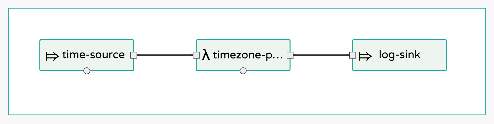

Other supporting stream definitions will also be created.

### Task

The task will be implemented as a Spring Batch job that will ingest a file containing times (one per line) and convert them to a specified timezone, writing them to another file. The task will be triggered every 60 seconds via the out-of-the-box [Trigger Task Source](https://github.com/spring-cloud/spring-cloud-stream-app-starters/tree/master/triggertask/spring-cloud-starter-stream-source-triggertask).

### Standalone

We'd also like to be able to get notified when the task to convert times has started and when it's completed. That's why we'll be deploying a standalone [Spring Cloud Stream](https://cloud.spring.io/spring-cloud-stream/) based web app that consumes from a channel where [Spring Batch events](http://docs.spring.io/spring-cloud-task/docs/current/reference/htmlsingle/#stream-integration-batch-events) will be emmitted by our task. Then we can stream those events to an HTTP client using a [Server Side Events](http://docs.spring.io/spring/docs/current/spring-framework-reference/htmlsingle/#mvc-ann-async-sse) based Spring MVC endpoint.

### Tools and runtimes

In the development of our timely demo application we'll be using the following development tools and runtime environments:

#### Spring Cloud Data Flow Maven Plugin

We'll implement the requirements incrementally with the help of the [Spring Cloud Data Flow Maven Plugin](https://github.com/donovanmuller/spring-cloud-dataflow-maven-plugin). The Maven plugin will allow us to register, define and deploy streams, tasks and standalone applications without having to leave our IDE or command line.

#### Local Deployer

The built in [local deployer](https://github.com/spring-cloud/spring-cloud-deployer-local) will be used for running our demo applications. Standing up a local server instance will be described below.

## Time to start

Enough waffling, let's get stuck into some code.

We will use a single multi-module Maven project for this demo application with each milestone in our development expressed in it's own Git branch. To save some, ahem...  time, I've already put together the basic project structure and the most basic implementation of our primary stream. So go ahead and clone this GitHub repository which contains all the source code for this demo application:

```
$ git clone https://github.com/donovanmuller/timely-application-group.git
```

You'll notice there is one module called `application-goup`. This module is the Application Group Descritor and contains the [`application-group.yml`](https://github.com/donovanmuller/timely-application-group/blob/master/application-group/src/main/resources/application-group.yml) descriptor file. We'll dig into that in a bit but first have a look at the `pom.xml`:

```
    <build>
        <plugins>
            <plugin>
                <groupId>io.switchbit</groupId>
                <artifactId>spring-cloud-dataflow-maven-plugin</artifactId>
                <configuration>
					<!-- These deployment properties will be passed to the relevant streams on deployment -->
                    <deploymentProperties>
                    </deploymentProperties>
                </configuration>
                <executions>
                    <execution>
                        <goals>
							<!-- This goal parses the 'application-group.yml' descriptor file and
							builds the app resource URI's if 'artifactId' are referenced as well as basic
							validation of the structure of the descriptor file.
							-->
                            <goal>application-group-processor</goal>
                        </goals>
                    </execution>
                </executions>
            </plugin>
        </plugins>
    </build>
```

where we add the Spring Cloud Data Flow Maven Plugin. The `<deploymentProperties>` configuration item is analogous to [deployment properties](http://docs.spring.io/spring-cloud-dataflow/docs/current/reference/htmlsingle/index.html#_deployment_properties) you would define when deploying through the Shell or UI. Also, note the `<goal>application-group-processor</goal>` goal, which parses the application group descriptor.

### Application Group Descriptor

The descriptor file is the heart and soul of an Application Group Descriptor project and what the Spring Cloud Data Flow Maven Plugin parses and applies when invoking the `/application-groups/definitions` endpoint on a Spring Cloud Data Flow server.

If you look at `src/main/resources/application-group.yml`, it has the following structure so far:

```
apps:
  - name: time-source
    type: source
    uri:  time-source-kafka
  - name: log-sink
    type: sink
    uri:  log-sink-kafka

stream:
  - name: timely-stream
    dsl: time-source | log-sink
```

The sections in the descriptor relate directly to the commands you would execute when defining a stream using the shell or UI.

#### `apps:` 

The `apps` section lists the apps that will be imported/registered as part of the deployment. The properties, `name`, `type` and `uri` map directly to the same way you would register an app with the [DSL](http://docs.spring.io/spring-cloud-dataflow/docs/current/reference/htmlsingle/index.html#_stream_dsl). For example, the DSL equivalent of the above `app` section in the descriptor would be look like:

```
dataflow:>app import --name time-source --type source --uri maven://org.springframework.cloud.stream.app:time-source-kafka:1.0.4.RELEASE
dataflow:>app import --name log-sink ...
```

Note however that the `uri` property is not the fully qualified Maven URI of `maven://org.springframework.cloud.stream.app:time-source-kafka:1.0.4.RELEASE` but rather, contains what is the `artifactId` in the `pom.xml`. I.e. `time-source-kafka`. It is the `application-group-processor` goal, mentioned briefly above, that expands the `artifactId` to the fully qualified URI property as the descriptor is parsed. It does this by looking at the dependencies section in the POM and expanding the URI based on the matching `groupId` and `version`. This has the benefit of enforcing that the apps being registered are resolvable artifacts.

> If you provide the fully qualified form of the URI the expansion will not be applied. This allows the descriptor to support other resource types like `docker://` and `file://`.

#### `stream:`

As with the `apps` section, the `stream` section maps directly to how you would define streams using the DSL. I.e. the above definition in the descriptor is exactly the same as this command in the Shell:

```
dataflow:>stream create --name timely-stream --definition "time-source | log-sink"
```

### Deploying the Application Group

Now that we've got our Application Group defined in our descriptor project, it's time to deploy it to a Local deployer based Spring Cloud Data Flow server instance.

#### Kafka to bind them

Before we can deploy our Application Group we need a binder instance to provide the messaging middleware. For this sample application we'll use Kafka.

Using Docker is probably the easiest way to stand up a Kafka instance for testing, so let's stand up a Kafka 0.8 container with:

```
# substitute en0 with the relavent interface on your machine
$ docker run \
  -p 2181:2181 \
  -p 9092:9092 \
  --env ADVERTISED_HOST=`ipconfig getifaddr en0` \
  --env ADVERTISED_PORT=9092 \
  spotify/kafka
...
2016-11-08 09:17:09,215 INFO success: zookeeper entered RUNNING state, process has stayed up for > than 1 seconds (startsecs)
2016-11-08 09:17:09,215 INFO success: kafka entered RUNNING state, process has stayed up for > than 1 seconds (startsecs)
```

#### Spring Cloud Data Flow Server Local

Now that we have a binder up we need an instance of the Spring Cloud Data Flow Server Local running. To stand up an instance download the built binary and run it:

```
$ wget https://github.com/donovanmuller/spring-cloud-dataflow/releases/download/v1.1.0.APPLICATION-GROUPS-SNAPSHOT/spring-cloud-dataflow-server-local-1.1.0.BUILD-SNAPSHOT.jar
$ java -jar spring-cloud-dataflow-server-local-1.1.0.BUILD-SNAPSHOT.jar \
  --spring.cloud.dataflow.features.application-groups-enabled=true
```

Note that you have to enable the application group feature (`--spring.cloud.dataflow.features.application-groups-enabled=true`) as it's disabled by default. Enabling the `application-groups` feature also implicitly enables the [standalone-application](https://blog.switchbit.io/introducing-standalone-applications-to-spring-cloud-data-flow/) feature.

#### Deploy all the things!

All the infrastructure bits are now ready so we can deploy our Application Group. Simply issue the following command in the root of the demo application:

```
$ ./mvnw scdf:deploy
[INFO] Scanning for projects...
[INFO] ------------------------------------------------------------------------
[INFO] Reactor Build Order:
[INFO] 
[INFO] timely-application-group-parent
[INFO] timely-application-group
[INFO]                                                                         
[INFO] ------------------------------------------------------------------------
[INFO] Building timely-application-group-parent 1.0-SNAPSHOT
[INFO] ------------------------------------------------------------------------
...
[INFO] --- spring-cloud-dataflow-maven-plugin:1.1.0.BUILD-SNAPSHOT:deploy (default-cli) @ application-group ---
[INFO] Importing application group: timely-application-group
[INFO] Waiting for application to deploy...
[INFO] Waiting for application to be deployed, currently 'deployed'
[INFO] Application 'timely-application-group' deployed successfully
[INFO] ------------------------------------------------------------------------
[INFO] Reactor Summary:
[INFO] 
[INFO] timely-application-group-parent .................... SUCCESS [  0.848 s]
[INFO] timely-application-group ........................... SUCCESS [ 32.995 s]
[INFO] ------------------------------------------------------------------------
[INFO] BUILD SUCCESS
[INFO] ------------------------------------------------------------------------
...
```

The plugin will use the default server URI of `http://localhost:9393` and invoke the RESTful API of the Data Flow server. 

Let's verify what the plugin did by using the [Shell](http://docs.spring.io/spring-cloud-dataflow/docs/current/reference/htmlsingle/#_deploying_local). 
First download the Shell and run it (also connecting to the default server URI) with:

```
$ wget https://github.com/donovanmuller/spring-cloud-dataflow/releases/download/v1.1.0.APPLICATION-GROUPS-SNAPSHOT/spring-cloud-dataflow-shell-1.1.0.BUILD-SNAPSHOT.jar
$ java -jar spring-cloud-dataflow-shell-1.1.0.BUILD-SNAPSHOT.jar
```

first let's check the apps registered and the Application Group created. The Application Group deployment facilitated the registration of our two apps and created the `timely-stream` stream definition which was subsequently deployed:

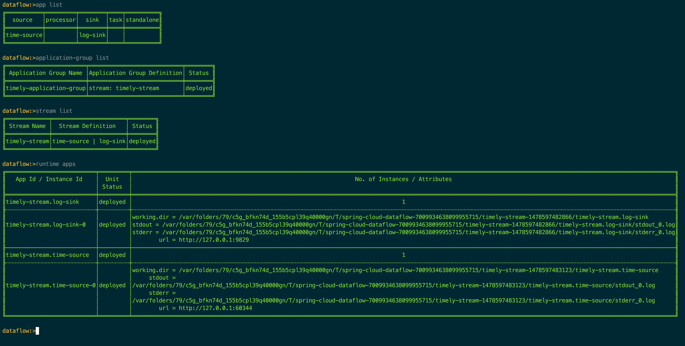

and we can see that the stream is functioning properly by tailing the logs of the Log Sink:

```
$ tail -fn500 /var/folders/79/c5g_bfkn74d_155b5cpl39q40000gn/T/spring-cloud-dataflow-7009934638099955715/timely-stream-1478597482866/timely-stream.log-sink/stdout_0.log
...  INFO 53320 --- [ kafka-binder-1] log.sink                                 : 11/08/16 11:36:19
...  INFO 53320 --- [ kafka-binder-1] log.sink                                 : 11/08/16 11:36:20
...  INFO 53320 --- [ kafka-binder-1] log.sink                                 : 11/08/16 11:36:21
```

feel free to **let this stream run in the background** as we continue...

## Adding the timezone processor

We've got off to a good start with the `timely-stream` spewing out the time every second but our requirement was to convert the times to a specified timezone. We'll implement this with a custom `timezone-processor`. To save some time, this processor has already been implemented on the `timezone-processor` Git branch, so switch to that branch now:

```
$ git checkout timezone-processor
```

You'll notice there is a new module called `timezone-processor-kafka`. All it does is take in the String representing the current time originating from the Time Source app and converts it to a configured (via an [application property)](https://github.com/donovanmuller/timely-application-group/blob/timezone-processor/timezone-processor-kafka/src/main/java/io/switchbit/TimezoneConfigurationProperties.java#L8) timezone. Then the converted time, as a formatted String representation, is sent out on the default `Processor.OUTPUT` channel. There's nothing much else to it, feel free to [browse the code](https://github.com/donovanmuller/timely-application-group/blob/timezone-processor/timezone-processor-kafka/src/main/java/io/switchbit/TimezoneProcessor.java) for more detail.

Of course, the processor also needs to be added to the `timely-stream` definition in the descriptor file. This has also been done and now looks like this:

```
apps:
  - name: time-source
    type: source
    uri:  time-source-kafka
  - name: timezone-processor
    type: processor
    uri:  timezone-processor-kafka
  - name: log-sink
    type: sink
    uri:  log-sink-kafka

stream:
  - name: timely-stream
    dsl: time-source | timezone-processor --timezone=Africa/Johannesburg | log-sink
```

Note that we register (using the shorthand method) the new `timezone-processor` processor app as before. We also added the new processor to the stream definition. Note that we provide the timezone we would like the input time to be converted to by specifying the `--timezone=Africa/Johannesburg` [application property](http://docs.spring.io/spring-cloud-dataflow/docs/current/reference/htmlsingle/index.html#_application_properties).

### Kafka upgrade

Now, before we can deploy this updated Application Group, we must upgrade Kafka 😐. 
The current stream app starters (`time-source` and `log-sink`) at version `1.0.4.RELEASE` (at time of writing), use the [`1.0.3.RELEASE`](https://mvnrepository.com/artifact/org.springframework.cloud/spring-cloud-stream-binder-kafka/1.0.3.RELEASE) version of `spring-cloud-starter-stream-kafka` which includes the Kafka *0.8* client library. However, our `timezone-processor` uses the latest and greatest `Brooklyn.SR1` Spring Cloud Stream release. This release includes the `1.1.0.RELEASE` version of `spring-cloud-starter-stream-kafka` which uses the Kafka *0.9* client library.

Problem is, the [`spotify/kafka`](https://hub.docker.com/r/spotify/kafka/) Docker image we are using is a [Kafka 0.8](https://github.com/spotify/docker-kafka/blob/master/kafka/Dockerfile#L7) instance. Therefore, the `timezone-processor` with the newer client library (0.9) will not work with this Kafka container (0.8).

So upgrade we must!
There are [multiple PR's](https://github.com/spotify/docker-kafka/pulls) currently open to upgrade the `spotify/kafka` image to the latest Kafka version but unfortunately none of them have been merged. So to make things easier I've built a Kafka 0.10.0.1 image based on [PR #56](https://github.com/spotify/docker-kafka/pull/56) and pushed it to Docker Hub as [`donovanmuller/kafka:0.10.0.1`](https://hub.docker.com/r/donovanmuller/docker-kafka).

So first stop the current Kafka 0.8 container and then start an upgraded Kafka container:

```
$ docker stop <current kafka container id>
8492d80f4a98
$ docker run \
  -p 2181:2181 \
  -p 9092:9092 \
  --env ADVERTISED_HOST=`ipconfig getifaddr en0` \
  --env ADVERTISED_PORT=9092 \
  donovanmuller/kafka:0.10.0.1
...
```

### Deploying the updated things!

Now the easy part, to update and redeploy our Application Group simply run:

```
$ ./mvnw scdf:deploy
```

once the plugin completes the deployment, you can use the Shell to inspect how the Application Group was updated by registering the new `timezone-processor` app, the `timely-stream` definition updated *and* redeployed:

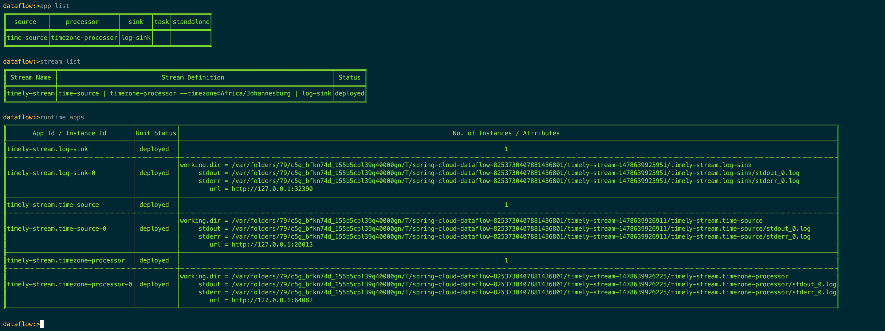

We can verify that the processor has kicked in by tailing the `timezone-processor`'s logs:

```
$ tail -fn500 /var/folders/79/c5g_bfkn74d_155b5cpl39q40000gn/T/spring-cloud-dataflow-1964580361911637897/timely-stream-1478905899350/timely-stream.timezone-processor/stdout_0.log
...
...  INFO 16450 --- [afka-listener-1] o.a.kafka.common.utils.AppInfoParser     : Kafka version : 0.9.0.1
...  INFO 16450 --- [afka-listener-1] o.a.kafka.common.utils.AppInfoParser     : Kafka commitId : 23c69d62a0cabf06
...  INFO 16450 --- [afka-listener-1] io.switchbit.TimezoneProcessor           : Converting time '11/12/16 01:11:10' to timezone: 'Africa/Johannesburg'
...  INFO 16450 --- [afka-listener-1] io.switchbit.TimezoneProcessor           : Converting time '11/12/16 01:11:11' to timezone: 'Africa/Johannesburg'
...  INFO 16450 --- [afka-listener-1] io.switchbit.TimezoneProcessor           : Converting time '11/12/16 01:11:12' to timezone: 'Africa/Johannesburg'
...
```

## A Batch Task

Now that our stream is fully implemented we need to finish off our demo application with a Spring Batch based Spring Cloud Task application. This task will read a file with a list of times (one per line) in the same format as our `timely-stream`, convert them using the same logic as our `timezone-processor` and finally write the converted times to a another file.

Now where could we get a list of times... 🤔

### Tap that stream

Our `timely-stream` already emits times in the correct format, so it makes sense to use that stream as a source of times for our task. We can use the [tap feature](http://docs.spring.io/spring-cloud-dataflow/docs/current/reference/htmlsingle/index.html#spring-cloud-dataflow-stream-tap-dsl) to write the converted times from the `timezone-processor` to a file using the out-of-the-box [File Sink](https://github.com/spring-cloud/spring-cloud-stream-app-starters/tree/master/file/spring-cloud-starter-stream-sink-file).

If that sounded complicated, fear not. This has already been implemented in the `timely-file-tap` branch, so let's checkout that branch:

```
$ git checkout timely-file-tap
```

In our Application Group descriptor (`application-group.yml`) we can see our new `timely-file-tap` tap definition:

```
apps:
  - name: time-source
    type: source
    uri:  time-source-kafka
  - name: timezone-processor
    type: processor
    uri:  timezone-processor-kafka
  - name: log-sink
    type: sink
    uri:  log-sink-kafka
  - name: file-sink
    type: sink
    uri:  file-sink-kafka

stream:
  - name: timely-stream
    dsl: time-source | timezone-processor --timezone=Africa/Johannesburg | log-sink
  - name: timely-file-tap
    dsl: :timely-stream.timezone-processor > file-sink --file.directory=/tmp --file.mode=APPEND --file.name=times
```

we create a new stream definition with the tap's name of `timely-file-tap` and the tap definition `:timely-stream.timezone-processor > file-sink ...`. We send the tapped messages from the `timezone-processor` of the `timely-stream` stream, to the `file-sink` registered app (added in the `apps` section above as well as a [`<dependency>`](https://github.com/donovanmuller/timely-application-group/blob/timely-file-tap/application-group/pom.xml#L45) in the POM). The application properties added to `file-sink` tell the app to write all messages to the `/tmp/times` file and append any messages received to the same file.

#### Deploy the all the taps!

As usual, to register the new `file-sink` app, update the Application Group and stream definition and redeploy all the apps, simply issue the usual command of:

```
$ ./mvnw scdf:deploy
```

and verify using the Shell:

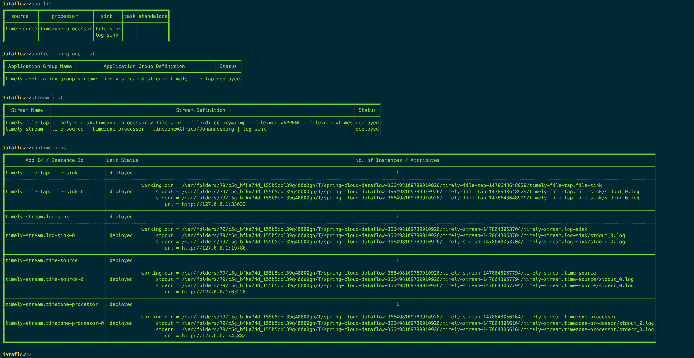

you can verify that the `timely-file-tap` is working by tailing the `/tmp/times` file:

```
$ tail /tmp/times
11/09/16 02:21:45
11/09/16 02:21:46
11/09/16 02:21:47
...
$
```

### Job creation

Great, so now we have our input file for our soon to be written batch job to process. Luckily that's already been implemented in the `timely-task` branch, so let's check that out:

```
$ git checkout timely-task
```

#### Timezone Converter

A few things to note before we dig into the task implementation. The logic to convert the times has been extracted into it's own [`timezone-converter`](https://github.com/donovanmuller/timely-application-group/tree/timely-task/timezone-converter) module, so we don't have to duplicate the functionality in the batch job's processor. This module will be [auto configured](https://github.com/donovanmuller/timely-application-group/blob/timely-task/timezone-converter/src/main/java/io/switchbit/TimezoneConverterConfiguration.java) by Spring when included as a dependency.

#### Time Task

Now let's examine the new [`timely-task`](https://github.com/donovanmuller/timely-application-group/tree/timely-task/timely-task) module which is where our Spring Batch job is configured. [`TimezoneJobConfiguration`](https://github.com/donovanmuller/timely-application-group/blob/timely-task/timezone-converter/src/main/java/io/switchbit/TimezoneConverterConfiguration.java) defines a run of the mill, one step Spring Batch job configuration that:

* [reads](https://github.com/donovanmuller/timely-application-group/blob/timely-task/timely-task/src/main/java/io/switchbit/TimezoneJobConfiguration.java#L62) an `inputFile` specified as a job parameter, in the process, mapping each line to a `TimelyTime` bean
* then a [processor](https://github.com/donovanmuller/timely-application-group/blob/timely-task/timely-task/src/main/java/io/switchbit/TimezoneJobConfiguration.java#L71) which invokes the [`timezoneConverter`](https://github.com/donovanmuller/timely-application-group/blob/timely-task/timely-task/src/main/java/io/switchbit/TimezoneJobConfiguration.java#L95) to convert the `originalTime` to the `timezone` specified as a job parameter and save the converted time as well as the timezone used, back on the `TimelyTime` bean instance
* and finally a [writer](https://github.com/donovanmuller/timely-application-group/blob/timely-task/timely-task/src/main/java/io/switchbit/TimezoneJobConfiguration.java#L80) which, in chunks of 10, writes the converted `TimelyTime` beans to an `outputFile`, also specified as a job parameter

```
/**
 * A Spring Batch Job ('timezone-task') configuration to:
 *
 * <ol>
 *     <li>Read a file specified by the 'inputFile' job parameter</li>
 *     <li>Process each line (representing a time) of the file by converting each time to the timezone specified
 *     by the 'timezone' job parameter</li>
 *     <li>Write the converted times to a file specified by the 'outputFile' job parameter</li>
 * </ol>
 */
@Configuration
public class TimezoneJobConfiguration {

    @Autowired
    private JobBuilderFactory jobBuilderFactory;

    @Autowired
    private StepBuilderFactory stepBuilderFactory;

    @Bean
    public Job job(Step timezone) throws Exception {
        return jobBuilderFactory.get("timezone-task")
                .incrementer(new RunIdIncrementer())
                .start(timezone)
                .build();
    }

    @Bean
    public Step timezoneConversion(FlatFileItemReader<TimelyTime> reader,
            ItemProcessor<TimelyTime, TimelyTime> itemProcessor,
            ItemWriter<TimelyTime> writer) {
        return stepBuilderFactory.get("timezone-conversion")
                .<TimelyTime, TimelyTime>chunk(10)
                .reader(reader)
                .processor(itemProcessor)
                .writer(writer)
                .build();
    }

    @Bean
    @StepScope
    public FlatFileItemReader<TimelyTime> reader(@Value("#{jobParameters[inputFile]}") String inputFile) {
        FlatFileItemReader<TimelyTime> reader = new FlatFileItemReader<>();
        reader.setResource(new FileSystemResource(inputFile));
        reader.setLineMapper((line, lineNumber) -> new TimelyTime(line));
        return reader;
    }

    @Bean
    @StepScope
    public ItemProcessor<TimelyTime, TimelyTime> timezoneProcessor(TimezoneConverter timezoneConverter,
            @Value("#{jobParameters[timezone]}") String timezone) {
        return timelyTime -> timelyTime.converted(
                timezoneConverter.convert(timelyTime.getOriginalTime()),
                timezone);
    }

    @Bean
    @StepScope
    public FlatFileItemWriter<TimelyTime> writer(@Value("#{jobParameters[outputFile]}") String outputFile) {
        FlatFileItemWriter<TimelyTime> writer = new FlatFileItemWriter<>();
        writer.setResource(new FileSystemResource(outputFile));

        FormatterLineAggregator<TimelyTime> lineAggregator = new FormatterLineAggregator<>();
        BeanWrapperFieldExtractor<TimelyTime> fieldExtractor = new BeanWrapperFieldExtractor<>();
        fieldExtractor.setNames(new String[] {"originalTime", "convertedTime", "timezone"});
        lineAggregator.setFieldExtractor(fieldExtractor);
        lineAggregator.setFormat("%s [UTC] -> %s [%s]");
        writer.setLineAggregator(lineAggregator);
        return writer;
    }

    @Bean
    @StepScope
    public TimezoneConverter timezoneConverter(@Value("#{jobParameters[timezone]}") String timezone) {
        TimezoneConfigurationProperties timezoneConfigurationProperties = new TimezoneConfigurationProperties();
        timezoneConfigurationProperties.setTimezone(timezone);
        return new TimezoneConverter(timezoneConfigurationProperties);
    }
}
```

and that's about it really. [`@EnableTask`](https://github.com/donovanmuller/timely-application-group/blob/timely-task/timely-task/src/main/java/io/switchbit/Application.java#L10) will take care of the Spring Cloud Task related chores of recording the execution of the job and so forth, so nothing more to see here.

#### Triggering the task

Now we need a way of triggering our `timely-task`.
We'll do that using the out-of-the-box [Trigger Task](https://github.com/spring-cloud/spring-cloud-stream-app-starters/tree/master/triggertask/spring-cloud-starter-stream-source-triggertask) Source application. The Trigger Task app can send a `TaskLaunchRequest` message at predefined intervals or based on a cron expression. Given that our requirements were to trigger our task every 60 seconds, the interval based approach will work nicely.

If you're not familiar with Spring Cloud Task in the context of Data Flow, you might be wondering what consumes this `TaskLaunchRequest` message and how our task gets launched? Well, we need one more app to do that for us, the out-of-the-box [Task Launcher Local](https://github.com/spring-cloud/spring-cloud-stream-app-starters/tree/master/tasklauncher/spring-cloud-starter-stream-sink-tasklauncher-local) Sink. This app consumes the `TaskLaunchRequest` message and launches the specified task locally, similar to how the Spring Cloud Deployer Local server launches apps.

The only thing left then is to add another stream definition (`timely-task`) to wire up these two apps to trigger our `timely-task` task. This has already been done in the application group descriptor file ([`application-group.yml`](https://github.com/donovanmuller/timely-application-group/blob/timely-task/application-group/src/main/resources/application-group.yml#L34)):

```
apps:
  - name: time-source
    type: source
    uri:  time-source-kafka
  - name: timezone-processor
    type: processor
    uri:  timezone-processor-kafka
  - name: log-sink
    type: sink
    uri:  log-sink-kafka
  - name: file-sink
    type: sink
    uri:  file-sink-kafka
  - name: trigger-task
    type: source
    uri:  triggertask-source-kafka
  - name: tasklauncher-local
    type: sink
    uri:  task-launcher-local-sink-kafka

stream:
  - name: timely-stream
    dsl: time-source | timezone-processor --timezone=Africa/Johannesburg | log-sink
  - name: timely-file-tap
    dsl: :timely-stream.timezone-processor > file-sink --file.directory=/tmp --file.mode=APPEND --file.name=times
  - name: timely-task
    dsl: trigger-task --fixed-delay=60 --uri=maven://io.switchbit:timely-task:1.0-SNAPSHOT --command-line-args="inputFile=/tmp/times timezone=Africa/Johannesburg outputFile=/tmp/times-converted" | tasklauncher-local
```

as before, we've added the `trigger-task` and `tasklauncher-local` apps to our POM as dependencies, which allows us to add them to the `apps` section using their shorthand URI's.

We then have our new `timely-task` stream definition, which wires the `trigger-task` and `tasklauncher-local` apps together, specifying the application properties of:

* `--fixed-delay=60` - Trigger the configured task every 60 seconds
* `--uri=maven://io.switchbit:timely-task:1.0-SNAPSHOT` - Resource URI of the task that will be launched
* `--command-line-args="inputFile=/tmp/times timezone=Africa/Johannesburg outputFile=/tmp/times-converted"` - The command line arguments to be passed to that launched task. Which in the case of Spring Batch based tasks, get translated into job parameters. The job parameters are:
 * `inputFile=/tmp/times` - this is the file that the `timely-file-tap` is appending to and which will contain times as produced by the `time-source`
 * `timezone=Africa/Johannesburg` - which is the timezone to convert the times in the `inputFile` too
 * `outputFile=/tmp/times-converted` - where to write the file with converted times

### Deploy that batch!

Deploying is the easy part, our friend:

```
$ ./mvnw scdf:deploy
```

and once again, verify with the Shell:

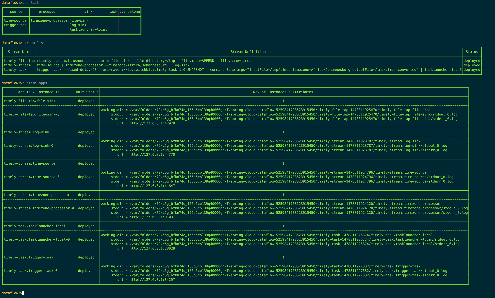

if you check the logs of the `trigger-task` instance, you should see log entries related to the launching of our `timely-task`:

```
$  tail -fn500 /var/folders/79/c5g_bfkn74d_155b5cpl39q40000gn/T/spring-cloud-dataflow-5259841708523915450/timely-task-1478811926374/timely-task.tasklauncher-local/stdout_0.log

...  INFO 12697 --- [ kafka-binder-1] o.s.c.task.launcher.TaskLauncherSink     : Launching Task for the following resource TaskLaunchRequest{uri='maven://io.switchbit:timely-task:1.0-SNAPSHOT', commandlineArguments=[inputFile=/tmp/times, timezone=Africa/Johannesburg, outputFile=/tmp/times-converted], environmentProperties={}, deploymentProperties={}}
...  INFO 12697 --- [ kafka-binder-1] o.s.c.d.spi.local.LocalTaskLauncher      : launching task Task--1952322854
   Logs will be in /var/folders/79/c5g_bfkn74d_155b5cpl39q40000gn/T/spring-cloud-dataflow-3911458145370420995/Task--1952322854-1478812145868/Task--1952322854
```

and you should be able to view the output file of our job once a job has been run successfully:

```
$ cat /tmp/times-converted
11/11/16 01:12:07 [UTC] -> 11/11/16 03:12:07 [Africa/Johannesburg]
11/11/16 01:12:08 [UTC] -> 11/11/16 03:12:08 [Africa/Johannesburg]
11/11/16 01:12:09 [UTC] -> 11/11/16 03:12:09 [Africa/Johannesburg]
...
```

## Streaming the task events

One final requirement and we're done!
When a Spring Cloud Task is executed it can emit [events](http://docs.spring.io/spring-cloud-task/docs/current/reference/htmlsingle/#stream-integration-events) to a Spring Cloud Stream channel, what's more, if the task is a Spring Batch based job, then Spring Batch related events can be emitted.

We would like to consume those events as our `timely-task` executes and provide a web endpoint where a HTTP client can stream those events for viewing. Turns out that's actually pretty easy and already done on the `timely-events` branch, so check that out now:

```
$ git checkout timely-events
```

### Centralising the config

Before we walk through the web app that will consume the task/batch events and the changes to the `timely-task` to emit those events, let's add support for centralising not only the configuration of our apps but also our Data Flow server.

The Data Flow server and out-of-the-box apps all have built in support for [Spring Cloud Config](https://cloud.spring.io/spring-cloud-config/), which allows you to centralise the configuration of applications. Let's make use of that feature by standing up a local config server and providing a Git repository where we will configure various options for the server and apps. You might have noticed the [`config-server`](https://github.com/donovanmuller/timely-application-group/tree/timely-events/config-server) module, which as luck would have it, is ready and configured for just that purpose. Stand up an instance with:

```
$ mvn spring-boot:run -pl config-server
...
...  INFO 14130 --- [           main] s.b.c.e.t.TomcatEmbeddedServletContainer : Tomcat started on port(s): 8888 (http)
...  INFO 14130 --- [           main] io.switchbit.Application                 : Started Application in 4.533 seconds (JVM running for 7.9)
```

the config server will be running on http://localhost:8888, which is the default endpoint for config clients.

#### The configuration

The following GitHub repository contains the configurations for the various applications as well as our Data Flow server:

https://github.com/donovanmuller/timely-application-group-configuration

the configurations are defined per application by their [`spring.application.name`](https://github.com/donovanmuller/timely-application-group/blob/timely-events/config-server/src/main/resources/application.yml#L9) property. So let's look into the Data Flow server's configuration ([`spring-cloud-dataflow-server-local/application.yml`](https://github.com/donovanmuller/timely-application-group-configuration/blob/master/spring-cloud-dataflow-server-local/application.yml)):

```
spring:
  datasource:
    url: jdbc:postgresql://localhost:5432/scdf
    username: scdf
    password: scdf
    driver-class-name: org.postgresql.Driver
  cloud:
    dataflow.features.application-groups-enabled: true
```

Surprise! The boot datasource configuration is provided for a Postgres database, which means we're going to connect our local Data Flow server to a persistent database and not the in-memory H2 default. Why? Well, there is a really neat feature in Data Flow that allows you to view the historical (and current) task executions. For example, in the Shell issue this command:

```
dataflow:>job execution list
╔═══╤═══════╤═════════╤═══════════╤═════════════════════╤══════════════════╗
║ID │Task ID│Job Name │Start Time │Step Execution Count │Definition Status ║
╚═══╧═══════╧═════════╧═══════════╧═════════════════════╧══════════════════╝

dataflow:>
```

nothing. Even though, as you are reading this, there are probably tasks being triggered and launched. So why don't we see the executions?

The task/batch executions can only be recorded if a persistent (not the default in-memory H2) [datasource is configured](http://docs.spring.io/spring-cloud-task/docs/current/reference/htmlsingle/#features-data-source). What's more, it should be the same datasource as used by the Data Flow server.

#### Postgres datasource

With that in mind, let's start a Postgres database instance up to act as our datasource for both Data Flow server and our `timely-task` application. The easiest way to do this, is to start a Postgres Docker container with:

```
$ docker run \
  -p 5432:5432 \
  -e POSTGRES_USER=scdf \
  -e POSTGRES_PASSWORD=scdf \
  -e POSTGRES_DB=scdf \
  postgres:9
```

Note the username (`POSTGRES_USER`), password (`POSTGRES_PASSWORD`) and database (`POSTGRES_DB`) name match those of the datasource configuration above.

#### Restarting the Data Flow server

Our config server is up and our new Git based configuration is waiting, all we have to do is kill the current server instance and restart it:

```
...  INFO 12538 --- [nio-9393-exec-2] o.s.c.d.spi.local.LocalAppDeployer       : deploying app timely-task.trigger-task instance 0
   Logs will be in /var/folders/79/c5g_bfkn74d_155b5cpl39q40000gn/T/spring-cloud-dataflow-5259841708523915450/timely-task-1478811927332/timely-task.trigger-task

Ctrl + C

...  INFO 12538 --- [       Thread-9] ationConfigEmbeddedWebApplicationContext : Closing org.springframework.boot.context.embedded.AnnotationConfigEmbeddedWebApplicationContext@2a5ca609: startup date [Thu Nov 10 23:04:36 SAST 2016]; parent: org.springframework.context.annotation.AnnotationConfigApplicationContext@3830f1c0
...
...  INFO 12538 --- [       Thread-9] o.s.s.c.ThreadPoolTaskScheduler          : Shutting down ExecutorService 'taskScheduler'
...
...  INFO 12538 --- [       Thread-9] o.s.c.d.spi.local.LocalAppDeployer       : un-deploying app timely-stream.timezone-processor instance 0
...

$ java -jar spring-cloud-dataflow-server-local-1.1.0.BUILD-SNAPSHOT.jar
...
```

when you stop your local server, all apps should be undeployed. Note that when we start the server again, we no longer need to add the `--spring.cloud.dataflow.features.application-groups-enabled=true` command line argument because this gets populated from the config server now.

#### Redeploy all the things! Again!

Let's get back up to where we left off (well, a little further really...) by deploying our application group once more:

```
$ ./mvnw scdf:deploy
```

once again, let's verify that our Application Group has been deployed successfully, using the Shell:

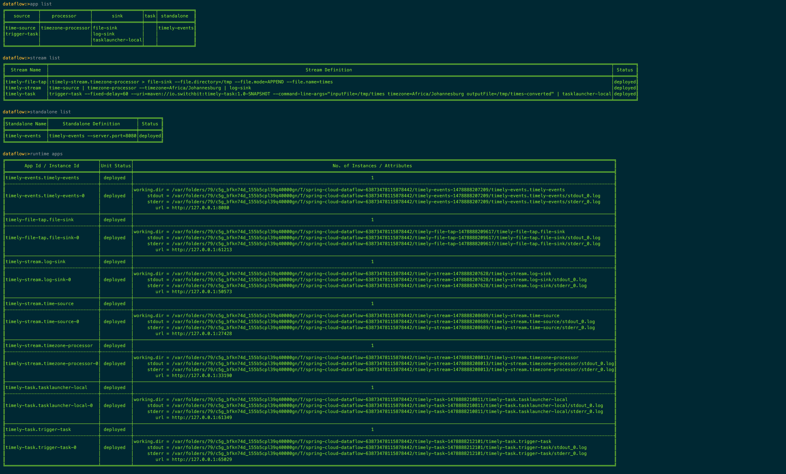

and as expected, all our streams and standalone application have been deployed successfully.

#### Revisiting Job Executions

If we now have a look at the job executions now (maybe give it a minute after a fresh deploy) using the Shell:

```
dataflow:>job execution list
╔═══╤═══════╤═════════════╤═════════════════════════════╤═════════════════════╤══════════════════╗
║ID │Task ID│  Job Name   │         Start Time          │Step Execution Count │Definition Status ║
╠═══╪═══════╪═════════════╪═════════════════════════════╪═════════════════════╪══════════════════╣
║1  │1      │timezone-task│Fri Nov 11 21:56:20 SAST 2016│1                    │Destroyed         ║
╚═══╧═══════╧═════════════╧═════════════════════════════╧═════════════════════╧══════════════════╝

dataflow:>job execution list
╔═══╤═══════╤═════════════╤═════════════════════════════╤═════════════════════╤══════════════════╗
║ID │Task ID│  Job Name   │         Start Time          │Step Execution Count │Definition Status ║
╠═══╪═══════╪═════════════╪═════════════════════════════╪═════════════════════╪══════════════════╣
║1  │1      │timezone-task│Fri Nov 11 21:56:20 SAST 2016│1                    │Destroyed         ║
╚═══╧═══════╧═════════════╧═════════════════════════════╧═════════════════════╧══════════════════╝

dataflow:>
```

we can now see that the task/job executions are recorded. This is thanks to our Data Flow server and our `timely-task` using the Postgres container instance as a datasource. We haven't mentioned the `timely-task` configuration of this datasource but that's just because it's configured exactly the same way as the Data Flow server, using the [`timely-application-group-configuration`](https://github.com/donovanmuller/timely-application-group-configuration) GitHub repository in the [`timely-task/application.yml`](https://github.com/donovanmuller/timely-application-group-configuration/blob/master/timely-task/application.yml) file which will be served up by the config server.

Just as a closing thought on job executions, the [Data Flow server UI](http://localhost:9393/dashboard/index.html#/jobs/executions) includes much more information than the Shell, below are a few screenshots showing some of the details available:

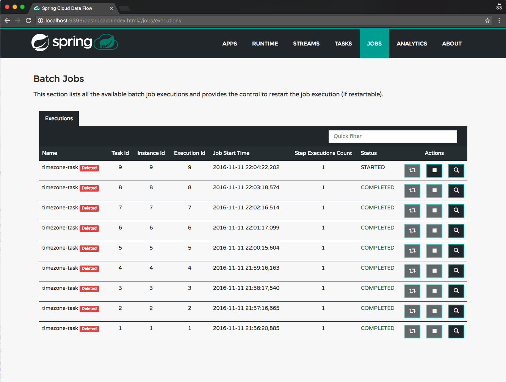

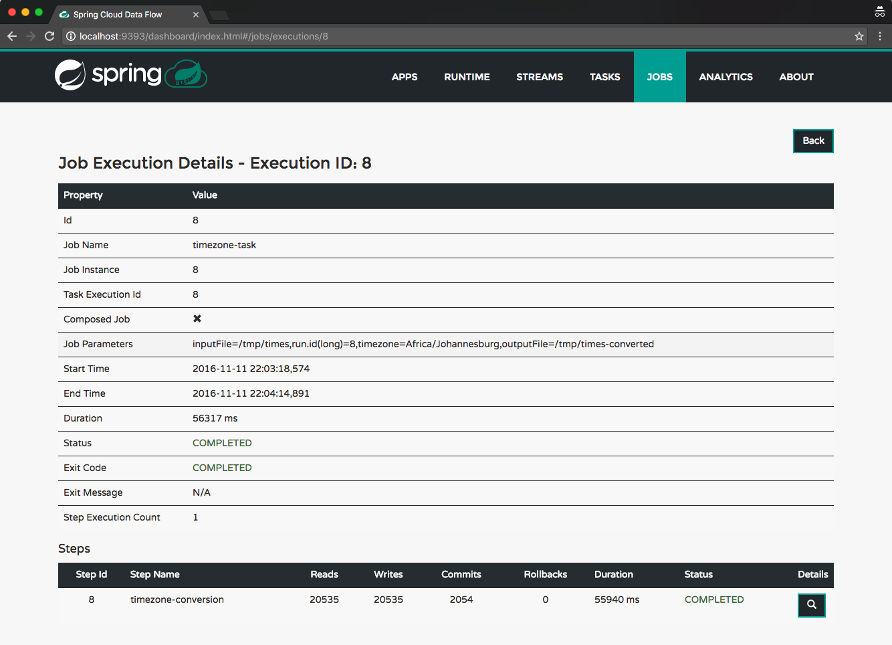

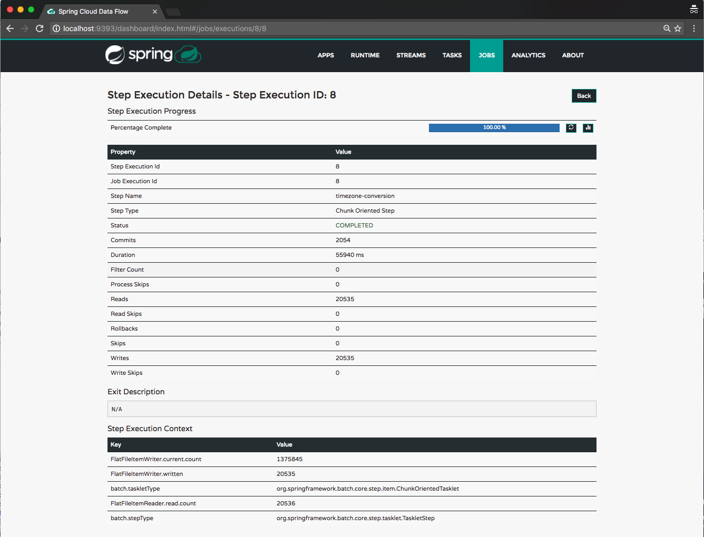

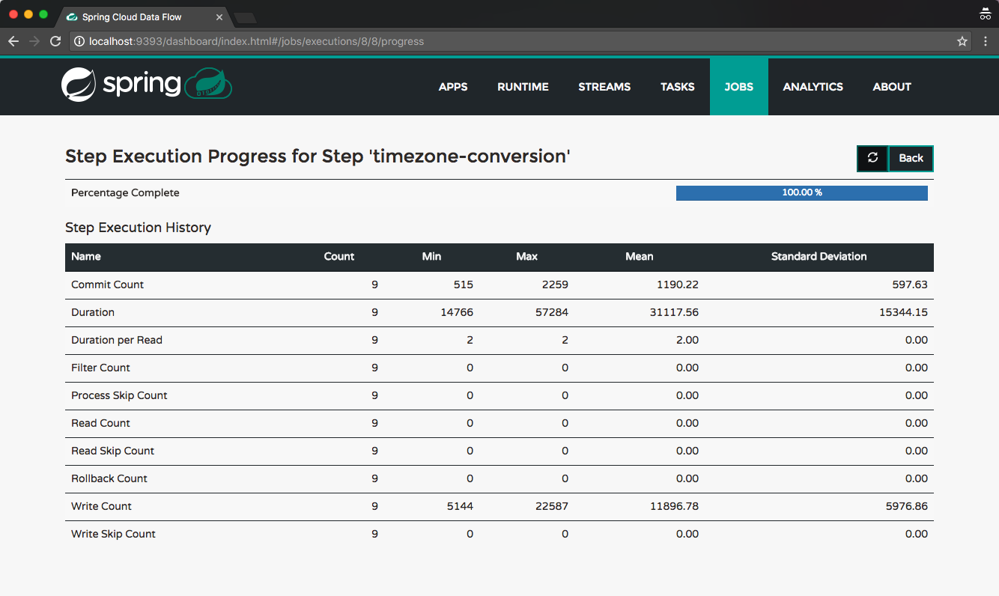

#### A timely event

For the astute reader, you would have noticed that there was an extra application registered and deployed when we deployed the `timely-event` branch version of the Application Group descriptor. The application is a standalone Spring Cloud Stream web application that binds to the `timely-events` channel and broadcasts any events emitted by our `timely-task` job to any subscribed HTTP clients using Server Side Events. 

If you look at the descriptor file:

```
apps:
  - name: time-source
    type: source
    uri:  time-source-kafka
  - name: timezone-processor
    type: processor
    uri:  timezone-processor-kafka
  - name: log-sink
    type: sink
    uri:  log-sink-kafka
  - name: file-sink
    type: sink
    uri:  file-sink-kafka
  - name: trigger-task
    type: source
    uri:  triggertask-source-kafka
  - name: tasklauncher-local
    type: sink
    uri:  task-launcher-local-sink-kafka
  - name: timely-events
    type: standalone
    uri:  timely-events

standalone:
  - name: timely-events
    dsl: timely-events --server.port=8080

...
```

you'll see the `timely-events` app registered and a new `standalone` section containing the definition of our `timely-events` standalone application (see [this blog post](https://blog.switchbit.io/introducing-standalone-applications-to-spring-cloud-data-flow/) introducing the standalone application type).

We can test out the event streaming of the `timely-events` application using `curl`:

```
$ curl http://localhost:8080/events/subscribe
```

this will connect to the `/events/subscribe` endpoint that will stream (connection will be closed after [60 seconds](https://github.com/donovanmuller/timely-application-group-configuration/blob/master/timely-events/application.yml#L3)) the events emitted by our `timely-task` job as it executes.

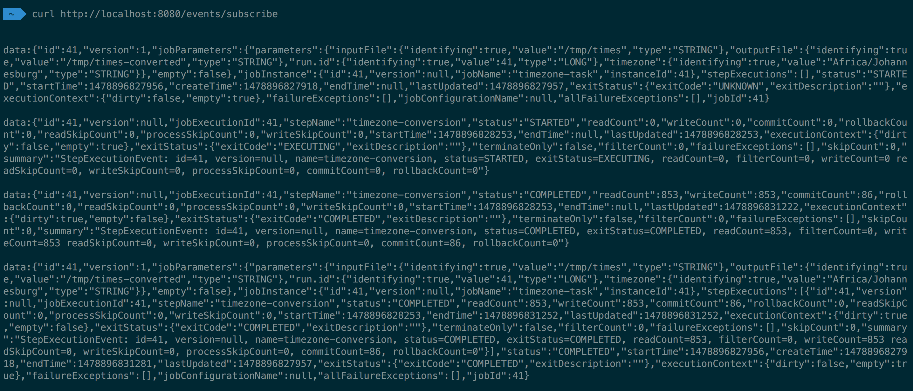

The [Spring Batch events](http://docs.spring.io/spring-cloud-task/docs/current/reference/htmlsingle/#stream-integration-batch-events) are normally emitted to a channel per listener, however, for simplicity, we [configure](https://github.com/donovanmuller/timely-application-group-configuration/blob/master/timely-task/application.yml#L8) the events to be sent to a single channel called `timely-events`. This channel becomes the [input channel](https://github.com/donovanmuller/timely-application-group-configuration/blob/master/timely-events/application.yml#L1) for the `timely-events` application. I.e. it receives all events emitted by the Spring Batch listeners. These events then get pushed to any connected clients via [Server Side Events](http://docs.spring.io/spring/docs/current/spring-framework-reference/htmlsingle/#mvc-ann-async-sse).

With that, we're done! 🏁

## Let's recap

The Application Group feature allowed us to incrementally add functionality from the most basic stream, all the way to multiple streams and a standalone application. All of this, without having to manually undeploy/destroy and define/deploy streams/standalone applications at any point. Nice.

Hopefully this was a good demonstration of this take on the  Application Group feature. Any [feedback](https://twitter.com/donovancmuller) welcome!

> All of the demo application's code is available at https://github.com/donovanmuller/timely-application-group

## Reference

If you would like to look deeper into some of the Spring Cloud Data Flow features used in this demo application, see below for reference:

* [Central Configuration](http://docs.spring.io/spring-cloud-dataflow/docs/current/reference/htmlsingle/#_central_configuration)
* [Streams](http://docs.spring.io/spring-cloud-dataflow/docs/current/reference/htmlsingle/#arch-streams)
 * [Taps](http://docs.spring.io/spring-cloud-dataflow/docs/current/reference/htmlsingle/#spring-cloud-dataflow-stream-tap-dsl)
* [Tasks](http://docs.spring.io/spring-cloud-dataflow/docs/current/reference/htmlsingle/#spring-cloud-task)
 * [Spring Batch events](http://docs.spring.io/spring-cloud-task/docs/current/reference/htmlsingle/#stream-integration-batch-events)