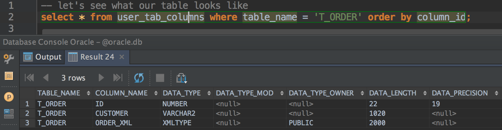
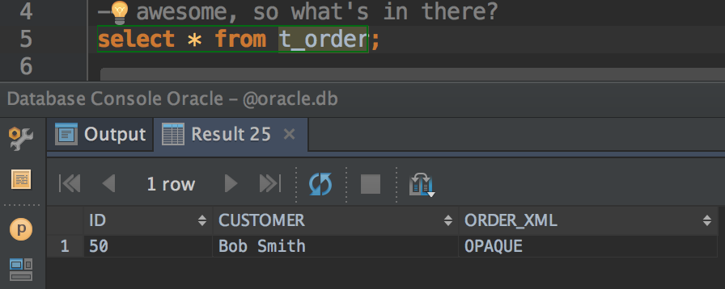
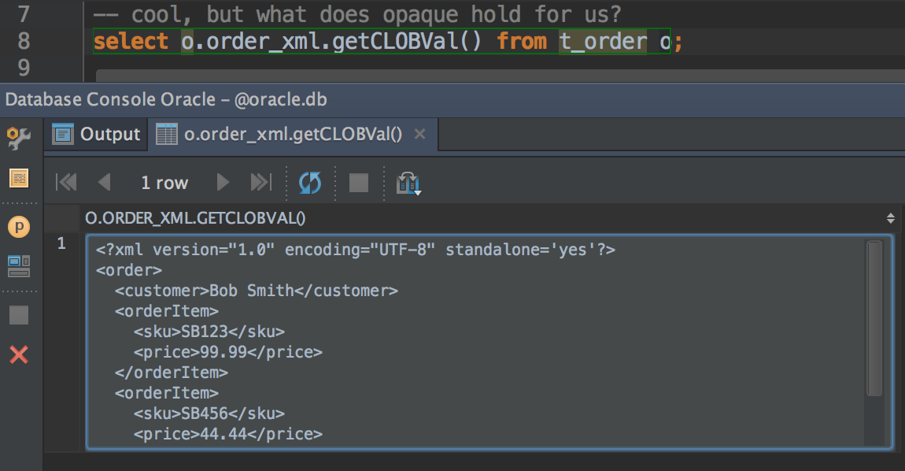
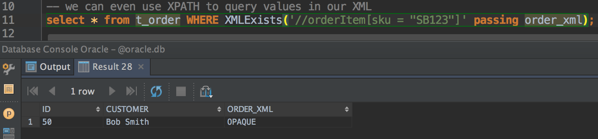

Storing *and* querying XML from a database in an efficient way with JPA, can be somewhat of a headache. This post describes how you can can use Oracle's XMLType to achieve this.

## Storing XML

Assuming you really really have to store the raw XML, there are a few options. 

### Clobbering a seal

Probably the easiest and most straightforward way, is to store the document as a `String` property annotated with `@Lob`. With this option you would just marshal the XML document to a `String` and save this as a CLOB type database column, potentially with other columns/properties related to this document and saving these along with the document in a single table/entity. Retrieving the document is equally as simple, given the `String` property containing the XML document, simply unmarshal this property to the correct XML document.

Let's demonstrate the above with some code describing our XML document as JAXB classes and then how we would marshal and unmarshal to/from the XML format in a JPA entity. We'll use Spring Boot to illustrate this.

*The complete code for this post is available on GitHub [here](https://github.com/switchbitio/xmltype-jpa)*

`Order.java`
```
@XmlRootElement
public class Order {

    private String customer;

    @XmlElement(name = "orderItem")
    private List<OrderItem> orderItems = new ArrayList<>();

    ...

    public void addOrderItem(final OrderItem orderItem) {
        this.orderItems.add(orderItem);
    }
}
```
`OrderItem.java`
```
public class OrderItem {

    private String sku;
    private Double price;

    ...
}
```

and our JPA entity, persisted with the help of Spring Data JPA looks like this:

`OrderEntity.java`
```
@Entity(name = "t_order")
public class OrderEntity {

    public static final String NAME = "t_order";
    public static final String SEQUENCE_NAME = NAME + "_seq";

    @Id
    @GeneratedValue(generator = SEQUENCE_NAME, strategy = SEQUENCE)
    @SequenceGenerator(name = SEQUENCE_NAME, sequenceName = SEQUENCE_NAME)
    private Long id;

    private String customer;

    @Lob
    private String orderXml;

    ...
```

the sequence on our identity property is actually more for Oracle, which we'll introduce later.

To place the `Order` we have a RESTful resource that accepts the order XML as a POST body. Spring Boot's [auto configured](https://github.com/spring-projects/spring-boot/blob/master/spring-boot-autoconfigure/src/main/java/org/springframework/boot/autoconfigure/web/HttpMessageConverters.java#L193) `Jaxb2RootElementHttpMessageConverter` will automatically convert the body to our `Order` JAXB structure. Below is our controller and app, Spring Data JPA repository interface left out for brevity.

`Application.java`
```
@SpringBootApplication
@RestController
public class Application {

    @Autowired
    private OrderEntityRepository orderEntityRepository;

    @RequestMapping(value = "/orders", method = POST, consumes = APPLICATION_XML_VALUE)
    public OrderEntity placeOrder(@RequestBody final Order order) {
        StringWriter orderXml = new StringWriter();
        JAXB.marshal(order, orderXml);

        return orderEntityRepository.save(new OrderEntity(order.getCustomer(), orderXml.toString()));
    }

    public static void main(String[] args) {
        SpringApplication.run(Application.class, args);
    }
}
```

After starting the app, you can test persisting our entity with:

```
$ curl -X POST --header "Content-Type: application/xml" --header "Accept: */*" -d "
dquote> <order>
dquote>     <customer>Bob Smith</customer>
dquote>     <orderItem>
dquote>         <sku>SB123</sku>
dquote>         <price>99.99</price>
dquote>     </orderItem>
dquote>     <orderItem>
dquote>         <sku>SB456</sku>
dquote>         <price>44.44</price>
dquote>     </orderItem>
dquote> </order>
dquote> " "http://localhost:8080/orders"
```

Unmarshalling our XML document from the `orderXml` property's value would be a similar affair.

Quite simple then, however, the problem with this option is that you cannot query the XML document easily. For example, you cannot query all records from the aforementioned table where some tag in the document equals X. Instead, as part of your app design, you would have identify which tags in your document might be queried and then extract those into their own columns (like the `customer` property above), allowing you to include them in your queries. Alternatively, in a worst case scenario, you would have to do a `select *`, unmarshal the document from each record and then filter with xpath etc. Pretty nasty stuff.

### You seek the Oracle

If you work in a corporate that uses Oracle, the above scenario can be handled a little more efficiently with the XMLType data type in conjunction with the Oracle XML DB related stack. More information [here](http://docs.oracle.com/database/121/ADXDB/xdb01int.htm#ADXDB3970)

Basically, the Oracle XML DB related technologies bring the benefits of the relational world to the XML world. Allowing you to query the XML document as you would in the relational world with similar performance and features.

So, need to store your XML data in its native form?
Using Oracle as your database engine?
XMLType with Oracle XML DB it is!

## Life's too short. That's not a prediction.

Wouldn't it be great if we could just set our JAXB instance directly on our entity and have all the gory details of persisting it to an Oracle XMLType column done for us? Well, that's exactly what we're going to do.

Let's start out by just, believing...
Change our entity to reference the actual `Order`:

`OrderEntity.java`
```
@Entity(name = "t_order")
public class OrderEntity {

    public static final String NAME = "t_order";
    public static final String SEQUENCE_NAME = NAME + "_seq";

    @Id
    @GeneratedValue(generator = SEQUENCE_NAME, strategy = SEQUENCE)
    @SequenceGenerator(name = SEQUENCE_NAME, sequenceName = SEQUENCE_NAME)
    private Long id;

    private String customer;

    @Column(name = "order_xml")
    private Order order;

    ...
```

and our controller accordingly:

`Application.java`
```
@SpringBootApplication
@RestController
public class Application {

    @Autowired
    private OrderEntityRepository orderEntityRepository;

    @RequestMapping(value = "/orders", method = POST, consumes = APPLICATION_XML_VALUE)
    public OrderEntity placeOrder(@RequestBody final Order order) {
        StringWriter orderXml = new StringWriter();
        JAXB.marshal(order, orderXml);

        return orderEntityRepository.save(new OrderEntity(order));
    }

    ...
}
```

fire up our app and... it puked up a steaming stack trace with the following remnant of a carrot:

```
...
Caused by: org.hibernate.MappingException: Could not determine type for: io.switchbit.domain.Order, at table: order_entity, for columns: [org.hibernate.mapping.Column(order)]
```

Hibernate, the default ORM used by Spring Data JPA apparently does not know how to handle or map our `Order` class to a database column. Fair enough. So we'll just have to tell Hibernate how we'd like this type handled. We can do this by specifying our own `org.hibernate.usertype.UserType`.

Since we're starting to implement an Oracle specific feature, we must bring in the Oracle JDBC/XDB dependencies at this point. The exact dependencies and versions might differ from the below but be sure to use the corresponding versions and names for *your* Oracle installation. Below is a snippet of just the Oracle dependencies, you can view the complete `pom.xml` [here](https://github.com/switchbitio/xmltype-jpa/blob/master/pom.xml)

`pom.xml`
```
        ...

        <!-- Oracle JDBC -->
        <dependency>
            <groupId>com.oracle</groupId>
            <artifactId>ojdbc6</artifactId>
            <version>12.1.0.1</version>
        </dependency>
        <dependency>
            <groupId>com.oracle</groupId>
            <artifactId>xdb6</artifactId>
            <version>11.2.0.3.0</version>
        </dependency>
        <dependency>
            <groupId>com.oracle</groupId>
            <artifactId>xmlparserv2</artifactId>
            <version>11.1.1.2.0</version>
        </dependency>
    </dependencies>
```

**Note:** Since the Oracle JDBC/XDB jars are not publicly available, you will have to source the jars for these dependencies from your own Oracle installation. You can then install them into your local Maven repo or install into your companies Maven repo of choice (Sonatype Nexus, etc.)

Oracle dependencies sorted, now for our very own `OrderUserType`

`OrderUserType.java`
```
public class OrderUserType implements UserType {

    private static JAXBContext jaxbContext;
    private Marshaller marshaller;
    private Unmarshaller unmarshaller;

    {
       jaxbContext = JAXBContext.newInstance(Order.class);
    }

    public OrderUserType() throws JAXBException {
        unmarshaller = jaxbContext.createUnmarshaller();
        marshaller = jaxbContext.createMarshaller();
        marshaller.setProperty(JAXB_ENCODING, UTF_8.name());
    }

    @Override
    public int[] sqlTypes() {
        // We register the SQL type code from oracle.xdb.XMLType
        return new int[] { XMLType._SQL_TYPECODE };
    }

    @Override
    public Class returnedClass() {
        return Order.class;
    }

    @Override
    public boolean equals(final Object x, final Object y) {
        return (x != null) && x.equals(y);
    }

    @Override
    public int hashCode(final Object x) {
        return (x != null) ? x.hashCode() : 0;
    }

    @Override
    public Object nullSafeGet(final ResultSet resultSet,
            final String[] names,
            final SessionImplementor session,
            final Object owner) throws SQLException {
        XMLType xmlType = (XMLType) resultSet.getObject(names[0]);

        Order document = null;
        if (xmlType != null) {
            try {
                // here we use JAXB to unmarshal from the org.w3c.dom.Document returned by oracle.xdb.XMLType to our Order class 
                document = unmarshaller.unmarshal(xmlType.getDocument(), Order.class).getValue();
            } catch (JAXBException e) {
                throw new SQLException("Could not unmarshal Order", e);
            }
        }

        return document;
    }

    @Override
    public void nullSafeSet(final PreparedStatement statement,
            final Object value,
            final int index,
            final SessionImplementor session) throws SQLException {
        try {
            XMLType xmlType = null;
            if (value != null) {
                NativeJdbcExtractor extractor = new OracleJdbc4NativeJdbcExtractor();
                Connection connection = extractor.getNativeConnection(statement.getConnection());
                // Using a helper method, we marshal our Order JAXB instance to its String representation and use that to create a oracle.xdb.XMLType instance
                xmlType = new XMLType(connection, jaxbToString(value));
            }

            // Important to still set object even if it's null
            // to prevent "org.h2.jdbc.JdbcSQLException: Parameter "#?" is not set; SQL statement"
            statement.setObject(index, xmlType);
        } catch (Exception e) {
            throw new SQLException("Could not marshal Order", e);
        }
    }

    @Override
    public Object deepCopy(final Object value) {
        return value;
    }

    @Override
    public boolean isMutable() {
        return true;
    }

    @Override
    public Serializable disassemble(final Object value) {
        return (Serializable) value;
    }

    @Override
    public Object assemble(final Serializable cached, final Object owner) {
        return cached;
    }

    @Override
    public Object replace(final Object original, final Object target, final Object owner) {
        return original;
    }

    protected String jaxbToString(final Object value) throws JAXBException {
        StringWriter stringWriter = new StringWriter();
        marshaller.marshal(value, stringWriter);

        return stringWriter.toString();
    }
}
```

now that our user type is defined, we need to annotate our entity's `order` property to inform Hibernate how to map our Order.

`OrderEntity.java`
```
@Entity(name = "t_order")
@TypeDefs({
        @TypeDef(name = "Order", typeClass = OrderUserType.class)
})
public class OrderEntity {

    public static final String NAME = "t_order";
    public static final String SEQUENCE_NAME = NAME + "_seq";

    @Id
    @GeneratedValue(generator = SEQUENCE_NAME, strategy = SEQUENCE)
    @SequenceGenerator(name = SEQUENCE_NAME, sequenceName = SEQUENCE_NAME)
    private Long id;

    private String customer;

    @Type(type = "Order")
    @Column(name = "order_xml")
    private Order order;

    ...
```

that should do it! Now, if only we had an instance of Oracle running locally to test... Luckily for us, there is a Docker [container](https://hub.docker.com/r/wnameless/oracle-xe-11g/) with just such a thing.

Start up a local instance of Oracle on port `49161` by running the following container:

```
$ docker run -d -p 49161:1521 wnameless/oracle-xe-11g
```

and now that we have a database running, we need to configure our app to use it (replace `localhost` with your `docker-machine` IP if you're on Windows/OSX):

`application.yml`
```
spring:

  datasource:
    url: jdbc:oracle:thin:@(description=(address=(protocol=tcp)(host=localhost)(port=49161))(connect_data=(service_name=xe)))
    username: system
    password: oracle
    driver-class-name: oracle.jdbc.OracleDriver

  jpa:
    database-platform: org.hibernate.dialect.Oracle10gDialect
    database: ORACLE
    show-sql: true
    hibernate:
      ddl-auto: create-drop
      naming_strategy: org.hibernate.cfg.ImprovedNamingStrategy
```

Right, let's run our app... and... another projectile code vommit

```
...
Caused by: org.hibernate.MappingException: No Dialect mapping for JDBC type: 2007
```

Arg! Seems Hibernate does not know what column type to use for JDBC type code 2007. Really? Anyone could tell you that code 2007 maps to a column type of `XMLTYPE`! Gosh, well, suppose the right thing to do would be to give Hibernate a hint by extending the `org.hibernate.dialect.Oracle10gDialect` and defining the mapping ourselves.

`OracleXmlDialect.java`
```
public class OracleXmlDialect extends Oracle10gDialect {

    public OracleXmlDialect() {
        registerColumnType(XMLType._SQL_TYPECODE, "XMLTYPE");
    }

    ...
```

and now we just need to configure our app to use our newly enlightened dialect

`application.yml`
```
spring:

  ... 

  jpa:
    database-platform: io.switchbit.persistence.OracleXmlDialect
   
...
```

crossing our fingers, run our app once more...
Awesome, it's started up. Now let's try and place an order using old curl'y wurlies

```
$ curl -X POST --header "Content-Type: application/xml" --header "Accept: */*" -d "
<order>
    <customer>Bob Smith</customer>
    <orderItem>
        <sku>SB123</sku>
        <price>99.99</price>
    </orderItem>
    <orderItem>
        <sku>SB456</sku>
        <price>44.44</price>
    </orderItem>
</order>
" "http://localhost:8080/orders"
{"id":50,"customer":"Bob Smith","order":{"customer":"Bob Smith","orderItems":[{"sku":"SB123","price":99.99},{"sku":"SB456","price":44.44}]}}%   
```

Success! Let's check out what it looks like in the database, just to make sure that it's actually persisted as an XMLTYPE column. 



definitely has, so what did we persist?



Hmm, `OPAQUE` doesn't really show us much does it? Let's see what's hiding there



that's better. Let's see if we can actually query the values in our XML



yup, we can do that as well. Try changing the sku `SB123` to say, `SB000` and you'll notice that no results are found. You know, just to check if it's really working.

## I'd ask you to sit down, but, you're not going to anyway. And don't worry about the vase. 

With a little work, we've successfully persisted our JAXB instance to an Oracle XMLType column while still keeping with a simple JPA programming model.

Only one thing remains, how do we allow our app to be tested *without* having to fire up an Oracle instance every time? What we really want, is to use Oracle when running in a production environment but use [H2](http://www.h2database.com/) when running our tests.

We cannot rely on in memory databases, like H2, to support the `XMLTYPE` data type, so we have to register our dialect a little different depending on what environment we're in, production or when running a test. Currently, the way we tell Hibernate which user type to use for our `Order` class, does not allow for swapping out implementations at test time to get around the Oracle specific stuff that just won't exist when using an in memory database. So let's change that and register our user type another way that will allow us to use a testable implementation when we need too. Luckily that's quite easy, we can do this in our custom `OracleXmlDialect` instead of using `@TypeDefs` annotation:

`OracleXmlDialect.java`
```
public class OracleXmlDialect extends Oracle10gDialect {

    public OracleXmlDialect() {
        registerColumnType(XMLType._SQL_TYPECODE, "XMLTYPE");
    }

    @Override
    public void contributeTypes(final TypeContributions typeContributions,
            final ServiceRegistry serviceRegistry) {
        super.contributeTypes(typeContributions, serviceRegistry);
        registerTypes(typeContributions);
    }

    private void registerTypes(final TypeContributions typeContributions) {
        try {
            typeContributions.contributeType(new OrderUserType(), new String[]{"Order"});
        } catch (JAXBException e) {
            throw new RuntimeException("Error registering Hibernate custom JAXB types", e);
        }
    }

}
```

and to finish this off, we need to remove the `@TypeDefs` from our entity:

`OrderEntity.java`
```
@Entity(name = "t_order")
public class OrderEntity {

    ...
```

now that registering our custom type can been swapped out, all we have to do now is create a testable version of our `OracleXmlDialect` that does not depend on any Oracle specific implementation. I.e. we'll marshal/unmarshal our JAXB instance from/to String which will be persisted in a VARCHAR column.

`H2OracleXmlDialect.java`
```
public class H2OracleXmlDialect extends Oracle10gDialect {

    public H2OracleXmlDialect() {
        // For testing, just map it to a VARCHAR please
        registerColumnType(XMLType._SQL_TYPECODE, "VARCHAR2");
    }

    @Override
    public void contributeTypes(final TypeContributions typeContributions,
            final ServiceRegistry serviceRegistry) {
        super.contributeTypes(typeContributions, serviceRegistry);
        registerTypes(typeContributions);
    }

    private void registerTypes(final TypeContributions typeContributions) {
        try {
            typeContributions.contributeType(new OrderUserType() {

                // Overriding this method to avoid the Oracle specific stuff
                @Override
                public void nullSafeSet(final PreparedStatement statement, final Object value, final int index, final SessionImplementor session) throws SQLException {
                    try {
                        statement.setObject(index, jaxbToString(value));
                    } catch (JAXBException e) {
                        throw new SQLException("Could not set test Order", e);
                    }
                }
            }, new String[]{"Order"});
        } catch (JAXBException e) {
            throw new RuntimeException("Error registering Hibernate custom JAXB types", e);
        }
    }
}
```

and now we can override the database connection settings for our tests (we'll use a `test` profile in our test class, which will switch this on)

`application-test.xml`
```
spring:

  datasource:
    url: jdbc:h2:mem:xe;MODE=Oracle;DB_CLOSE_DELAY=-1;DB_CLOSE_ON_EXIT=FALSE
    username: sa
    password:
    driver-class-name: org.h2.Driver

  jpa:
    database-platform: io.switchbit.persistence.H2OracleXmlDialect
    database: H2
```

and now we can write a quick test for our RESTful resource

```
@RunWith(SpringJUnit4ClassRunner.class)
@SpringApplicationConfiguration(Application.class)
@WebIntegrationTest(randomPort = true)
@ActiveProfiles("test")
public class ApplicationTest {

    @Value("${local.server.port}")
    private int port;

    @Test
    public void persist_order_successfully() throws IOException {
        Order order = JAXB.unmarshal(new ClassPathResource("order.xml").getFile(), Order.class);

        RestTemplate restTemplate = new TestRestTemplate();
        ResponseEntity<OrderEntity> response = restTemplate.postForEntity(
                format("http://localhost:%d/orders", port),
                order,
                OrderEntity.class);

        assertThat("Placing order did not return 200 OK", response.getStatusCode(), equalTo(OK));
        assertNotNull("Persisted order Id cannot be null", response.getBody().getId());
    }
}
```

## Conclusion

In this post, we saw how we can persist a JAXB instance to an Oracle database using the native XMLType support, without breaking the JPA programming model and still with the ability to test against an in memory database like H2.

*The complete code for this post is available on GitHub [here](https://github.com/switchbitio/xmltype-jpa)*